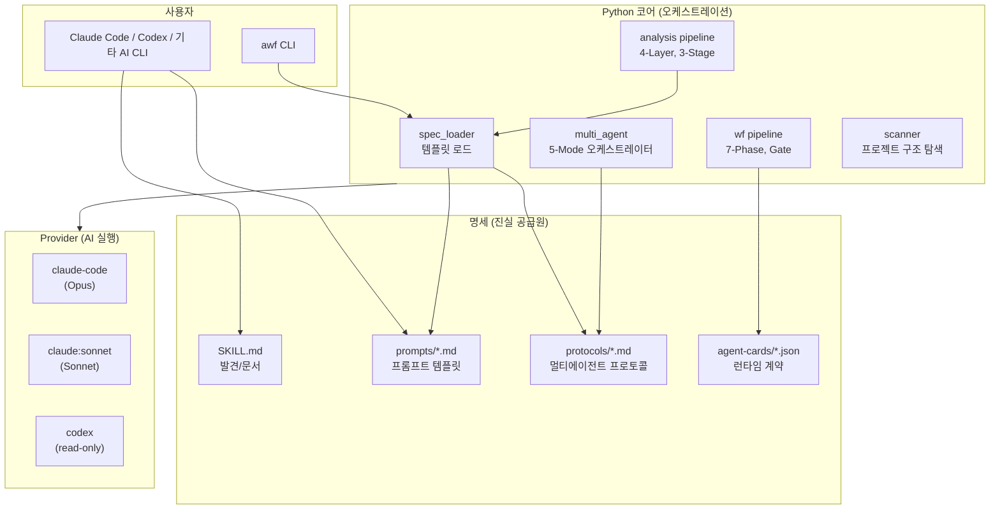
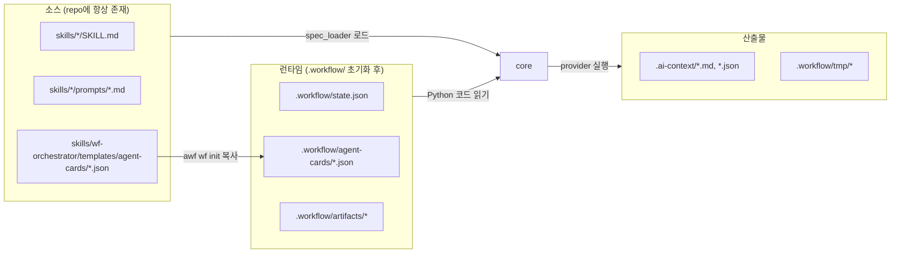

# awf-cli 아키텍처 개요

## 프로젝트 목적

소스코드 분석과 워크플로우 자동화를 위한 LLM 중립 CLI.
어떤 AI CLI(Claude Code, Codex, Gemini 등)에서든 같은 명세를 참조하여 동작한다.

## 핵심 설계 원칙

1. **명세가 진실 공급원**: `skills/*/prompts/*.md`가 프롬프트 원천. Python은 오케스트레이션만.
2. **런타임 계약은 agent card**: SKILL.md는 발견/문서용. gate/artifact 계약은 `.workflow/agent-cards/`.
3. **LLM 중립**: 어떤 AI CLI에서든 같은 명세 참조. Claude Code 전용 문법 없음.
4. **언어 중립**: 모든 프로젝트 구조 지원. DDD 가정 없음. "domain" 대신 "unit(분석 단위)".
5. **Standalone 호환**: cmux-agent 없이 독립 실행. 통합은 선택적.
6. **Provider 교체 가능**: `phase_models`/`stage_routing`으로 Phase/Stage별 provider 설정.
7. **멀티에이전트는 선택적**: solo가 기본. cross/critical은 필요할 때만.
8. **프롬프트 외부화**: `prompts/*.md` 편집으로 동작 변경. 코드 수정 불필요.
9. **XML 번들 = 원본 설계 준수**: per-file XML + import context 패턴 (`agentic-workflows`).
10. **비용 인식**: 저렴한 모델 우선, 토큰 추적, 예산 기반 context 수집.

## 시스템 구조



## 컴포넌트 책임

| 컴포넌트 | 파일 | 책임 | 진실 공급원 참조 |
|---------|------|------|--------------|
| **spec_loader** | `core/spec_loader.py` | 프롬프트 템플릿 로드 + 변수 치환 | `skills/*/prompts/*.md` |
| **scanner** | `core/scanner.py` | 프로젝트 구조 탐색. deterministic marker/root-unit 탐색 후 필요한 경우 AI fallback | — |
| **imports** | `core/imports.py` | import 추출 + 시그니처 + context 수집 | — |
| **analysis_stage1** | `core/analysis_stage1.py` | 파일별 XML 번들 분석 | `skills/analysis/prompts/stage1-file.md` |
| **analysis_prompt** | `core/analysis_prompt.py` | Stage 2/3 프롬프트 조립 | `skills/analysis/prompts/stage2.md`, `stage3.md` |
| **workflow_prompt** | `core/workflow_prompt.py` | Phase 프롬프트 조립 | `skills/wf-orchestrator/prompts/base.md`, `*-gate.md` |
| **multi_agent** | `core/multi_agent.py` | 5-mode 오케스트레이션 + Judge | `skills/multi-agent/protocols/*.md` |
| **agent_runner** | `core/agent_runner.py` | 개별 agent 실행 + 타임아웃 | — |
| **progress** | `core/progress.py` | 실시간 진행 표시 (⟳ 토큰, 도구) | — |
| **usage** | `core/usage.py` | 토큰 비용 추정 | — |

## 진실 공급원 계층



## 디렉토리 구조

```
ai-workflow-tools/
├── claude/skills/                   ← 명세 (진실 공급원)
│   ├── analysis/
│   │   ├── SKILL.md                 ← 발견/문서
│   │   ├── prompts/                 ← 프롬프트 템플릿
│   │   │   ├── stage1-file.md
│   │   │   ├── stage2.md
│   │   │   ├── stage3.md
│   │   │   ├── mode-precise.md
│   │   │   └── mode-cross.md
│   │   └── reference.md            ← 상세 파이프라인
│   ├── wf-orchestrator/
│   │   ├── SKILL.md
│   │   ├── prompts/
│   │   │   ├── base.md
│   │   │   ├── review-gate.md
│   │   │   ├── verify-gate.md
│   │   │   └── envelope-schema.md
│   │   └── templates/
│   │       └── agent-cards/         ← agent card 소스 템플릿
│   ├── multi-agent/
│   │   ├── SKILL.md
│   │   └── protocols/               ← 멀티에이전트 프로토콜
│   ├── phase-{plan,review,...}/     ← Phase별 skill (7개)
│   ├── wf-{status,reset}/          ← Utility skill (2개)
│   └── wf-{reviewer,verifier}/     ← Helper skill (2개)
├── cli/src/awf/
│   ├── commands/                    ← CLI 진입점
│   │   ├── analyze.py
│   │   ├── wf.py
│   │   ├── scan.py
│   │   └── init.py
│   ├── core/                        ← 코어 로직
│   │   ├── spec_loader.py           ← 명세 로드
│   │   ├── multi_agent.py           ← 5-mode 오케스트레이터
│   │   ├── scanner.py               ← 프로젝트 구조 탐색
│   │   ├── imports.py               ← import 추출 + 시그니처
│   │   └── ...
│   └── providers/                   ← AI provider 추상화
│       ├── registry.py
│       ├── claude_code.py
│       ├── codex.py
│       └── ...
└── docs/
    ├── architecture/                ← 이 문서들
    └── ...
```

### Scanner onboarding 규칙

`awf ready`와 `awf scan --no-ai`는 provider 호출 없이 같은 deterministic
scanner를 사용한다. Python repo는 `pyproject.toml`, `setup.py`,
`setup.cfg`, `requirements.txt`, `Pipfile`, `poetry.lock`를 marker로 인식한다.
`src/`/`domain`/`modules` 패턴이 없는 script repo도 `collectors/`,
`analyzers/`, `importers/`, `exporters/`, `monitors/`, `matchers/` 같은
root-level source directory를 분석 unit으로 노출할 수 있다.

## 기능별 상세

| 문서 | 설명 |
|------|------|
| [01-analysis-pipeline.md](01-analysis-pipeline.md) | 4-Layer, 3-Stage 분석 파이프라인 |
| [02-wf-pipeline.md](02-wf-pipeline.md) | 7-Phase, Gate 워크플로우 파이프라인 |
| [03-multi-agent.md](03-multi-agent.md) | 5-Mode 멀티에이전트 교차 검증 |
