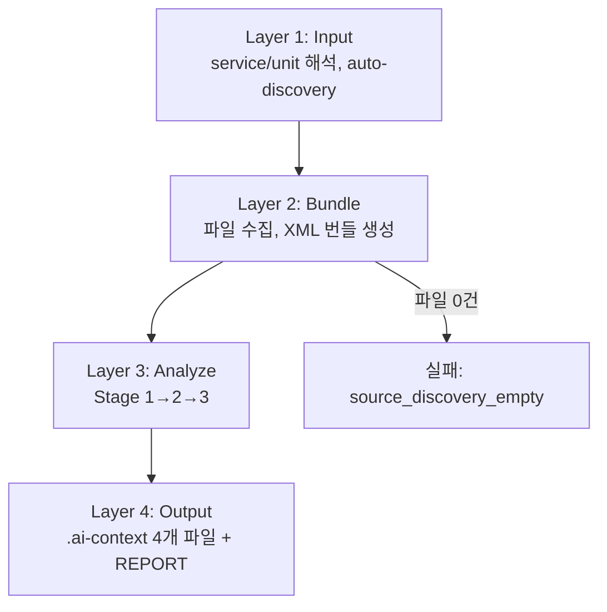
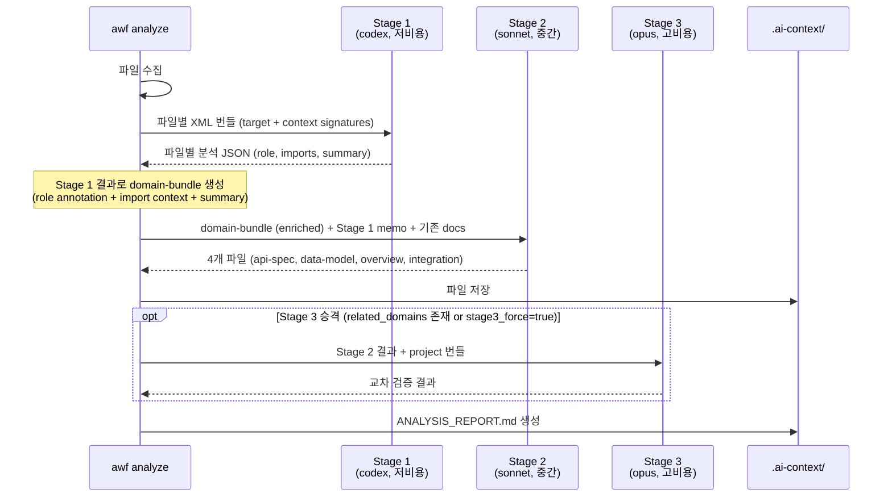
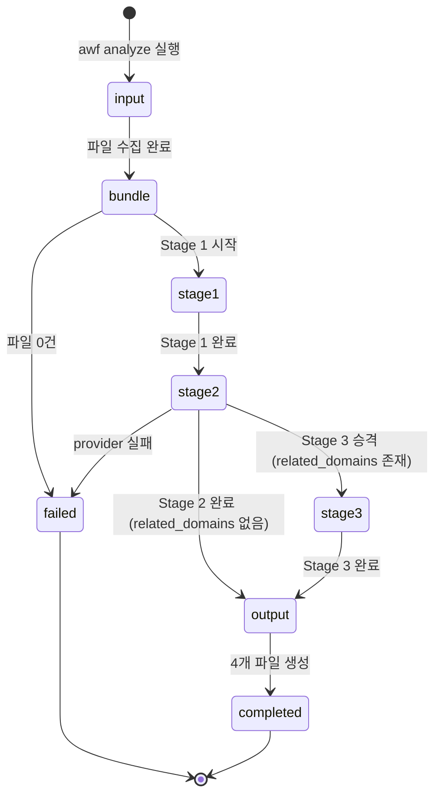

# Analysis Pipeline

## 개요

소스코드를 분석하여 `.ai-context/` 문서를 자동 생성하는 4계층 파이프라인.
모든 프로젝트 구조(TypeScript, PHP, Python, Go, Terraform, K8s 등)를 지원한다.

## 파이프라인 흐름



## Stage 구조



## Stage별 Provider 라우팅

`analysis-pipeline.json`의 `stage_routing.{scale}`:

| Scale | Stage 1 | Stage 2 | Stage 3 |
|-------|---------|---------|---------|
| small | codex | sonnet | skip (related_domains < 3) / opus (≥ 3) |
| standard | codex | sonnet | opus |
| large | codex | opus | opus |

## Stage 3 자동 승격 규칙

독립적인 `--deep` CLI 플래그는 제거됨(2026-04-08, 커밋 a1ec135). Stage 3은 다음 조건에서 자동 승격된다:

| 승격 조건 | 판정 근거 |
|----------|----------|
| `related_domains` 배열이 존재 (≥1) | `analysis-config.json`의 `domain_definitions.{domain}.related_domains` |
| `stage3_force: true` 설정 | `analysis-config.json` 단위별 오버라이드 |
| scale이 `standard` 또는 `large` | 위 조건과 AND 결합 |

`small` scale + `related_domains` 없음 → Stage 3 skip.
승격 판정은 Layer 2(bundle 완료) 직후 결정론적으로 수행된다.

## Stage 1: 파일별 XML 번들

원본 설계(`agentic-workflows/.draft/deep-analysis`) 준수:

```xml
<review target="src/artistUnit/ArtistUnitRouter.ts">
  <structure>
    <path>src/artistUnit/ArtistUnitRouter.ts</path>
    <path>src/today/TodayController.ts</path>
  </structure>
  <file path="src/artistUnit/ArtistUnitRouter.ts" role="target" language="typescript">
    <content encoding="xml-escaped">...</content>
  </file>
  <file path="src/today/TodayController.ts" role="context" mode="signatures" language="typescript">
    <content encoding="xml-escaped">export { TodayController };</content>
  </file>
</review>
```

- `role="target"`: 분석 대상 파일 (전체 내용)
- `role="context"`: import된 파일 (export 시그니처만, 예산 기반 수집)

## Domain Bundle (Stage 2 입력)

Stage 1 분석 결과로 enriched된 unit 전체 번들. Stage 2 provider에 전달:

```xml
<review unit="attendance">
  <structure>
    <path role="controller">src/domain/attendance/attendance.batch.controller.ts</path>
    <path role="service">src/domain/attendance/attendance.service.ts</path>
    <path role="context">src/common/entities/index.ts</path>
  </structure>
  <file path="...controller.ts" role="target" language="typescript"
        summary="NestJS batch controller exposing a PUT endpoint...">
    <content encoding="xml-escaped">...</content>
  </file>
  <file path="...service.ts" role="target" language="typescript"
        summary="This NestJS service sends attendance reminder...">
    <content encoding="xml-escaped">...</content>
  </file>
  <file path="...entities/index.ts" role="context" mode="signatures" language="typescript">
    <content encoding="xml-escaped">export { UserAttendance };</content>
  </file>
</review>
```

- **structure**: 파일 구조 + Stage 1이 파악한 역할 → LLM이 코드를 읽기 전에 개괄 파악
- **target + summary**: 소스 전문 + Stage 1 한줄 요약
- **context + signatures**: unit 외부 import 파일의 인터페이스만 → 의존성 파악

Stage 1이 실행되지 않으면(provider 미설정) role/summary annotation 없이 target만 포함.

## Analysis State 전이



## Incremental Analysis (K1)

이전 분석 결과가 있을 때 변경 파일만 재분석하여 비용 절감:

1. **Resume Gate**: `.tmp/hashes.json`의 파일 해시와 현재 소스 비교
2. **해시 변경 감지**: 변경 없으면 skip, 변경 있으면 re-analyze 경로
3. **Stage 1 증분**: 변경된 파일만 provider에 전송, 이전 Stage 1 결과와 merge
4. **Stage 2 보존**: 기존 `.ai-context` 4개 파일이 프롬프트에 주입되고, 변경 없는 부분은 유지 지시

```
14개 파일 중 2개 변경 시:
  Stage 1: 2개만 분석 (12개 이전 결과 재사용) → 비용 86% 절감
  Stage 2: 기존 문서 + 변경분 반영 → 품질 안정
```

## Drift Detection (`--check`)

`.ai-context`가 소스와 drift한 단위를 자동 감지:

```bash
awf analyze sample-api --check
```

- `.tmp/hashes.json`과 현재 파일 SHA-256 비교
- 변경 파일 수 + 변경 파일 목록 출력
- exit code: 0 (no drift), 1 (stale units found)

## Analysis Catalog (`--catalog`)

서비스 전체 분석 현황을 한 곳에서 파악:

```bash
awf analyze sample-api --catalog
```

- `analysis-config.json`의 `domain_definitions` = 전체 단위 (분모)
- `.ai-context/` 디렉토리 스캔 = 분석된 단위 (분자)
- 각 단위의 상태: ✓ 완료, ⚠ stale, ✗ 미분석/빈약

## Domain Knowledge Accumulation (K6)

분석 완료 시 핵심 지식을 서비스별 `project-context.md`에 자동 누적:

1. `domain-overview.md`에서 목적/요약 추출
2. `api-spec.json`에서 endpoint 수 추출
3. `analysis-docs/{service}/project-context.md`에 unit별 섹션으로 갱신
4. 다음 분석의 Stage 2 프롬프트에 project-context가 참조 주입

이전 unit 분석의 도메인 지식이 다음 unit 분석의 context로 활용되어 품질이 점진적으로 향상된다.

## Auto-Discovery

config에 없는 서비스도 자동 탐색:
1. heuristic: `src/domains/`, `src/domain/`, `src/`, `app/` 패턴
2. AI fallback: Codex가 디렉토리 트리에서 분석 단위 판단
3. 언어 자동 감지: 파일 확장자 기반
