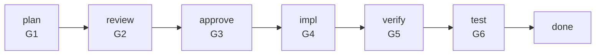
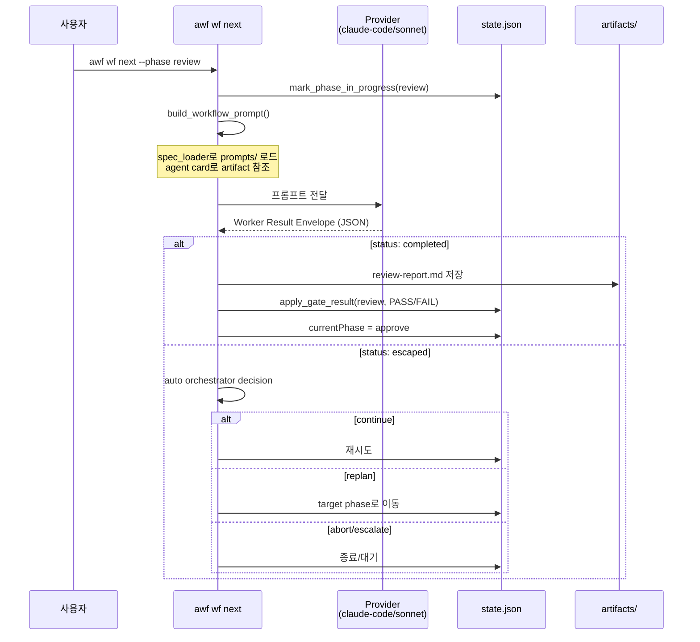
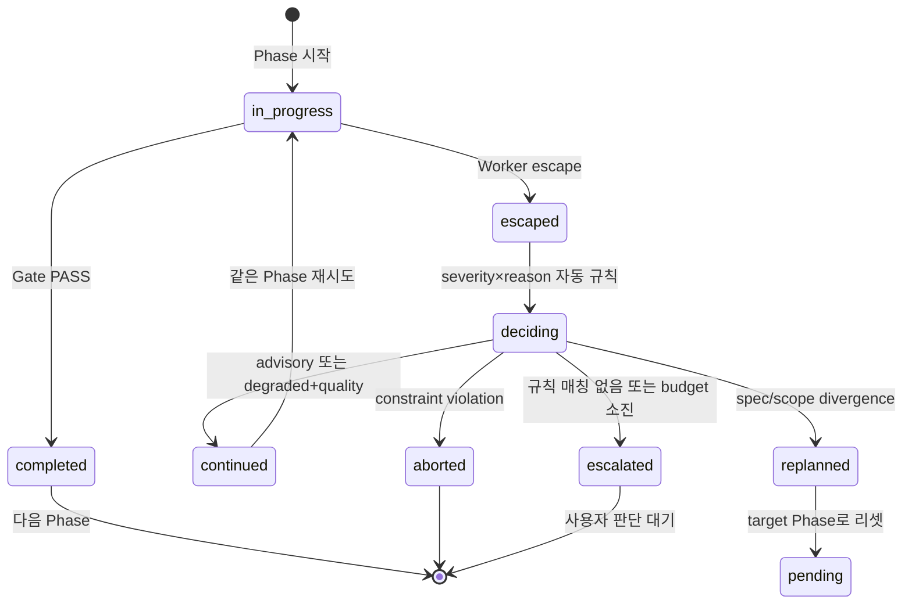

# Workflow Pipeline

## 개요

7-Phase 게이트 파이프라인. 기능 구현을 plan → review → approve → impl → verify → test → done 단계로 진행한다.

## Phase 흐름



## Phase 실행 시퀀스



## Closed-Loop (Escape → Decision)



## Replan Budget

```
loop.replanCount / loop.maxReplans (기본: 3)
```

replan 시 count 증가. budget 소진 시 escalate_user.

## Provider 라우팅 (phase_models)

`provider-config.json`의 `phase_models`:

| Phase | inline_model | 설명 |
|-------|-------------|------|
| plan | (default=opus) | 설계 판단, 높은 추론 |
| review | (default=opus) | 교차 검증, 높은 추론 |
| impl | sonnet | 코드 작성, 중간 |
| verify | (default=opus) | 스코프 검증, 높은 추론 |
| test | sonnet | 테스트 실행, 중간 |

## 진실 공급원

| 관심사 | 소스 | 런타임 |
|--------|------|--------|
| Phase 계약 (gate, artifacts) | `templates/agent-cards/{phase}.json` | `.workflow/agent-cards/{phase}.json` |
| Phase 설명/조건 | `skills/phase-*/SKILL.md` | — |
| 프롬프트 템플릿 | `skills/wf-orchestrator/prompts/*.md` | — |
| 워크플로우 상태 | — | `.workflow/state.json` |
