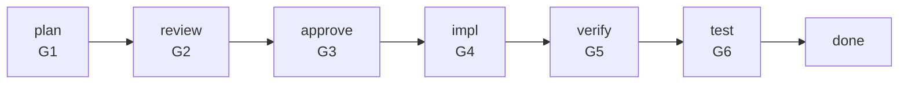
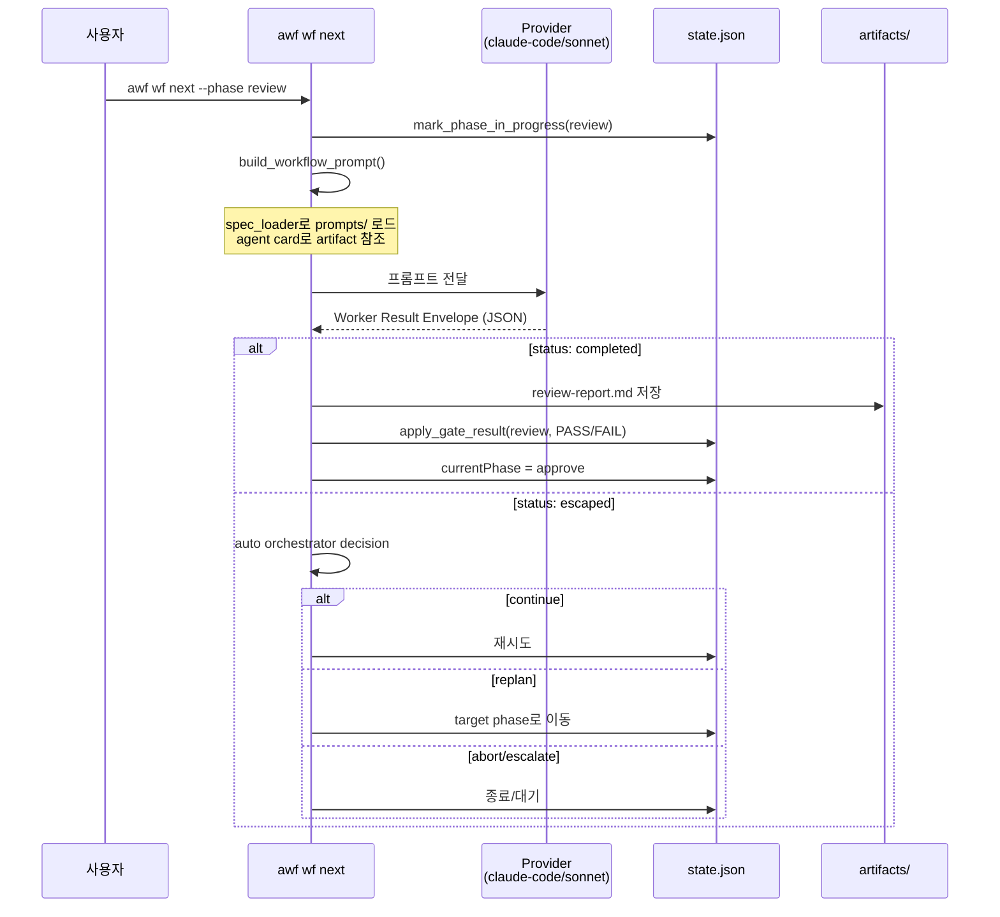
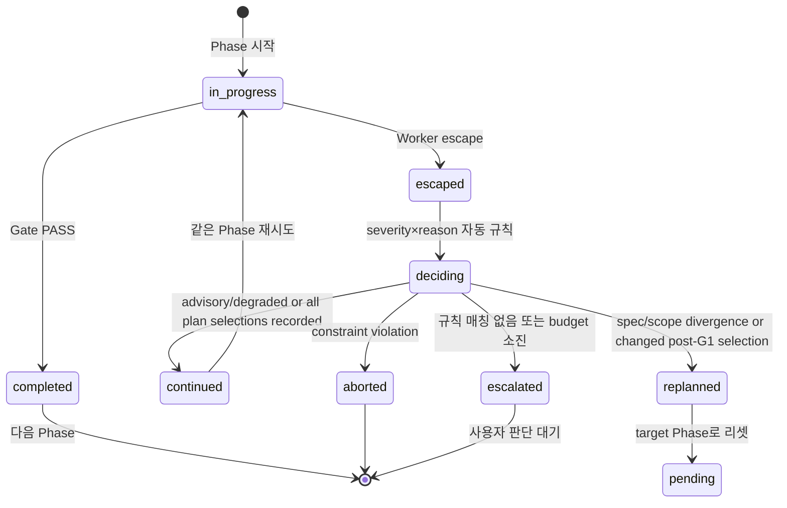

# Workflow Pipeline

## 개요

7-Phase 게이트 파이프라인. 기능 구현을 plan → review → approve → impl → verify → test → done 단계로 진행한다.

## Phase 흐름



## Phase 실행 시퀀스



## Closed-Loop (Escape → Decision)



## Planning Options lifecycle

plan worker는 requirement/convention으로 결정할 수 없는 material choice만 canonical
`.workflow/artifacts/planning-options.json`에 2개 또는 3개의 substantively
different option과 recommendation-first rationale으로 작성한다. 되돌릴 수 있거나
material하지 않은 선호는 질문하지 않는다.

`no_decision_required`는 non-empty reason을 기록하고 G1으로 계속한다.
`selection_required`는 worker가 state를 mutation하지 않은 채
`recommended_action: "user_decision"` escape를 반환한다. parent workflow가 plan을
`deciding`으로 전환한 뒤 user는 exact CLI로 append-only selection journal을 쓴다.

```bash
awf wf select-option --decision-id D-001 --option-id O-001 --actor "${AWF_OPERATOR:?set operator identity}" --repo-root . --json
```

Selected/no-decision rerun은 `constitution.md`, `spec.md`, `plan.md`, `tasks.md`,
`test-criteria.md`를 모두 만든 뒤 host-only provenance seal을 쓴다. Unselected
options는 seal할 수 없고, selection 또는 다섯 artifact 중 하나가 바뀌면 old seal은
stale라 G1이 `provenance_changed`로 막힌다.

```bash
awf wf seal-plan --repo-root . --json
```

partial selection은 `selected_pending`, all-selected plan은 `continued`이며,
selected/no-decision artifact는 plan rerun input이다. G1 후 selection 변경은
`replanned`: plan~done phases, retries/executions, runtime/skip marker와 G1–G6
initial shape(`G3.scope_hash: null`)를 reset하되 loop/history를 보존한다. same hash는
`reuse`. Missing manifest/profile plus absent artifact is `legacy_not_required`.
Only explicit `planning_options.required: false` plus absent artifact is
`not_required`. Every present artifact is strictly validated regardless of profile.

## Replan Budget

```
loop.replanCount / loop.maxReplans (기본: 3)
```

replan 시 count 증가. budget 소진 시 escalate_user.

## Provider 및 worker model 라우팅

`provider-config.json`의 `phase_models`는 phase 실행 effort와 선택적 inline
model을 정한다. model이 생략된 phase는 현재 provider의 기본 model을 사용하며,
문서가 특정 vendor model을 기본값으로 고정하지 않는다. 현재 template은
plan/review/verify에 `effort: "max"`, impl/test에 `effort: "high"`와
`inline_model: "sonnet"`을 둔다.

OMP native worker는 별도의 `dispatch.omp.role_models`를 사용한다:

| Worker role | 기본 OMP model alias |
|-------------|----------------------|
| `plan_conformance`, `precision` | `@default` |
| `quality_validation`, `primary` | `@slow` |
| `speed` | `@smol` |

role mapping은 native `task.agentModelOverrides`로 전달된다. 같은 agent type에
서로 다른 model을 지정하면 `omp_worker_model_conflict`로 실행 전에 차단한다.
기본 `execution_mode`는 `external_host`이며, `current_host`는 현재 host가
`task`/`hub` bridge를 제공할 때만 사용할 수 있다.

## 진실 공급원

| 관심사 | 소스 | 런타임 |
|--------|------|--------|
| Phase 계약 (gate, artifacts) | `claude/skills/wf-orchestrator/templates/agent-cards/{phase}.json` | `.workflow/agent-cards/{phase}.json` |
| Phase 설명/조건 | `claude/skills/phase-*/SKILL.md` | — |
| 프롬프트 템플릿 | `claude/skills/wf-orchestrator/prompts/*.md` | — |
| 워크플로우 상태 | — | `.workflow/state.json` |
