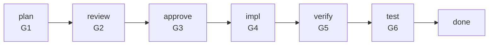
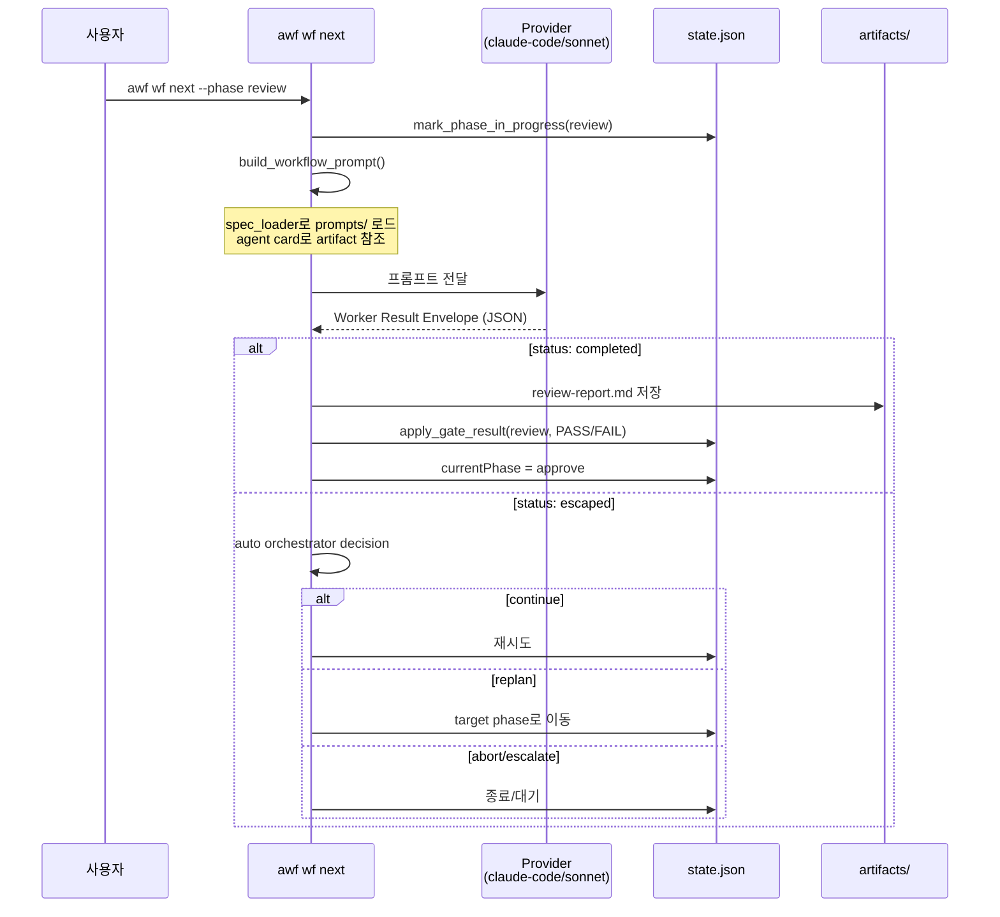
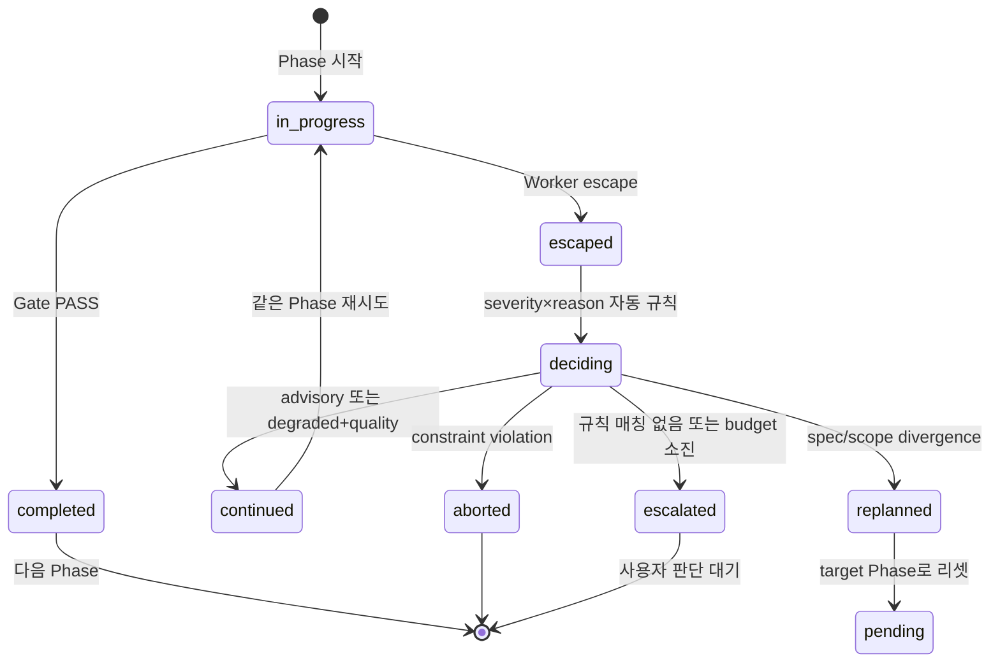

# Workflow Pipeline

## 개요

7-Phase 게이트 파이프라인. 기능 구현을 plan → review → approve → impl → verify → test → done 단계로 진행한다.

## Phase 흐름



## Phase 실행 시퀀스



## Closed-Loop (Escape → Decision)



## Replan Budget

```
loop.replanCount / loop.maxReplans (기본: 3)
```

replan 시 count 증가. budget 소진 시 escalate_user.

## Provider 및 worker model 라우팅

`provider-config.json`의 `phase_models`는 phase 실행 effort와 선택적 inline
model을 정한다. model이 생략된 phase는 현재 provider의 기본 model을 사용하며,
문서가 특정 vendor model을 기본값으로 고정하지 않는다. 현재 template은
plan/review/verify에 `effort: "max"`, impl/test에 `effort: "high"`와
`inline_model: "sonnet"`을 둔다.

OMP native worker는 별도의 `dispatch.omp.role_models`를 사용한다:

| Worker role | 기본 OMP model alias |
|-------------|----------------------|
| `plan_conformance`, `precision` | `@default` |
| `quality_validation`, `primary` | `@slow` |
| `speed` | `@smol` |

role mapping은 native `task.agentModelOverrides`로 전달된다. 같은 agent type에
서로 다른 model을 지정하면 `omp_worker_model_conflict`로 실행 전에 차단한다.
기본 `execution_mode`는 `external_host`이며, `current_host`는 현재 host가
`task`/`hub` bridge를 제공할 때만 사용할 수 있다.

## 진실 공급원

| 관심사 | 소스 | 런타임 |
|--------|------|--------|
| Phase 계약 (gate, artifacts) | `claude/skills/wf-orchestrator/templates/agent-cards/{phase}.json` | `.workflow/agent-cards/{phase}.json` |
| Phase 설명/조건 | `claude/skills/phase-*/SKILL.md` | — |
| 프롬프트 템플릿 | `claude/skills/wf-orchestrator/prompts/*.md` | — |
| 워크플로우 상태 | — | `.workflow/state.json` |
