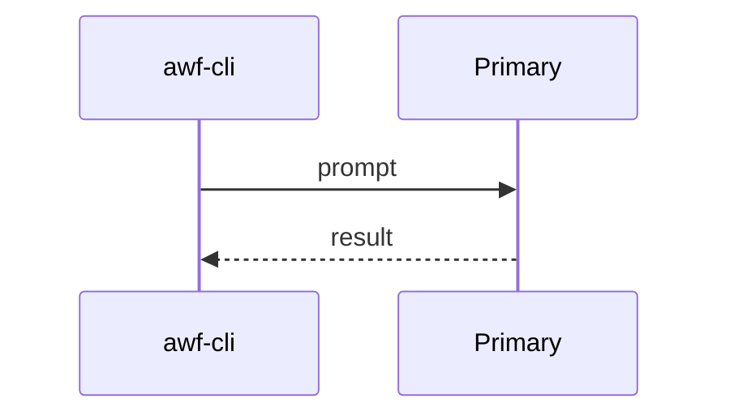
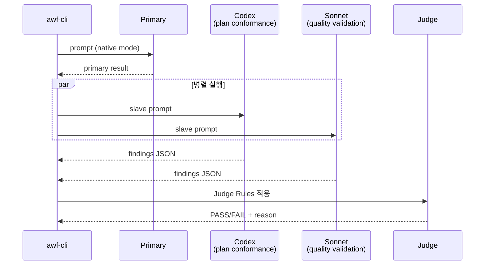
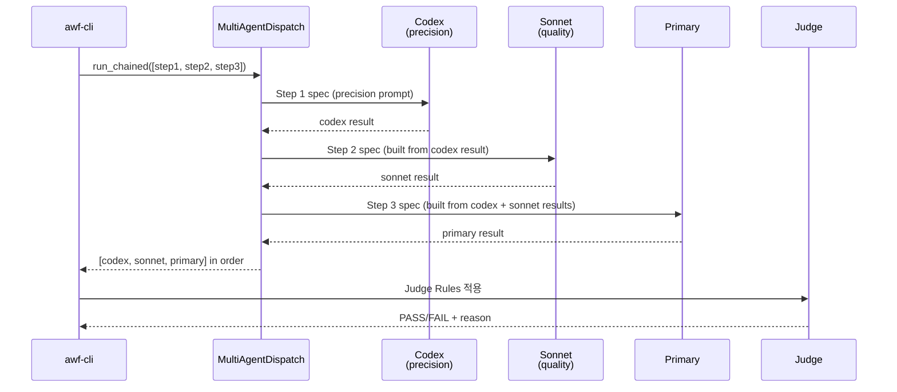
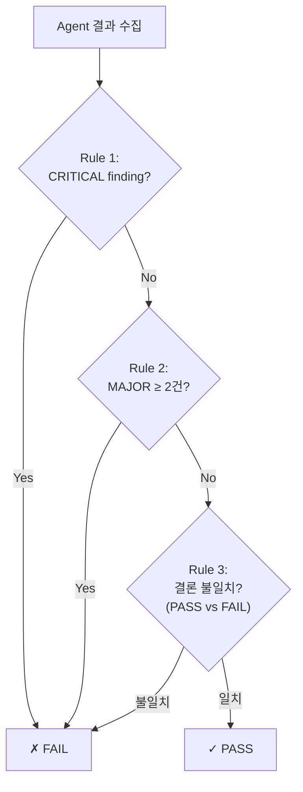
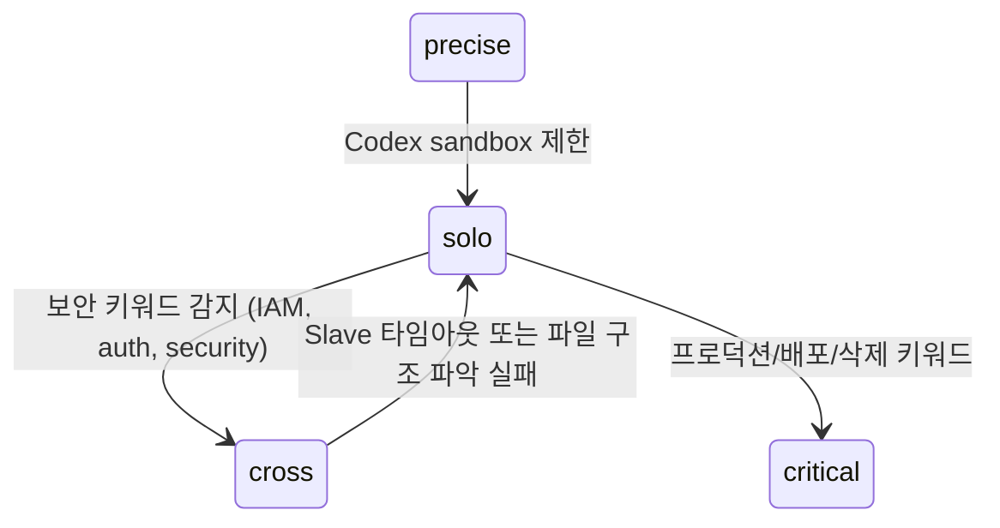

# Multi-Agent 교차 검증

## 개요

5가지 모드로 작업 복잡도에 따라 에이전트 조합을 자동 선택한다.

## 모드별 시퀀스

### solo (기본)



### cross (교차 검증)



### critical (순차 심층)



각 step은 `ChainedStep(role, factory)` 구조이며, `factory(prior_results)` 가 다음 단계의 `WorkerSpec` 을 만든다. cmux 백엔드 선택 시 같은 role 의 worker 가 chain 동안 고정되어 터미널 컨텍스트가 누적된다.

### precise (정밀)

```
Codex → Primary 순차. Codex 분석 → Primary 검증 + 보완.
```

### quick (빠른)

```
Codex only. read-only, 45초 timeout.
```

## Judge Rules



## 자동 승격/다운그레이드



## Slave 원칙

- Slave(Codex, Sonnet)는 **read-only 분석만** 수행
- 실제 파일 변경은 Primary(Master)만 사용자 승인 후 실행
- Codex: `sandbox: read-only` (MCP 기본)
- Sonnet: `--model sonnet --permission-mode default` by default; `--yolo` switches Claude Code to `bypassPermissions` for trusted automation.

## 에이전트 정의

`claude/agents/*.md` — 단일 소스. Claude Code는 frontmatter를 네이티브 소비, Codex는 body를 base-instructions로 주입.

| 에이전트 | 역할 | 사용 모드 |
|---------|------|---------|
| `plan-validator` | 요구사항 커버리지, 스코프 준수 | cross (Codex) |
| `quality-validator` | 엣지케이스, 회귀 리스크, 보안 | cross (Sonnet) |
| `code-reviewer` | 코드/설정 정밀 분석 + 빠른 분석 | precise, critical, quick |
| `adversarial-tester` | 경계 조건, 실패 모드, 보안 취약점 | team (Codex) |
| `happy-path-tester` | 정상 시나리오 수락 기준 검증 | team (Codex) |
| `artifact-reviewer` | spec↔plan↔tasks 교차 검증 | review phase |
| `spec-verifier` | spec 준수 검증 | verify phase |
| `spec-writer` | spec-kit 산출물 생성 | plan phase |
| `implementer` | tasks.md 순서대로 구현 | impl phase (worktree) |
| `analyzer` | 소스코드 분석 | analysis pipeline |
| `project-discoverer` | 프로젝트 식별 | wf-discovery |
| `analysis-docs-explorer` | 기술 문서 탐색 | analysis-docs |

> Legacy fallback: `skills/multi-agent/protocols/*.md`는 에이전트 미매칭 시 fallback으로 유지.

## 출력 가시성

```
=== multi-agent: cross mode ===
mode: cross — 2 agents parallel
  ✓ codex/plan_conformance (66s)
    결론: FAIL - spec obligations are not fully covered
    발견: 3건 (critical=2, major=1)
    주요: analysis-docs private repo 생성 task 누락
  ✓ claude:sonnet/quality_validation (96s)
    결론: PASS - no quality issues found
    발견: 이슈 없음
  ✗ 판정: FAIL — critical finding from codex
token_usage: input=13,000 output=3,000 total=16,000
cost_estimate: ~$0.0630
=== multi-agent: cross complete ===
```
