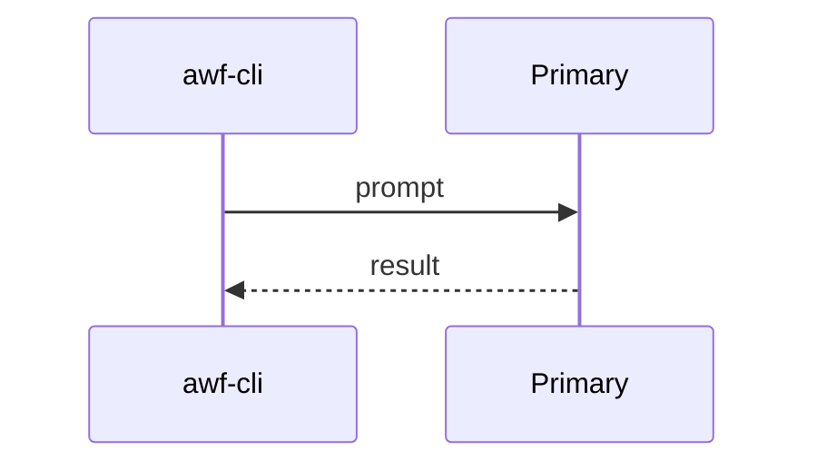
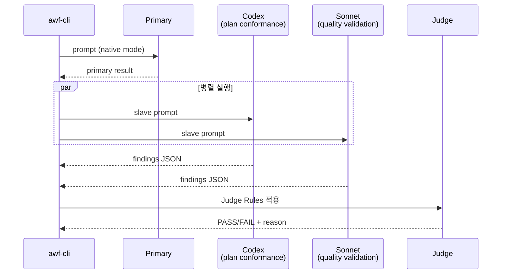
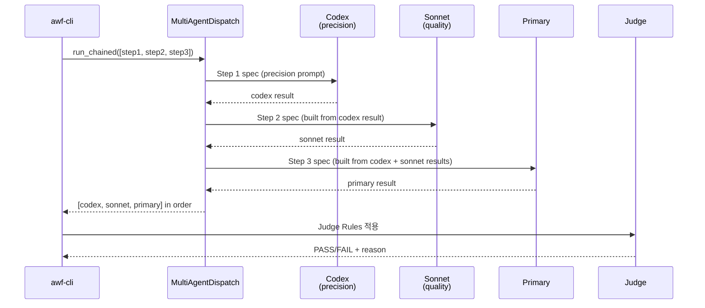
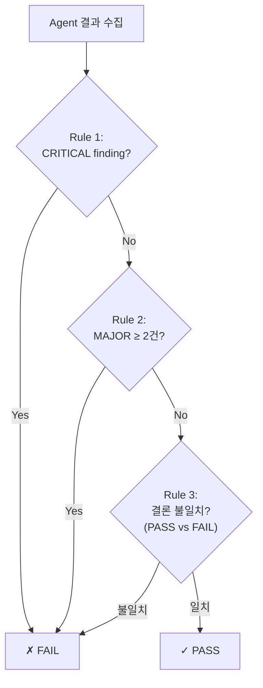
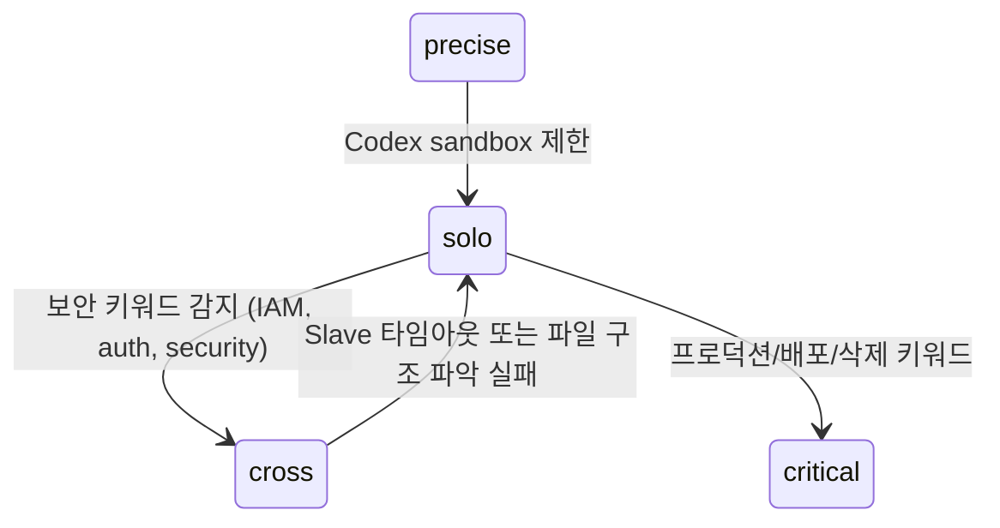

# Multi-Agent 교차 검증

## 개요

5가지 모드로 작업 복잡도에 따라 에이전트 조합을 자동 선택한다.

## 모드별 시퀀스

### solo (기본)



### cross (교차 검증)



### critical (순차 심층)



각 step은 `ChainedStep(role, factory)` 구조이며, `factory(prior_results)` 가 다음 단계의 `WorkerSpec` 을 만든다. cmux 백엔드 선택 시 같은 role 의 worker 가 chain 동안 고정되어 터미널 컨텍스트가 누적된다.

### precise (정밀)

```
Codex → Primary 순차. Codex 분석 → Primary 검증 + 보완.
```

### quick (빠른)

```
Codex only. read-only, 45초 timeout.
```

## Judge Rules



## 자동 승격/다운그레이드



## Slave 원칙

- Slave(Codex, Sonnet)는 **read-only 분석만** 수행
- 실제 파일 변경은 Primary(Master)만 사용자 승인 후 실행
- Codex: `sandbox: read-only` (MCP 기본)
- Sonnet: `--model sonnet --permission-mode default` by default; `--yolo` switches Claude Code to `bypassPermissions` for trusted automation.

## 에이전트 정의

`claude/agents/*.md` — 단일 소스. Claude Code는 frontmatter를 네이티브 소비, Codex는 body를 base-instructions로 주입.

| 에이전트 | 역할 | 사용 모드 |
|---------|------|---------|
| `plan-validator` | 요구사항 커버리지, 스코프 준수 | cross (Codex) |
| `quality-validator` | 엣지케이스, 회귀 리스크, 보안 | cross (Sonnet) |
| `code-reviewer` | 코드/설정 정밀 분석 + 빠른 분석 | precise, critical, quick |
| `adversarial-tester` | 경계 조건, 실패 모드, 보안 취약점 | team (Codex) |
| `happy-path-tester` | 정상 시나리오 수락 기준 검증 | team (Codex) |
| `artifact-reviewer` | spec↔plan↔tasks 교차 검증 | review phase |
| `spec-verifier` | spec 준수 검증 | verify phase |
| `spec-writer` | spec-kit 산출물 생성 | plan phase |
| `implementer` | tasks.md 순서대로 구현 | impl phase (worktree) |
| `analyzer` | 소스코드 분석 | analysis pipeline |
| `project-discoverer` | 프로젝트 식별 | wf-discovery |
| `analysis-docs-explorer` | 기술 문서 탐색 | analysis-docs |

> Legacy fallback: `skills/multi-agent/protocols/*.md`는 에이전트 미매칭 시 fallback으로 유지.

## 출력 가시성

```
=== multi-agent: cross mode ===
mode: cross — 2 agents parallel
  ✓ codex/plan_conformance (66s)
    결론: FAIL - spec obligations are not fully covered
    발견: 3건 (critical=2, major=1)
    주요: analysis-docs private repo 생성 task 누락
  ✓ claude:sonnet/quality_validation (96s)
    결론: PASS - no quality issues found
    발견: 이슈 없음
  ✗ 판정: FAIL — critical finding from codex
token_usage: input=13,000 output=3,000 total=16,000
cost_estimate: ~$0.0630
=== multi-agent: cross complete ===
```

## OMP와 벤더 멀티에이전트 비교 (2026-07-29)

| 항목 | OMP | Claude Code / Agent SDK | Codex | Gemini CLI / Google ADK |
|------|-----|-------------------------|-------|-------------------------|
| 모델 범위 | Anthropic, OpenAI, Google, 로컬/게이트웨이를 같은 registry와 role alias로 선택 | Claude 모델 및 Anthropic 실행 환경 중심 | GPT/Codex 모델 중심 | Gemini 모델 및 Google 실행 환경 중심 |
| 작업 분할 | heterogeneous batch `task`, agent별 model/effort/schema/isolation | subagent 병렬 실행; experimental agent teams는 shared task와 peer messaging 제공 | 병렬 subagent와 inspect/steer 가능한 agent thread | CLI subagent는 specialist-as-tool; ADK는 graph/dynamic/collaborative/template workflow 제공 |
| 에이전트 통신 | `hub` mailbox, direct/broadcast messaging, idle/parked agent revive | subagent는 parent 반환; agent teams는 teammate direct messaging | parent가 spawn/steer/collect하는 thread 중심 | CLI subagent는 parent 반환; ADK collaborative workflow는 coordinator 중심 |
| 실행 격리 | agent별 workspace isolation, patch/branch merge, recursion/concurrency guard | permission/tool 제한과 독립 context; agent teams는 별도 Claude Code session | parent sandbox 상속, 별도 agent thread | 독립 context/tool 제한; ADK는 애플리케이션이 실행 정책 소유 |
| 관찰성 | `agent://`, `history://`, background job lifecycle, live progress, process supervision | agent panel, transcript, hooks | client별 agent activity/thread UI | CLI agent tool result; ADK event/session 추적 |
| 사람 협업 | E2E 암호화된 `/collab`, agent hub 제어, view-only link | lead UI와 teammate pane | app/CLI/IDE agent thread inspection | CLI 또는 ADK 애플리케이션 UI에 의존 |
| 워크플로우 결정성 | 런타임 primitive는 강력하지만 gate/DAG는 상위 계층이 정의 | subagent는 모델 주도, agent teams task list는 experimental | 모델 또는 SDK 코드가 orchestration | ADK graph/template이 가장 명시적인 결정론적 흐름 제공 |

### OMP가 우세한 지점

1. **벤더 중립 라우팅**: 하나의 agent graph 안에서 provider/model을 worker별로
   바꿀 수 있고, canonical model ID와 `@smol`/`@slow`/`@task` 같은 role로
   구체 모델 교체 비용을 낮춥니다.
2. **실행 substrate 완성도**: batch fan-out, per-agent structured output,
   filesystem isolation, patch merge, background job, lifecycle revive가 한 surface에
   결합되어 있습니다.
3. **수평 통신**: parent-return만 제공하는 일반 subagent보다 `hub` 기반 peer
   messaging이 긴 작업의 재조정과 교차 검증에 유리합니다.
4. **증거 보존**: 결과, transcript, patch, nested agent artifact가 안정적인 내부
   URI로 남아 gate evidence와 사후 분석에 연결하기 쉽습니다.
5. **운영자 개입**: 실행 중 agent를 inspect/steer/cancel/revive할 수 있고,
   `/collab`으로 원격 동료가 같은 세션과 subagent를 관찰하거나 제어할 수 있습니다.

### OMP 내부 런타임과 awf 전용 오케스트레이터 비교

2026-07-29에 로컬 설치된 OMP 17.1.8의 실제 구현을 기준으로 비교했다.
OMP는 범용 **멀티에이전트 실행 커널**, awf는 개발 수명주기를 통제하는
**결정론적 workflow/gate 계층**이다. 따라서 둘은 대체재보다 상하위 계층에 가깝다.

| 축 | OMP 내부 멀티에이전트 | awf 멀티에이전트 | 판정 |
|----|----------------------|-------------------|------|
| 상태의 기준 | process-global agent registry, session JSONL, `task`/`hub` job state | `.workflow/state.json`, phase artifacts, scope hash | 장기 workflow 진실은 awf가 우세 |
| fan-out | batch `task`, session 단위 semaphore, async job, recursion/concurrency 제한, all-settled 결과 | `WorkerSpec` + inline thread pool/cmux/OMP/Pi dispatch, phase별 parallel/sequential | 범용 실행 안정성은 OMP가 우세 |
| 수평 협업 | `hub` direct/broadcast, reply wait, inbox, idle wake, parked revive | file blackboard로 turn 간 공유; sequential team은 같은 turn의 이전 결과를 읽음 | 실시간 재조정은 OMP가 우세 |
| 수명주기 | keep-alive, idle → park → revive, transcript를 보존한 follow-up turn | 기본 worker는 one-shot `AgentResult`; cmux만 reusable worker 지원 | OMP가 우세 |
| 격리/병합 | spawn별 worktree, patch/branch 모드, nested repo patch, 실패 artifact 보존, owner job reap | impl phase worktree와 cmux 격리는 있으나 모든 dispatch worker의 공통 계약은 아님 | OMP가 우세 |
| 출력 계약 | spawn별 JSON Schema, permissive/strict mode, output artifact, usage/cost | `require_json`과 4-Block 관례, `AgentResult` parser | schema 강제력은 OMP가 우세 |
| 모델 라우팅 | registry/role alias, agent별 override, auth·retry fallback, provider service tier | phase/provider/role config와 cross-vendor 고정 모드, readiness fallback | OMP는 동적 실행, awf는 재현 가능한 정책에 강점 |
| 판단/종료 | runtime은 결과를 보존하며 최종 판단은 parent에 위임 | severity dedup, fail-closed judge, team turn/timeout 종료 규칙 | workflow 판정은 awf가 우세 |
| 승인 경계 | headless child는 parent task 승인을 권한 경계로 사용하고 approval policy를 상속 | approve/done과 scope hash를 parent-only gate로 강제 | HIL과 변경 통제는 awf가 우세 |
| 운영 증거 | live event, `agent://`, `history://`, job snapshot, `/collab` | readiness gate, dispatch provenance, operations event/wiki, phase result | 서로 보완적 |

#### OMP가 awf보다 나은 점

1. **structured concurrency**: cancellation 시 새 작업을 막고 시작된 worker를 정리하며,
   child가 남긴 background process도 owner 기준으로 reap한 뒤 isolation을 정리한다.
2. **상태를 가진 협업**: agent가 결과 문자열만 반환하는 것이 아니라 살아 있는 peer로
   남아 message, follow-up, park/revive를 지원한다.
3. **실행 계약의 세밀함**: agent별 model/effort/schema/isolation/tool/spawn 정책을
   하나의 task 호출에서 다르게 지정할 수 있다.
4. **안전한 병렬 쓰기 기반**: 격리 worktree에서 변경을 수집하고 merge 실패 시 patch를
   보존하므로 병렬 구현의 실패가 곧 작업 유실로 이어지지 않는다.
5. **런타임 관찰성**: request/token/cost, resolved fallback model, 최근 tool/output,
   agent/job 상태가 실행 중에도 노출된다.

#### awf가 OMP보다 나은 점

1. **결정론적 개발 수명주기**: plan → review → approve → impl → verify → test → done의
   전이, gate, retry 한도를 Python이 통제한다.
2. **fail-closed 품질 정책**: provider가 달라도 동일한 severity/judge 규칙과 team
   termination 규칙을 적용한다. OMP 자체에는 domain-specific judge가 없다.
3. **canonical artifact와 HIL**: scope hash, phase result, 승인 이력이 agent session과
   분리되어 있어 runtime 교체나 재실행에도 workflow 의미가 유지된다.
4. **명시적 cross-vendor 검증**: Codex/Claude/Gemini/OpenAI를 역할별로 고정해 독립
   관점을 만들 수 있고, provider 부재와 fallback을 readiness 단계에서 진단한다.
5. **운영 집계**: 개별 agent transcript보다 상위인 dispatch/phase 단위 성공률,
   timeout, provenance를 repo-local operations 기록으로 합성한다.

#### 현재 통합의 핵심 한계

`OmpDispatch`는 worker마다 `omp --mode json --no-session -p ...`를 실행하는
**NDJSON print adapter**다. 따라서 model/provider/usage/provenance는 얻지만, 그 N개
worker가 하나의 OMP host session 아래서 `task` batch와 `hub`를 공유하지는 않는다.
OMP-native `task`/`hub` 경로는 OMP 안에서 wf skill을 실행할 때만 활성화된다. 현재
구현은 OMP의 모델 실행기를 연결한 P1이며, OMP의 멀티에이전트 커널 전체를 awf
dispatch backend로 연결한 상태는 아니다.

정성 평가(10점 만점, 위 소스 계약 기준)는 실행 커널 OMP 9.5 / awf 6.5,
workflow 결정성 OMP 5.0 / awf 9.0, 실시간 agent 협업 OMP 9.5 / awf 5.0,
gate·HIL OMP 4.5 / awf 9.5다. 합산 순위는 의미가 없다. 최적 구조는
**awf가 state/gate/judge를 소유하고 OMP가 fan-out/session/isolation을 소유하는 것**이다.

### awf/wf 구현 상태와 다음 우선순위

| 상태 | 우선순위 | 항목 | 구현/다음 방향 |
|------|----------|------|----------------|
| 완료 | P0 | concrete model ID 중복 | SDK 기본값은 `model_defaults.py`에서 관리하고 CLI provider는 role alias/native auto-selection 사용 |
| 완료 | P1 | OMP 실행 surface | `surface_preference=omp` NDJSON adapter와 OMP host-native `task`/`hub` skill 경로 분리 |
| 완료 | P1 | OMP agent discovery | `awf agents sync-omp`가 `claude/agents`를 `.omp/agents`로 변환하고 manifest로 생성 파일 소유권 관리 |
| 완료 | P1 | OMP dispatch provenance | CLI adapter가 session/provider/model/usage/response hash를 `.workflow/artifacts/dispatch/omp-*.json`에 저장; host-native task URI는 phase evidence에 연결 |
| 완료 | P1 | workflow HIL 경계 | approve/done과 scope hash 승인은 parent-only, OMP runtime state는 gate evidence로만 취급 |
| 예정 | P2 | OMP native coordinator bridge | worker별 subprocess 대신 단일 OMP host session이 `.omp/agents`를 `task` batch로 실행하고 task ID, `agent://`/`history://`, hub transcript를 정규화해 반환 |
| 예정 | P2 | dispatch contract parity | `WorkerSpec`에 output schema/mode, isolation, agent type을 추가하고 OMP strict schema 결과를 `AgentResult`에 보존 |
| 예정 | P2 | structured cancellation/capacity | inline/OMP backend에 전역 concurrency cap, cancellation propagation, partial-result 보존, child process reap 계약 추가 |
| 예정 | P2 | capability/cost-aware routing | OMP role alias와 awf usage/latency/quota telemetry를 결합하되 선택 근거와 resolved model을 provenance에 고정 |
| 예정 | P2 | evidence-aware judge v2 | disagreement 자체는 재검증 대상으로 보내고 evidence quality, confidence, reproducibility를 판정에 추가; critical/high는 기존 fail-closed 유지 |
| 예정 | P2 | cross-runtime conformance | 동일 fixture를 OMP native, OMP print adapter, Claude teams/subagents, Codex subagents, Gemini/ADK에서 실행해 결과·취소·격리·provenance 계약 비교 |
| 예정 | P3 | durable agent follow-up | workflow phase evidence에 OMP agent handle을 연결해 inspect/steer/revive를 허용하되 approve/done 권한은 parent에만 유지 |

### 안전 경계

- OMP의 todo/agent registry는 실행 상태이며 `.workflow/state.json`을 대체하지 않습니다.
- `agent://`와 `history://`는 evidence/provenance이고 gate 자체가 아닙니다.
- headless subagent가 approve/done HIL 또는 사용자 권한 승인을 대신할 수 없습니다.
- 병렬 write는 파일 소유권 또는 isolation/merge 계약이 있을 때만 허용합니다.

### 근거 문서

- [OMP task implementation](https://github.com/can1357/oh-my-pi/blob/main/packages/coding-agent/src/task/index.ts)
- [OMP subagent lifecycle and structured cleanup](https://github.com/can1357/oh-my-pi/blob/main/packages/coding-agent/src/task/executor.ts)
- [OMP hub implementation](https://github.com/can1357/oh-my-pi/tree/main/packages/coding-agent/src/tools/hub)
- [awf dispatch contract](../../cli/src/awf/core/dispatch.py)
- [awf deterministic judge](../../cli/src/awf/core/multi_agent.py)
- [awf team runner](../../cli/src/awf/core/team_runner.py)
- [OMP task runtime](https://github.com/can1357/oh-my-pi/blob/main/docs/tools/task.md)
- [OMP model/provider configuration](https://github.com/can1357/oh-my-pi/blob/main/docs/models.md)
- [Claude Agent SDK subagents](https://code.claude.com/docs/en/agent-sdk/subagents)
- [Claude Code agent teams](https://code.claude.com/docs/en/agent-teams)
- [Codex subagents](https://developers.openai.com/codex/multi-agent/)
- [OpenAI Agents SDK orchestration](https://openai.github.io/openai-agents-python/multi_agent/)
- [Gemini CLI subagents](https://geminicli.com/docs/core/subagents/)
- [Google ADK workflows](https://adk.dev/workflows/)
