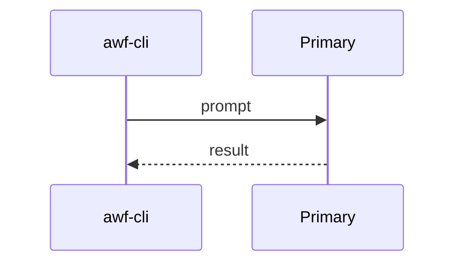
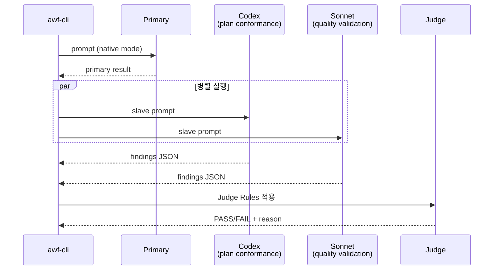
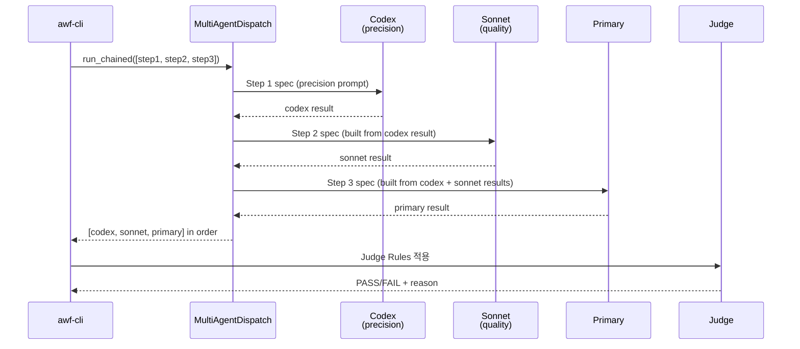
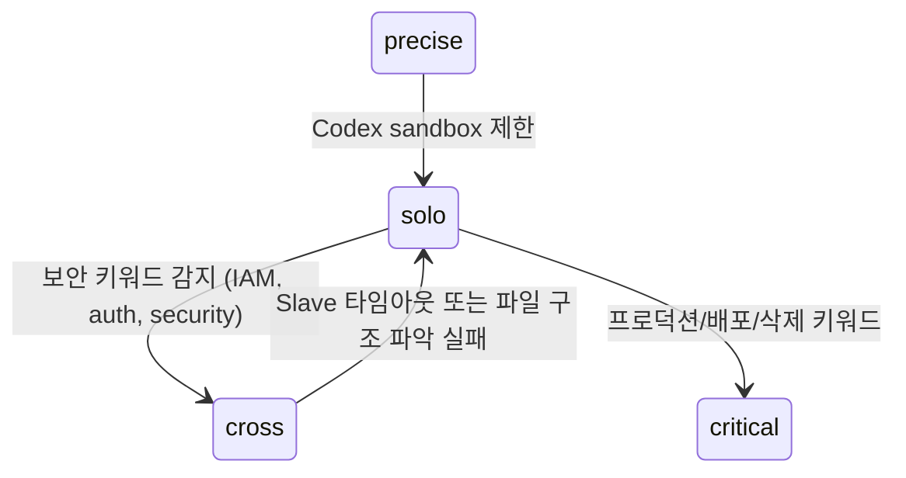

# Multi-Agent 교차 검증

## 개요

5가지 모드로 작업 복잡도에 따라 에이전트 조합을 자동 선택한다.

## 모드별 시퀀스

### solo (기본)



### cross (교차 검증)



### critical (순차 심층)



각 step은 `ChainedStep(role, factory)` 구조이며, `factory(prior_results)` 가 다음 단계의 `WorkerSpec` 을 만든다. cmux 백엔드 선택 시 같은 role 의 worker 가 chain 동안 고정되어 터미널 컨텍스트가 누적된다.

### precise (정밀)

```
Codex → Primary 순차. Codex 분석 → Primary 검증 + 보완.
```

### quick (빠른)

```
Codex only. read-only, 45초 timeout.
```

## Judge Rules v2

판정은 입력 순서와 아래 우선순위만 사용하므로 동일한 `AgentResult` 목록은 항상
동일한 verdict를 만든다.

1. 결과가 없으면 `FAIL`.
2. 실행 성공 여부와 무관하게 `CRITICAL`/`HIGH` finding이 하나라도 있으면 `FAIL`.
3. `category:location`으로 중복 제거한 `MAJOR`/`MEDIUM` finding이 2개 이상이면 `FAIL`.
4. `PASS`/`FAIL` 불일치일 때만 실패 측 evidence score(0–5)를 적용한다. 유효 실행
   +1, high/`>=0.8` confidence +2 또는 medium/`>=0.5` +1, 실제 evidence/location
   +1, 재현 가능한 file:line·command·test/result +1이다. `FAIL`을 확정하려면 실패
   agent가 유효하고 score가 3 이상이며 실제 evidence 또는 재현 정보가 있어야 한다.
   confidence만으로는 grounded failure가 되지 않으며, 나머지는
   `ESCALATE`와 `revalidation_required:` reason을 반환한다.
5. 모든 명시적 결론이 `FAIL`이면 `FAIL`. `PASS`와 invalid/missing conclusion이
   섞이면 `ESCALATE`; 결론이 전혀 없고 실행도 invalid면 `FAIL`.
6. 그 뒤 기존 detailed-agent 우선 규칙을 적용하고, unanimous `PASS` 또는 유효한
   legacy unstructured success는 `PASS`.

여러 실패 agent 중에서는 유효 실행을 먼저, 그 안에서 evidence score가 높은 결과를
먼저 사용하며 동점은 입력 순서를 보존한다. `precise`/`cross`/`critical`은 이 verdict를
변환하지 않고 `MultiAgentResult`에 그대로 보존한다.

## 자동 승격/다운그레이드



## Slave 원칙

- Slave(Codex, Sonnet)는 **read-only 분석만** 수행
- 실제 파일 변경은 Primary(Master)만 사용자 승인 후 실행
- Codex: `sandbox: read-only` (MCP 기본)
- Sonnet: `--model sonnet --permission-mode default` by default; `--yolo` switches Claude Code to `bypassPermissions` for trusted automation.

## 에이전트 정의

`claude/agents/*.md` — 단일 소스. Claude Code는 frontmatter를 네이티브 소비, Codex는 body를 base-instructions로 주입.

| 에이전트 | 역할 | 사용 모드 |
|---------|------|---------|
| `plan-validator` | 요구사항 커버리지, 스코프 준수 | cross (Codex) |
| `quality-validator` | 엣지케이스, 회귀 리스크, 보안 | cross (Sonnet) |
| `code-reviewer` | 코드/설정 정밀 분석 + 빠른 분석 | precise, critical, quick |
| `adversarial-tester` | 경계 조건, 실패 모드, 보안 취약점 | team (Codex) |
| `happy-path-tester` | 정상 시나리오 수락 기준 검증 | team (Codex) |
| `artifact-reviewer` | spec↔plan↔tasks 교차 검증 | review phase |
| `spec-verifier` | spec 준수 검증 | verify phase |
| `spec-writer` | spec-kit 산출물 생성 | plan phase |
| `implementer` | tasks.md 순서대로 구현 | impl phase (worktree) |
| `analyzer` | 소스코드 분석 | analysis pipeline |
| `project-discoverer` | 프로젝트 식별 | wf-discovery |
| `analysis-docs-explorer` | 기술 문서 탐색 | analysis-docs |

> Legacy fallback: `skills/multi-agent/protocols/*.md`는 에이전트 미매칭 시 fallback으로 유지.

## 출력 가시성

```
=== multi-agent: cross mode ===
mode: cross — 2 agents parallel
  ✓ codex/plan_conformance (66s)
    결론: FAIL - spec obligations are not fully covered
    발견: 3건 (critical=2, major=1)
    주요: analysis-docs private repo 생성 task 누락
  ✓ claude:sonnet/quality_validation (96s)
    결론: PASS - no quality issues found
    발견: 이슈 없음
  ✗ 판정: FAIL — critical finding from codex
token_usage: input=13,000 output=3,000 total=16,000
cost_estimate: ~$0.0630
=== multi-agent: cross complete ===
```

## 런타임 계약 근거 행렬

`measured/local`은 이 저장소의 실제 adapter를 동일한 offline fixture corpus와 fake
외부 경계로 실행한다는 뜻이다. `mapped/external`은 공개 런타임 계약을 awf 용어로
대응시킨 것일 뿐, 이 suite가 해당 벤더 런타임을 실행했다는 뜻이 아니다.

| 로컬 surface | 근거 | 정렬·부분 결과 | 취소/timeout | strict schema | isolation | durable follow-up | provenance |
|--------------|------|----------------|--------------|---------------|-----------|-------------------|------------|
| inline | measured/local fake provider | 입력 순서, 명시 실패 보존 | 완료 후 timeout 판정; active cancel 없음 | 미지원 (`require_json`만) | 미지원 | 미지원 | dispatch 기록 없음 |
| cmux adapter | measured/local fake bridge | 입력 순서; 명시 실패 채널 없이 timeout만 | deadline 만료, active cancel 없음 | 미지원 (`require_json`만) | `WorkerSpec.isolated` 미지원 | durable handle 미지원 | OMP 기록 없음 |
| OMP print adapter | measured/local fake NDJSON | 입력 순서, subprocess 실패 보존 | worker별 subprocess timeout | 미지원 (`require_json`만) | 미지원 | 미지원 | schema v2 hash/실행 metadata |
| OMP native coordinator | measured/local fake host `task` batch | 입력 순서, 완료 partial 보존 | structured batch cancel, host/child reap | strict/permissive 지원 | worker별 지원 | session + `agent://`/`history://` | schema v2 handle/lineage/hash |
| legacy Pi adapter | measured/local fake print process | 입력 순서, subprocess 실패 보존 | worker별 subprocess timeout | 미지원 (`require_json`만) | 미지원 | 미지원 | dispatch 기록 없음 |

| 외부 runtime | 근거 상태 | awf 계약 매핑 | 이 저장소의 실행 주장 |
|--------------|-----------|---------------|-------------------------|
| Claude Code agent teams | mapped/external | shared task + teammate message → batch/peer coordination | 없음 |
| Claude subagents / Agent SDK | mapped/external | parent invoke/collect → ordered `AgentResult` | 없음 |
| Codex subagents | mapped/external | spawn/steer/collect thread → coordinator mapping | 없음 |
| Gemini CLI subagents | mapped/external | specialist-as-tool → parent result mapping | 없음 |
| Google ADK | mapped/external | application workflow graph/event/session → orchestration mapping | 없음 |

### Native OMP 역할별 model 무결성

기본 provider template은 worker 역할과 model alias를 분리한다.

| AWF worker role | OMP model alias |
|-----------------|-----------------|
| `plan_conformance`, `precision` | `@default` |
| `quality_validation`, `primary` | `@slow` |
| `speed` | `@smol` |

`OmpDispatch`는 role mapping을 `OmpWorkerTask.model`에 보존한다. external-host
native coordinator는 임시 OMP config의 `task.agentModelOverrides`로 이를
전달하고, current-host bridge에는 정렬된 immutable mapping을 넘긴다. 결과
provenance에는 `requested_worker_model`이 기록된다.

OMP override key는 AWF role이 아니라 최종 agent type이다. 같은 native batch에서
동일 agent type에 서로 다른 model을 요구하면 어느 쪽도 임의 선택하지 않고
`omp_worker_model_conflict`로 batch 전체를 차단한다. 이 검사는 cross-provider
검증이 coordinator 기본 model 하나로 축소되는 것을 막는다.

## OMP와 벤더 멀티에이전트 비교 (2026-07-29)

| 항목 | OMP | Claude Code / Agent SDK | Codex | Gemini CLI / Google ADK |
|------|-----|-------------------------|-------|-------------------------|
| 모델 범위 | Anthropic, OpenAI, Google, 로컬/게이트웨이를 같은 registry와 role alias로 선택 | Claude 모델 및 Anthropic 실행 환경 중심 | GPT/Codex 모델 중심 | Gemini 모델 및 Google 실행 환경 중심 |
| 작업 분할 | heterogeneous batch `task`, agent별 model/effort/schema/isolation | subagent 병렬 실행; experimental agent teams는 shared task와 peer messaging 제공 | 병렬 subagent와 inspect/steer 가능한 agent thread | CLI subagent는 specialist-as-tool; ADK는 graph/dynamic/collaborative/template workflow 제공 |
| 에이전트 통신 | `hub` mailbox, direct/broadcast messaging, idle/parked agent revive | subagent는 parent 반환; agent teams는 teammate direct messaging | parent가 spawn/steer/collect하는 thread 중심 | CLI subagent는 parent 반환; ADK collaborative workflow는 coordinator 중심 |
| 실행 격리 | agent별 workspace isolation, patch/branch merge, recursion/concurrency guard | permission/tool 제한과 독립 context; agent teams는 별도 Claude Code session | parent sandbox 상속, 별도 agent thread | 독립 context/tool 제한; ADK는 애플리케이션이 실행 정책 소유 |
| 관찰성 | `agent://`, `history://`, background job lifecycle, live progress, process supervision | agent panel, transcript, hooks | client별 agent activity/thread UI | CLI agent tool result; ADK event/session 추적 |
| 사람 협업 | E2E 암호화된 `/collab`, agent hub 제어, view-only link | lead UI와 teammate pane | app/CLI/IDE agent thread inspection | CLI 또는 ADK 애플리케이션 UI에 의존 |
| 워크플로우 결정성 | 런타임 primitive는 강력하지만 gate/DAG는 상위 계층이 정의 | subagent는 모델 주도, agent teams task list는 experimental | 모델 또는 SDK 코드가 orchestration | ADK graph/template이 가장 명시적인 결정론적 흐름 제공 |

### OMP가 우세한 지점

1. **벤더 중립 라우팅**: 하나의 agent graph 안에서 provider/model을 worker별로
   바꿀 수 있고, canonical model ID와 `@smol`/`@slow`/`@task` 같은 role로
   구체 모델 교체 비용을 낮춥니다.
2. **실행 substrate 완성도**: batch fan-out, per-agent structured output,
   filesystem isolation, patch merge, background job, lifecycle revive가 한 surface에
   결합되어 있습니다.
3. **수평 통신**: parent-return만 제공하는 일반 subagent보다 `hub` 기반 peer
   messaging이 긴 작업의 재조정과 교차 검증에 유리합니다.
4. **증거 보존**: 결과, transcript, patch, nested agent artifact가 안정적인 내부
   URI로 남아 gate evidence와 사후 분석에 연결하기 쉽습니다.
5. **운영자 개입**: 실행 중 agent를 inspect/steer/cancel/revive할 수 있고,
   `/collab`으로 원격 동료가 같은 세션과 subagent를 관찰하거나 제어할 수 있습니다.

### OMP 내부 런타임과 awf 전용 오케스트레이터 비교

2026-07-29에 로컬 설치된 OMP 17.1.8의 실제 구현을 기준으로 비교했다.
OMP는 범용 **멀티에이전트 실행 커널**, awf는 개발 수명주기를 통제하는
**결정론적 workflow/gate 계층**이다. 따라서 둘은 대체재보다 상하위 계층에 가깝다.

| 축 | OMP 내부 멀티에이전트 | awf 멀티에이전트 | 판정 |
|----|----------------------|-------------------|------|
| 상태의 기준 | process-global agent registry, session JSONL, `task`/`hub` job state | `.workflow/state.json`, phase artifacts, scope hash | 장기 workflow 진실은 awf가 우세 |
| fan-out | batch `task`, session 단위 semaphore, async job, recursion/concurrency 제한, all-settled 결과 | `WorkerSpec` + inline thread pool/cmux/OMP/Pi dispatch, phase별 parallel/sequential | 범용 실행 안정성은 OMP가 우세 |
| 수평 협업 | `hub` direct/broadcast, reply wait, inbox, idle wake, parked revive | file blackboard로 turn 간 공유; sequential team은 같은 turn의 이전 결과를 읽음 | 실시간 재조정은 OMP가 우세 |
| 수명주기 | keep-alive, idle → park → revive, transcript를 보존한 follow-up turn | 기본 worker는 one-shot; OMP native는 session/agent handle follow-up, cmux는 reusable worker 지원 | durable 협업은 OMP가 우세 |
| 격리/병합 | spawn별 worktree, patch/branch 모드, nested repo patch, 실패 artifact 보존, owner job reap | impl phase worktree와 cmux 격리는 있으나 모든 dispatch worker의 공통 계약은 아님 | OMP가 우세 |
| 출력 계약 | spawn별 JSON Schema, permissive/strict mode, output artifact, usage/cost | `WorkerSpec` schema/mode를 native surface가 강제하고 legacy surface는 `require_json` parser만 사용 | native는 동등, legacy는 OMP가 우세 |
| 모델 라우팅 | registry/role alias, agent별 override, auth·retry fallback, provider service tier | phase/provider/role policy 뒤 capability와 cost/budget으로 후보를 filter | OMP는 동적 실행, awf는 재현 가능한 정책에 강점 |
| 판단/종료 | runtime은 결과를 보존하며 최종 판단은 parent에 위임 | severity dedup + evidence-aware judge v2 + team turn/timeout 종료 규칙 | workflow 판정은 awf가 우세 |
| 승인 경계 | headless child는 parent task 승인을 권한 경계로 사용하고 approval policy를 상속 | approve/done과 scope hash를 parent-only gate로 강제 | HIL과 변경 통제는 awf가 우세 |
| 운영 증거 | live event, `agent://`, `history://`, job snapshot, `/collab` | readiness gate, dispatch provenance, operations event/wiki, phase result | 서로 보완적 |

#### OMP가 awf보다 나은 점

1. **structured concurrency**: cancellation 시 새 작업을 막고 시작된 worker를 정리하며,
   child가 남긴 background process도 owner 기준으로 reap한 뒤 isolation을 정리한다.
2. **상태를 가진 협업**: agent가 결과 문자열만 반환하는 것이 아니라 살아 있는 peer로
   남아 message, follow-up, park/revive를 지원한다.
3. **실행 계약의 세밀함**: agent별 model/effort/schema/isolation/tool/spawn 정책을
   하나의 task 호출에서 다르게 지정할 수 있다.
4. **안전한 병렬 쓰기 기반**: 격리 worktree에서 변경을 수집하고 merge 실패 시 patch를
   보존하므로 병렬 구현의 실패가 곧 작업 유실로 이어지지 않는다.
5. **런타임 관찰성**: request/token/cost, resolved fallback model, 최근 tool/output,
   agent/job 상태가 실행 중에도 노출된다.

#### awf가 OMP보다 나은 점

1. **결정론적 개발 수명주기**: plan → review → approve → impl → verify → test → done의
   전이, gate, retry 한도를 Python이 통제한다.
2. **결정론적 품질 정책**: critical/high와 중복 제거된 다중 major는 fail closed,
   grounded disagreement는 `FAIL`, 약하거나 재현 불가한 disagreement는 재검증으로 보낸다.
3. **canonical artifact와 HIL**: scope hash, phase result, 승인 이력이 agent session과
   분리되어 있어 runtime 교체나 재실행에도 workflow 의미가 유지된다.
4. **명시적 cross-vendor 검증**: Codex/Claude/Gemini/OpenAI를 역할별로 고정해 독립
   관점을 만들 수 있고, provider 부재와 fallback을 readiness 단계에서 진단한다.
5. **운영 집계**: 개별 agent transcript보다 상위인 dispatch/phase 단위 성공률,
   timeout, provenance를 repo-local operations 기록으로 합성한다.

#### 현재 통합 경계

`OmpDispatch`는 `coordination_surface`에 따라 두 경로를 사용한다. print
adapter는 worker별 `omp --mode json -p ...` subprocess를 실행한다. native
coordinator는 external-host 모드에서 병렬 batch마다 단일 OMP host session을
열고 한 번의 `task` batch를 호출한다. current-host 모드는 현재 host가 제공한
`task`/`hub` bridge만 사용하며, bridge가 없을 때 nested subprocess나 inline으로
조용히 fallback하지 않는다.

두 경로 모두 `AgentResult`로 정규화하지만 strict schema, worker isolation,
structured batch cancellation, role별 immutable model override, `task_id`,
`agent://`/`history://`, durable checkpoint/follow-up은 native surface에만 있다.
checkpoint와 dispatch provenance는 strict schema 및 worker identity 검증을
통과해야 follow-up 입력으로 사용할 수 있다.

awf는 계속 `.workflow/state.json`, phase transition, scope hash, approve/done
gate와 최종 judge를 소유한다. OMP session/registry와 follow-up handle은
provenance/evidence일 뿐 canonical workflow state나 parent-only 승인 권한을
대체하지 않는다. 최적 구조는 **awf가 state/gate/judge를 소유하고 OMP가
fan-out/session/isolation을 소유하는 것**이다.

### awf/wf 구현 상태와 다음 우선순위

| 상태 | 우선순위 | 항목 | 구현/다음 방향 |
|------|----------|------|----------------|
| 완료 | P0 | concrete model ID 중복 | SDK 기본값은 `model_defaults.py`에서 관리하고 CLI provider는 role alias/native auto-selection 사용 |
| 완료 | P1 | OMP 실행 surface | `surface_preference=omp` NDJSON adapter와 OMP host-native `task`/`hub` skill 경로 분리 |
| 완료 | P1 | OMP agent discovery | `awf agents sync-omp`가 `claude/agents`를 `.omp/agents`로 변환하고 manifest로 생성 파일 소유권 관리 |
| 완료 | P1 | OMP dispatch provenance | CLI adapter가 session/provider/model/usage/response hash를 `.workflow/artifacts/dispatch/omp-*.json`에 저장; host-native task URI는 phase evidence에 연결 |
| 완료 | P1 | workflow HIL 경계 | approve/done과 scope hash 승인은 parent-only, OMP runtime state는 gate evidence로만 취급 |
| 완료 | P2 | OMP native coordinator bridge | 단일 OMP host session이 한 번의 `task` batch를 실행하고 task ID, `agent://`/`history://`, provider/model/usage를 입력 순서대로 정규화 |
| 완료 | P2 | dispatch contract parity | `WorkerSpec`이 agent type, output schema/mode, isolation을 표현하고 strict invalid output은 non-zero `AgentResult`로 fail closed |
| 완료 | P2 | structured cancellation/capacity | native coordinator capacity를 제한하고 timeout/cancel 때 완료 partial을 보존하며 host/child를 reap; 다른 surface의 제한은 위 행렬에 명시 |
| 완료 | P2 | capability/cost-aware routing | 선언 capability와 추정 비용/budget으로 후보를 먼저 거른 뒤 기존 heuristic을 적용하고 선택 근거를 metadata에 보존 |
| 완료 | P2 | evidence-aware judge v2 | critical/high와 다중 major는 fail closed, grounded disagreement는 FAIL, 약하거나 재현 불가한 disagreement는 `revalidation_required` ESCALATE |
| 완료 | P2 | cross-runtime conformance | 하나의 offline corpus로 모든 로컬 surface를 fake 실행하고 Claude/Codex/Gemini/ADK는 mapped/external로만 기록 |
| 완료 | P3 | durable agent follow-up | provenance v2 handle/lineage로 OMP host session을 resume하고 steer/revive하되 approve/done은 parent-only로 유지 |
| 완료 | P2 | OMP worker model integrity | `dispatch.omp.role_models`를 native agent override로 전달하고 requested model을 provenance에 기록; 동일 agent type의 상충 model은 실행 전 fail closed |

### 안전 경계

- OMP의 todo/agent registry는 실행 상태이며 `.workflow/state.json`을 대체하지 않습니다.
- `agent://`와 `history://`는 evidence/provenance이고 gate 자체가 아닙니다.
- headless subagent가 approve/done HIL 또는 사용자 권한 승인을 대신할 수 없습니다.
- 병렬 write는 파일 소유권 또는 isolation/merge 계약이 있을 때만 허용합니다.

### 근거 문서

- [OMP task implementation](https://github.com/can1357/oh-my-pi/blob/main/packages/coding-agent/src/task/index.ts)
- [OMP subagent lifecycle and structured cleanup](https://github.com/can1357/oh-my-pi/blob/main/packages/coding-agent/src/task/executor.ts)
- [OMP hub implementation](https://github.com/can1357/oh-my-pi/tree/main/packages/coding-agent/src/tools/hub)
- [awf dispatch contract](../../cli/src/awf/core/dispatch.py)
- [awf deterministic judge](../../cli/src/awf/core/multi_agent.py)
- [awf team runner](../../cli/src/awf/core/team_runner.py)
- [OMP task runtime](https://github.com/can1357/oh-my-pi/blob/main/docs/tools/task.md)
- [OMP model/provider configuration](https://github.com/can1357/oh-my-pi/blob/main/docs/models.md)
- [Claude Agent SDK subagents](https://code.claude.com/docs/en/agent-sdk/subagents)
- [Claude Code agent teams](https://code.claude.com/docs/en/agent-teams)
- [Codex subagents](https://developers.openai.com/codex/multi-agent/)
- [OpenAI Agents SDK orchestration](https://openai.github.io/openai-agents-python/multi_agent/)
- [Gemini CLI subagents](https://geminicli.com/docs/core/subagents/)
- [Google ADK workflows](https://adk.dev/workflows/)
