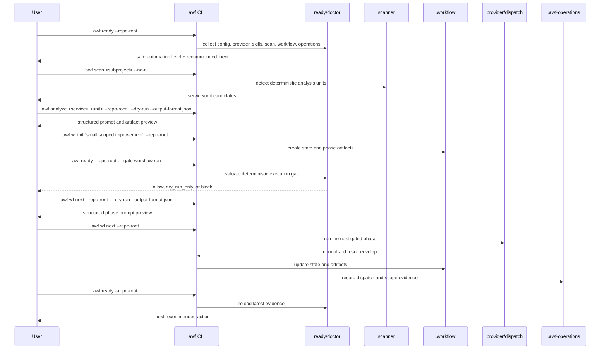

# First ai-workflow-tools Workflow

This guide shows the safe first-run sequence for using `ai-workflow-tools` on a
repository. The intent is not to call a provider immediately. Start with
read-only readiness, confirm deterministic scan units, preview prompts with a
dry-run, then move into gated workflow execution.

Korean version: [첫 ai-workflow-tools 작업 흐름](./08-first-workflow.ko.md)

## Recommended Order

1. Run `awf ready` to see the current safe automation level and next commands.
2. Run `awf scan` to confirm deterministic analysis units.
3. Run `awf analyze --dry-run --output-format json` to inspect prompts and artifact paths before a provider call.
4. Run `awf wf init` to create `.workflow` state for one small task.
5. Run `awf ready --gate workflow-run` before executing the workflow phase.
6. Run `awf wf next --dry-run --output-format json`, then `awf wf next` to execute the next gated phase.
7. Record operational evidence, then run `awf ready` again for the next action.

## Sequence Diagram



## Command Example

Start with a read-only check.

```bash
awf ready --repo-root .
```

If the root is a workspace, scan the subproject recommended by `ready`.
For script-style Python repositories, deterministic scan also recognizes
`requirements.txt`, `setup.cfg`, `Pipfile`, and `poetry.lock`, and it can treat
root-level source folders such as `collectors/`, `analyzers/`, or `importers/`
as units.

```bash
awf scan <repo-or-subproject> --no-ai
```

After a unit is known, preview the analysis prompt without calling a provider.

```bash
awf analyze <service> <unit> --repo-root . --dry-run --output-format json
```

Start one small workflow task, then preview the next phase prompt before
provider execution.

```bash
awf wf init "small scoped improvement" --repo-root .
awf ready --repo-root . --gate workflow-run
awf wf next --repo-root . --dry-run --output-format json
awf wf next --repo-root .
```

## Optional Pi Loop

Pi is not the default dispatch surface. It is an opt-in runner. Before relying
on it, write real field-smoke evidence and let `ready` consume it.

```bash
python3 cli/tests/run_pi_field_smoke.py --json --write-result
awf doctor --repo-root . --json
awf ready --repo-root .
```

`provider_quota_exhausted`, `missing_provider_auth`, and stale smoke evidence
are promoted into `awf ready` `recommended_next`. Fix provider auth, quota, or
smoke freshness before enabling `dispatch.surface_preference=pi`.

## Operating Rules

- If `ready` returns `block`, follow its recommendation before workflow execution.
- If the dry-run output is unclear, do not move to provider execution yet.
- `.workflow` is the canonical state for feature workflow execution.
- If `.workflow/` is ignored by `.gitignore`, `ready` reports the workflow state
  as local-only; commit only the surrounding project artifacts intentionally.
- `.awf-operations` stores operational evidence used by later recommendations.
- Pi evidence is optional, but Pi dispatch should have fresh field-smoke evidence.
