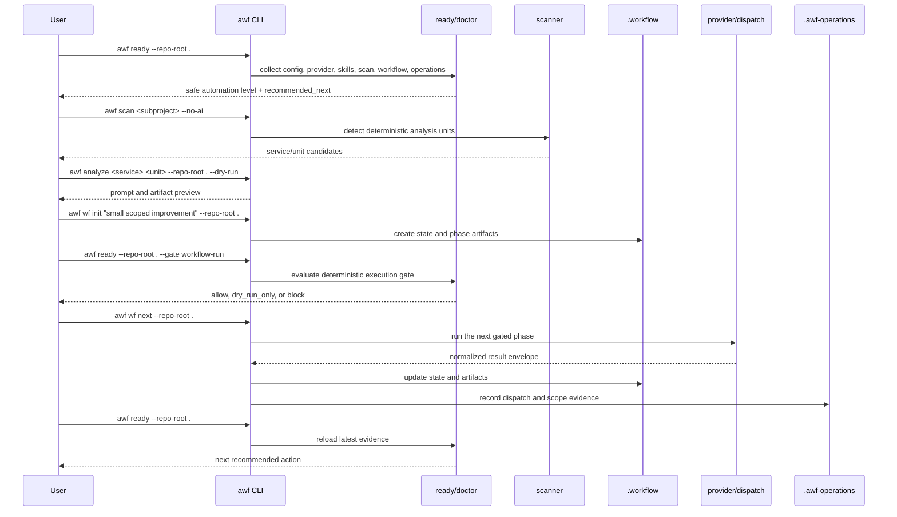

# 첫 ai-workflow-tools 작업 흐름

이 문서는 `ai-workflow-tools`로 처음 작업을 시작할 때의 안전한 순서를
정리합니다. 목표는 "바로 provider를 호출"하는 것이 아니라, 먼저 현재
repo가 어느 수준까지 자동화 가능한지 확인하고 작은 dry-run부터 실제
workflow 실행까지 단계적으로 올리는 것입니다.

영어 버전: [First Workflow](./08-first-workflow.en.md)

## 권장 순서

1. `awf ready`로 현재 안전 레벨과 다음 추천 명령을 확인합니다.
2. `awf scan`으로 분석 단위를 확정합니다.
3. `awf analyze --dry-run`으로 provider 호출 전 prompt와 산출물 경로를 확인합니다.
4. `awf wf init`으로 작은 작업의 `.workflow` 상태를 만듭니다.
5. `awf ready --gate workflow-run`으로 실행 gate를 통과합니다.
6. `awf wf next`로 다음 phase를 실행합니다.
7. `.awf-operations` evidence를 남긴 뒤 다시 `awf ready`로 다음 행동을 확인합니다.

## 시퀀스 다이어그램



## 실제 명령 예시

처음에는 read-only 명령부터 시작합니다.

```bash
awf ready --repo-root .
```

workspace root라서 subproject가 보이면, `ready`가 추천한 subproject를 먼저
스캔합니다.

```bash
awf scan cli --no-ai
```

분석 단위가 확인되면 provider 호출 없이 dry-run을 실행합니다.

```bash
awf analyze ai-workflow-tools <unit> --repo-root . --dry-run
```

작은 작업을 workflow로 시작합니다.

```bash
awf wf init "small scoped improvement" --repo-root .
awf ready --repo-root . --gate workflow-run
awf wf next --repo-root .
```

## Pi를 쓰는 경우

Pi는 기본 dispatch surface가 아니라 opt-in runner입니다. 먼저 실제 field
smoke를 남기고, 그 결과를 `ready`가 읽게 합니다.

```bash
python3 cli/tests/run_pi_field_smoke.py --json --write-result
awf doctor --repo-root . --json
awf ready --repo-root .
```

`provider_quota_exhausted`, `missing_provider_auth`, 오래된 smoke 결과는
`awf ready`의 `recommended_next`에 반영됩니다. 이런 경우에는
`dispatch.surface_preference=pi`를 켜기 전에 provider auth, quota, 또는
smoke freshness를 먼저 해결합니다.

## 판단 기준

- `ready`가 `block`이면 workflow 실행보다 추천 명령을 먼저 수행합니다.
- `dry-run`이 이해되지 않으면 provider 실행으로 넘어가지 않습니다.
- `.workflow`는 feature workflow의 canonical state입니다.
- `.awf-operations`는 운영 evidence와 후속 판단의 입력입니다.
- Pi evidence는 optional이지만, Pi dispatch를 쓰려면 최신 field smoke가 있어야 합니다.
