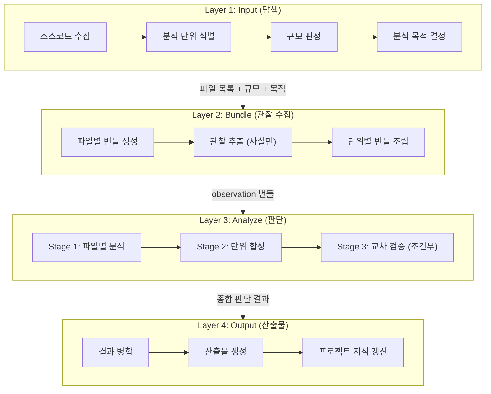
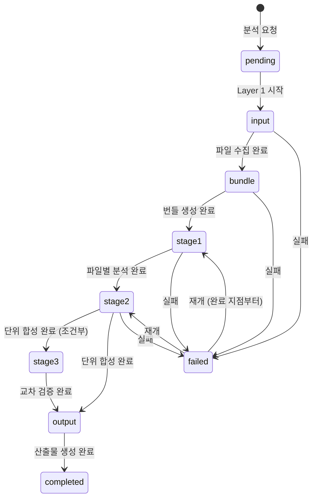
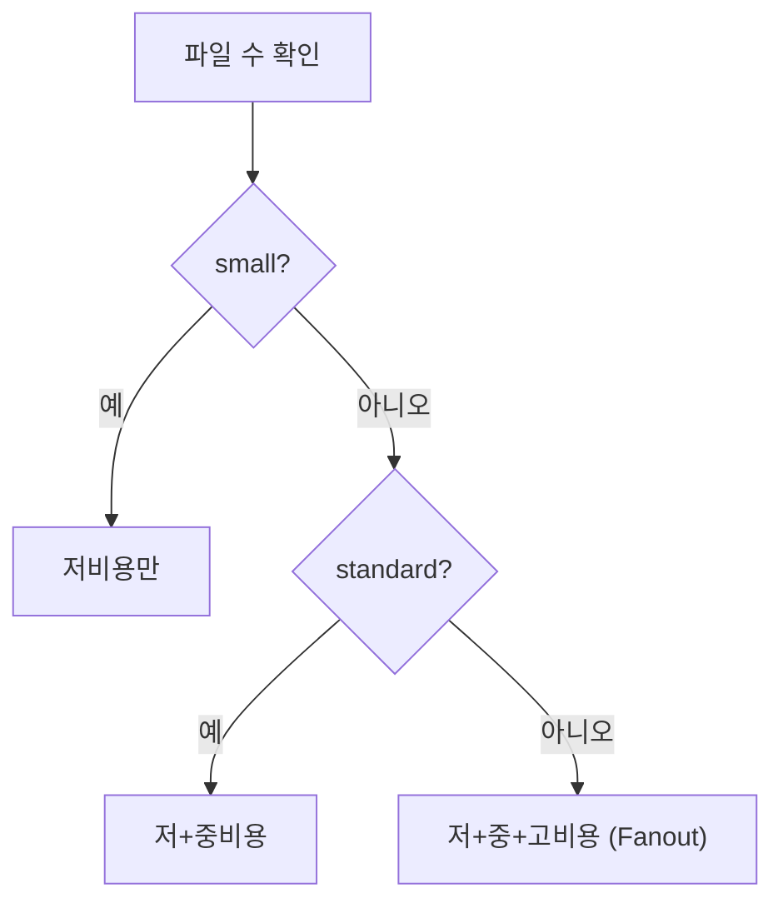
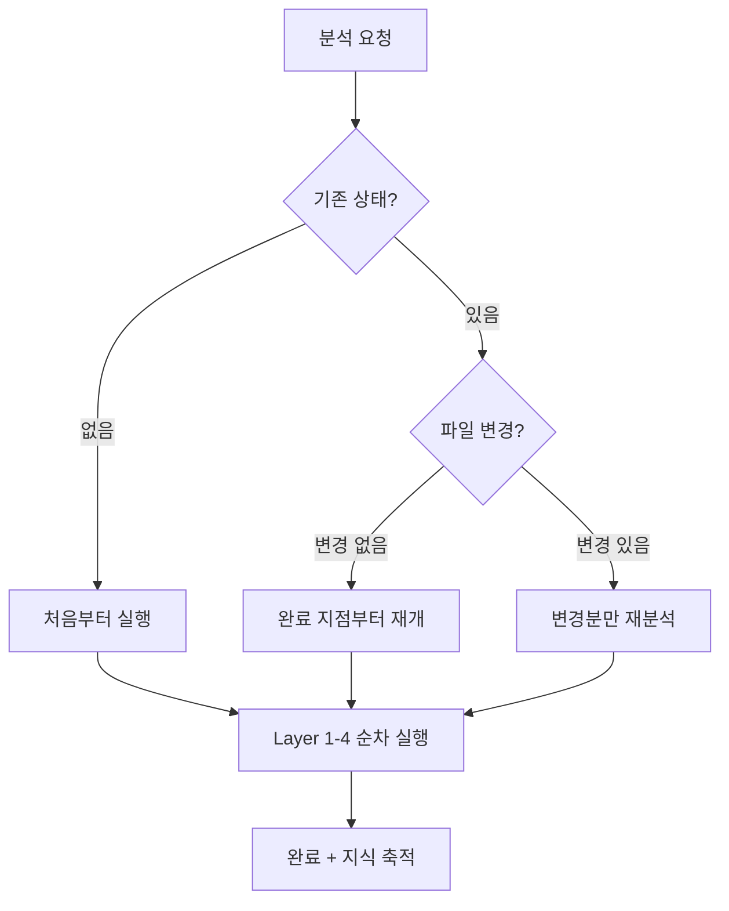

# Analysis Pipeline 다이어그램

## 1. 4-Layer 아키텍처

입력 수집에서 산출물 생성까지의 전체 파이프라인 구조.
각 Layer는 명확한 입출력 계약을 가지며, 독립적으로 교체 가능하다.

---

## 2. 분석 상태 머신

실패 시 마지막 완료 stage 이후부터 재개 가능하다.

---

## 3. 규모 기반 라우팅

분석 대상의 규모(scale)에 따라 Provider 등급과 처리 전략을 결정한다.
규모가 Provider depth를 결정한다.

규모 분류 임계값, Provider별 비용/품질 비교표는 reference 문서를 참조한다.

---

## 4. 전체 워크플로우 생명주기

