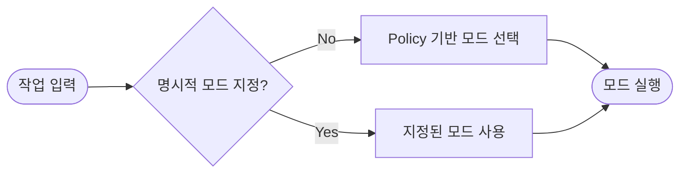
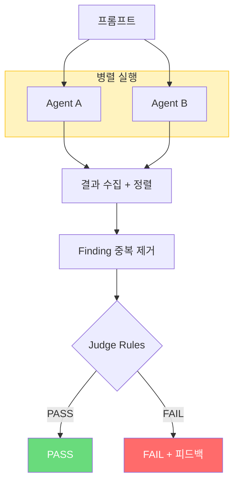
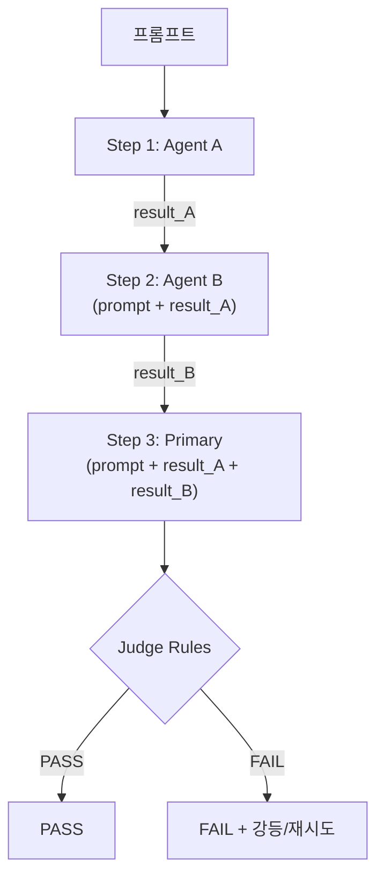
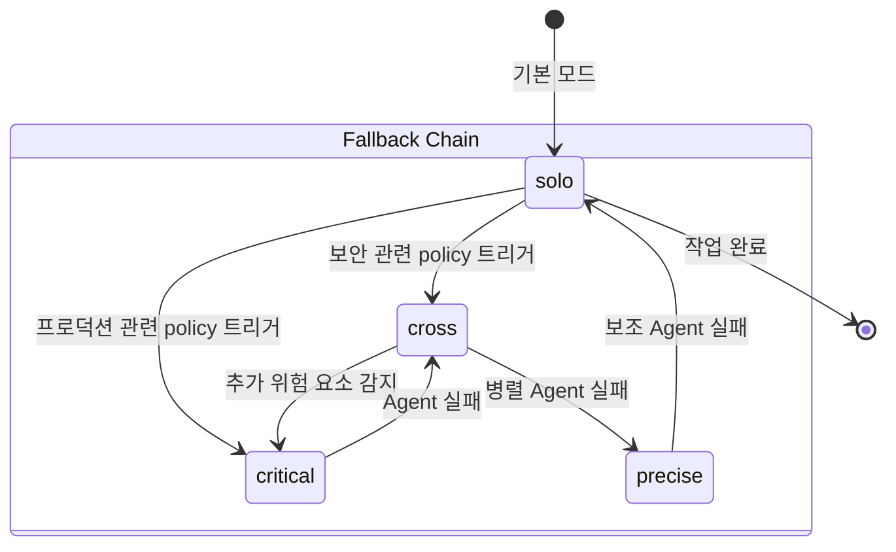
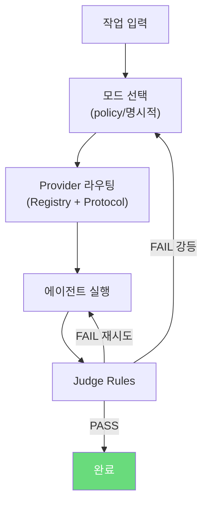
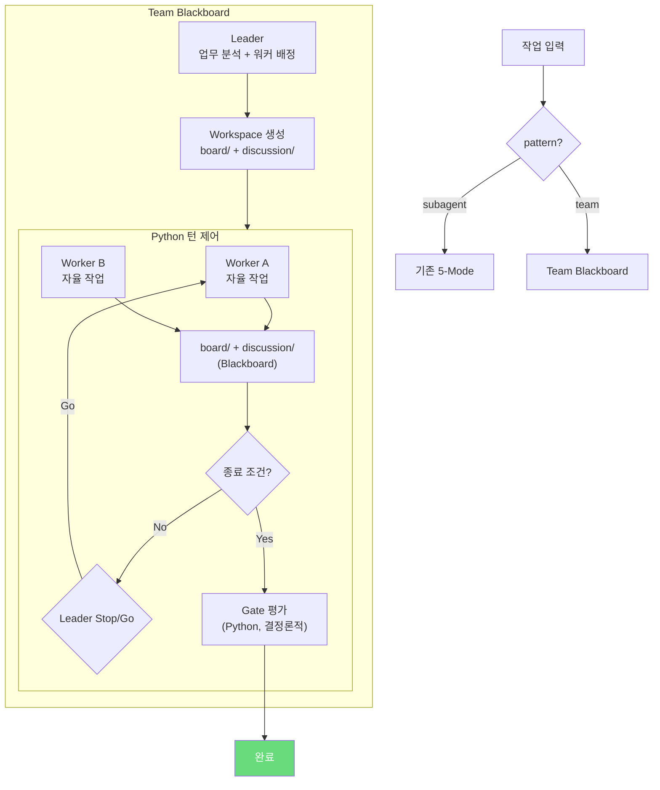

# Multi-Agent Orchestration Diagrams

---

## 1. 5-Mode 실행 의사결정

입력된 작업의 정책, 위험도, 명시적 지정에 따라 실행 모드를 결정한다.

모드 선택에 사용되는 키워드 목록과 매핑은 reference 문서를 참조한다.

---

## 2. Cross Mode — 병렬 실행 흐름

두 에이전트가 독립적으로 병렬 분석하고, Judge가 결과를 종합 판정한다.

---

## 3. Critical Mode — 순차 체인 흐름

각 단계의 결과가 다음 단계의 입력에 누적되는 순차 실행.

---

## 4. 자동 승격/강등 상태

Policy 기반으로 승격(escalation)하고, 에이전트 실패 시 강등(de-escalation)한다.

승격/강등 키워드 목록 및 구체 경로는 reference 문서를 참조한다.

---

## 5. 전체 생명주기

---

## 6. Team Blackboard — 3레이어 팀 패턴

`pattern: "team"` 사용 시의 실행 흐름. 상세는 [04-team-blackboard.md](04-team-blackboard.md) 참조.

