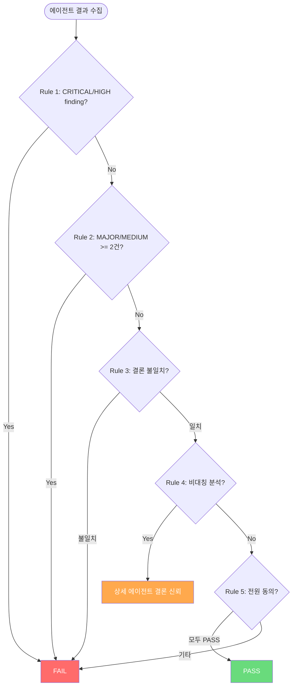

# Multi-Agent Judge Rules — 판정 로직

에이전트 결과를 종합하여 최종 판정(PASS/FAIL)을 내리는 결정론적 규칙 체계. (Analysis Judge와 역할이 다름 — glossary 참조)

---

## 1. 결정론적 Judge Rules

5개 규칙을 순서대로 적용한다. 먼저 매칭되는 규칙이 최종 판정을 결정한다.

### Rule 상세

| 순서 | 규칙 | 판정 | 근거 |
|------|------|------|------|
| 1 | CRITICAL 또는 HIGH finding 존재 | **FAIL** | 심각한 이슈는 무조건 차단 |
| 2 | MAJOR/MEDIUM finding 합산 2건 이상 (중복 제거 후) | **FAIL** | 중간 이슈도 복수 존재 시 위험 |
| 3 | 에이전트 간 결론 불일치 (PASS vs FAIL) | **FAIL** | 보수적 원칙: 의견 충돌 시 안전 쪽 |
| 4 | 한쪽만 상세 분석, 다른 쪽 빈 결과 | **상세 에이전트 신뢰** | 빈 결과는 분석 실패로 간주 |
| 5 | 모든 에이전트 동의 | **PASS** | 전원 합의 시에만 통과 |

---

## 2. Finding Severity 계층

| Severity | Judge 영향 | 설명 |
|----------|-----------|------|
| CRITICAL | 단독으로 FAIL (Rule 1) | 즉각적 위험 |
| HIGH | 단독으로 FAIL (Rule 1) | 심각한 품질 문제 |
| MAJOR / MEDIUM | 2건 이상 FAIL (Rule 2) | 중요하지만 단독으로는 차단하지 않음 |
| LOW | 영향 없음 | 개선 권장 사항 |

---

## 3. Finding 중복 제거

병렬 실행된 에이전트의 결과는 결정론적 순서로 정렬한 후 중복을 제거한다.

### 원칙

- 동일 category + location 조합의 finding은 중복으로 판정
- 중복 시 더 높은 severity의 finding을 유지
- 중복 제거는 Rule 2 적용 전에 수행하여 이중 집계를 방지

정렬 기준, 비교 키 상세는 reference 문서를 참조한다.

---

## 4. 신뢰도 기반 Tie-Breaking

Rule 3(결론 불일치)의 기본 동작은 FAIL이다. 선택적으로 신뢰도(confidence)를 활용하여 tie-breaking을 수행할 수 있다.

### 원칙

- 기본 동작은 보수적 FAIL
- Tie-breaking은 설정에서 명시적으로 활성화한 경우에만 동작
- CRITICAL/HIGH finding이 없는 경우에만 적용 가능
- Confidence 차이가 임계값 이상일 때만 적용

Confidence 산출 요소, 가중치, 임계값은 reference 문서를 참조한다.

---

## 5. Rule 4 — 비대칭 분석 처리

한 에이전트가 상세 분석을 제공하고 다른 에이전트가 빈 결과를 반환하는 경우, 상세 분석 에이전트의 결론을 신뢰한다.

### 원칙

- 빈 결과 에이전트는 무시하고, 상세 분석 에이전트의 conclusion을 따른다
- 상세 에이전트가 FAIL이면 FAIL, PASS이면 PASS

---

## 6. Judge 적용 모드별 차이

| 항목 | cross | critical | precise |
|------|-------|----------|---------|
| Judge 적용 | 필수 | 필수 | 선택적 |
| 중복 제거 | 적용 | 적용 | 적용 |
| FAIL 시 동작 | 피드백 → 재시도/강등 | 피드백 → 강등 | 피드백 → solo 강등 |
