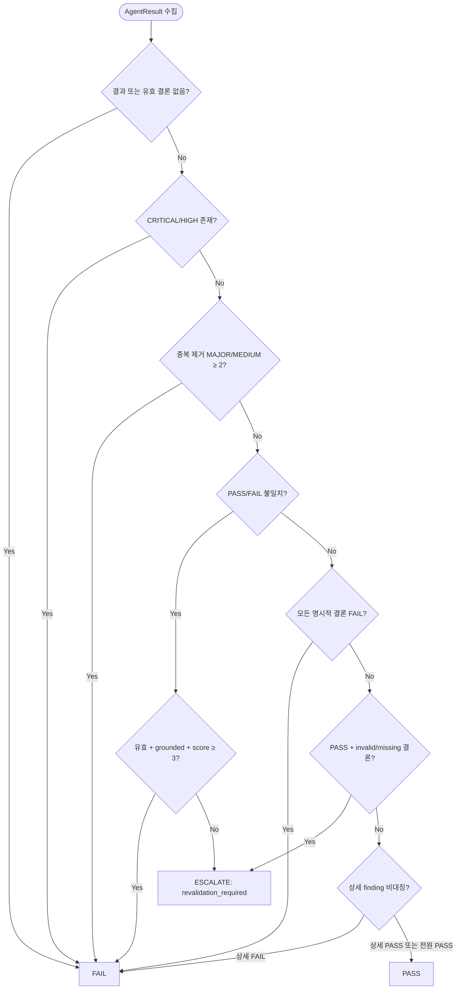

# Multi-Agent Judge Rules v2 — 근거 기반 판정

에이전트 결과를 `PASS`, `FAIL`, `ESCALATE`로 종합하는 결정론적 규칙이다.
동일한 `AgentResult` 입력 순서에는 항상 동일한 verdict와 reason을 반환한다.
구현 기준은 `cli/src/awf/core/multi_agent.py::judge`, 회귀 기준은
`cli/tests/test_multi_agent_judge_v2.py`다.

## 1. 판정 순서

아래 규칙을 순서대로 적용하며 먼저 확정된 판정을 반환한다.

| 순서 | 조건 | 판정 |
|------|------|------|
| 1 | 결과 없음 또는 유효한 conclusion 없음 | `FAIL` |
| 2 | `CRITICAL`/`HIGH` finding 하나 이상 | `FAIL` |
| 3 | `category:location` 중복 제거 후 `MAJOR`/`MEDIUM` 2건 이상 | `FAIL` |
| 4 | PASS/FAIL 불일치이고 가장 강한 FAIL이 유효·grounded·3점 이상 | `FAIL` |
| 5 | PASS/FAIL 불일치지만 FAIL 근거가 약하거나 실행이 invalid | `ESCALATE` |
| 6 | 모든 명시적 결론이 FAIL | `FAIL` |
| 7 | PASS와 timeout/parse error/missing conclusion이 함께 존재 | `ESCALATE` |
| 8 | 한쪽만 상세 finding을 제공 | 상세 agent의 명시적 결론 |
| 9 | 모든 유효 결론 PASS | `PASS` |

`CRITICAL`/`HIGH`와 다중 `MAJOR`/`MEDIUM`은 실행 실패나 parse error가 있어도
fail closed로 처리한다. 심각한 finding을 invalid 실행이라는 이유로 버리지 않는다.

결론 분류는 `strip().upper()` 뒤 normalized `PASS`/`FAIL` prefix를 확인한다.
부분 문자열 검색은 사용하지 않는다. 예를 들어 `FAIL: tests did not pass`는
명시적 FAIL이고, PASS agent와 함께 들어오면 Rule 4~5의 disagreement로
처리한다. 알 수 없는 structured conclusion은 유효한 PASS가 아니다.

## 2. Disagreement evidence score

점수는 PASS/FAIL 불일치에서만 사용한다. confidence만으로 FAIL을 확정하지 않는다.

| 항목 | 점수 | 조건 |
|------|------|------|
| 실행 유효성 | +1 | return code 0, timeout 아님, parse error 아님 |
| confidence | +2 / +1 | high 또는 `>=0.8` / medium 또는 `>=0.5` |
| 실제 근거 | +1 | location, finding evidence 또는 top-level evidence 존재 |
| 재현성 | +1 | `file:line`, test command/result, returncode/exit code 존재 |

FAIL 확정 조건은 다음을 모두 만족해야 한다.

1. 실행이 유효하다.
2. location 또는 evidence/reproducibility가 있어 grounded 상태다.
3. 합계가 3점 이상이다.

조건을 충족하지 못하면 `ESCALATE`와 `revalidation_required:` reason을 반환한다.
여러 FAIL agent가 있으면 유효 실행을 먼저 선택하고, 그 안에서 grounded 여부와
점수를 비교한다. 동점은 입력 순서를 보존한다.

## 3. Finding 중복 제거와 severity

- 중복 키: `category:location`
- 같은 키에서는 더 높은 severity 유지
- 중복 제거 후 Rule 3 임계치를 계산
- severity 순서: `CRITICAL > HIGH > MAJOR > MEDIUM > LOW`
- `LOW`는 단독 fail-closed 조건이 아니지만 disagreement evidence에 참여 가능

## 4. 비대칭·불완전 결과

- 한 agent만 finding을 제공하고 나머지가 빈 유효 결과면 상세 agent의 결론을 따른다.
- 유효 PASS와 invalid/missing conclusion이 섞이면 통과시키지 않고 `ESCALATE`한다.
- 모든 결과가 invalid이고 명시적 결론도 없으면 `FAIL`한다.
- 모든 agent가 명시적으로 FAIL이면 severity 임계치와 무관하게 `FAIL`한다.

## 5. 모드별 적용

| 항목 | cross | critical | precise |
|------|-------|----------|---------|
| Judge 적용 | 필수 | 필수 | 결과 종합 시 적용 |
| 중복 제거 | 적용 | 적용 | 적용 |
| `ESCALATE` | 재검증 필요 | 재검증 필요 | 재검증 필요 |
| `FAIL` | gate/강등 정책 적용 | chain/gate 정책 적용 | solo 강등 정책 적용 |

각 모드는 verdict를 임의로 PASS로 변환하지 않는다. phase gate와 retry/강등 정책은
judge 결과를 입력으로 사용하되, canonical workflow state 변경은 parent만 수행한다.
