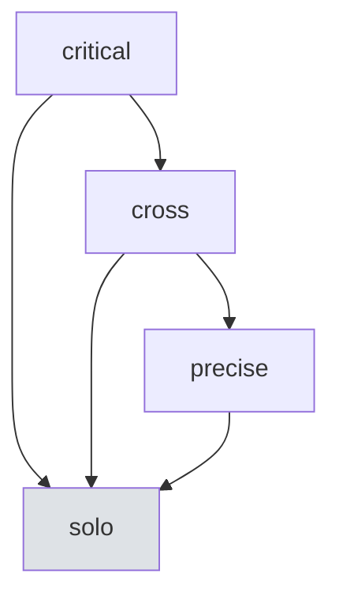

# Provider Routing & Synthesis Patterns

Fallback 체인, Timeout Budget, Synthesis 패턴.

---

## 1. Escalation Fallback Chain

고급 모드 실행 실패 시 하위 모드로 단계적으로 강등한다. 어떤 상황에서든 작업 완료를 보장한다.

### 원칙

- Fallback chain은 항상 solo에서 종료한다 (순환 없음)
- 각 모드는 자신보다 하위 모드의 리스트를 가진다
- solo는 최종 모드이며, 실패 시 오류를 반환한다

구체적 fallback 경로, 트리거 조건, 의사결정 흐름은 reference 문서를 참조한다.

---

## 2. Timeout Budget Inheritance

순차 모드(precise, critical)에서는 이전 단계의 소요 시간이 이후 단계의 가용 시간에 영향을 준다.

### 원칙

- 전체 예산(budget)을 설정하고, 각 단계가 소비한 시간을 차감한다
- 잔여 budget이 다음 단계 최소 시간 미만이면 남은 단계를 건너뛰거나 fallback한다
- 전체 budget 소진 시 즉시 Fallback 모드로 강등한다

### Budget 초과 시 동작

| 상황 | 동작 |
|------|------|
| 단계별 타임아웃 초과 | 해당 단계 중단, 부분 결과 전달 |
| 전체 budget 잔여 < 최소 시간 | 남은 단계 건너뛰고 현재까지 결과로 Judge |
| 전체 budget 소진 | 즉시 Fallback |

모드별 기본 타임아웃 수치는 reference 문서를 참조한다.

---

## 3. Protocol Externalization

프로토콜은 외부 파일로 관리되며, 코드 수정 없이 에이전트 동작을 변경할 수 있다.

### 원칙

- 프로토콜은 마크다운 파일로 외부화
- 반복 로드를 방지하기 위해 TTL 기반 캐싱 적용
- 파일 변경 시 캐시 무효화

Protocol cache TTL, 파일 경로 등은 reference 문서를 참조한다.

---

## 4. Synthesis Patterns

멀티에이전트 결과를 워크플로우에 통합하는 3가지 패턴. 작업 유형에 따라 적절한 패턴을 선택한다.

### parallel_evaluate (리뷰/검증)

두 에이전트가 동일 대상을 독립적으로 평가하고, 결과를 병합한다.

- 실행 방식: 병렬
- Judge 적용: 필수
- 적용 대상: 코드 리뷰, 보안 검증, 품질 평가

### generate_then_validate (계획/테스트)

Primary가 결과를 생성하고, Secondary가 사전 검증한다. 검증 실패 시 피드백 루프를 형성한다.

- 실행 방식: 순차 (생성 → 검증 → 피드백)
- Judge 적용: 선택적
- 적용 대상: 계획 수립, 테스트 생성

### implement_then_review (구현)

Primary가 구현하고, Secondary가 사후 리뷰한다. 리뷰 결과에 따라 수정 루프를 형성한다.

- 실행 방식: 순차 (구현 → 리뷰 → 수정)
- Judge 적용: 리뷰 결과에 적용
- 적용 대상: 코드 구현, 설정 변경

### 패턴 선택 원칙

| 작업 유형 | 권장 패턴 |
|----------|----------|
| 평가/검증 | parallel_evaluate |
| 생성/계획 | generate_then_validate |
| 구현/변경 | implement_then_review |

패턴별 대응 모드, 피드백 루프 상한, 시퀀스 다이어그램은 reference 문서를 참조한다.

---

## 5. Finding Feedback Loop

CRITICAL/HIGH finding이 발견되면 이력에 기록하고, 피드백을 생성한다.

### 원칙

- CRITICAL과 HIGH severity finding만 이력에 기록한다
- 피드백은 재실행, 무시, 모드 변경 중 하나로 연결된다
- 이력은 재실행 시 이전 finding 참조에 활용된다
