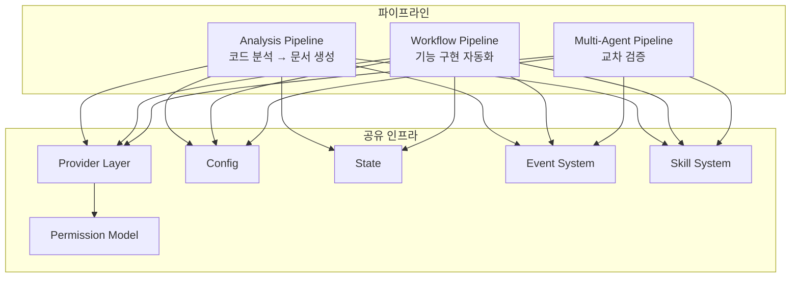
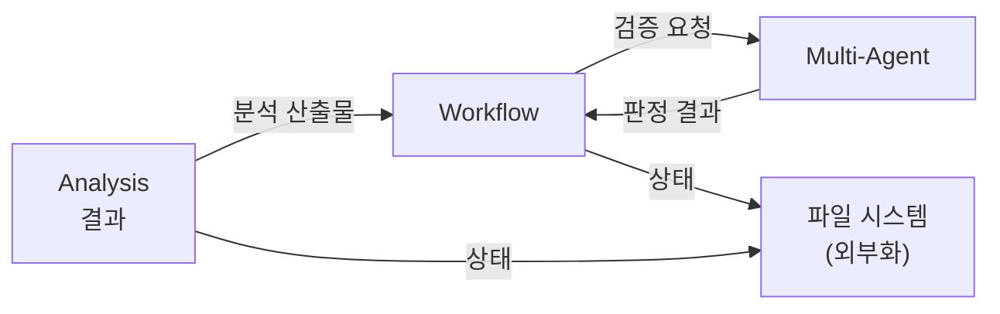
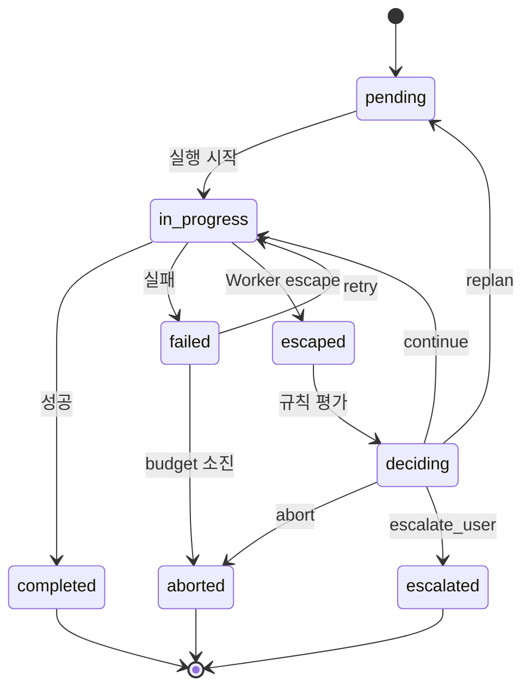
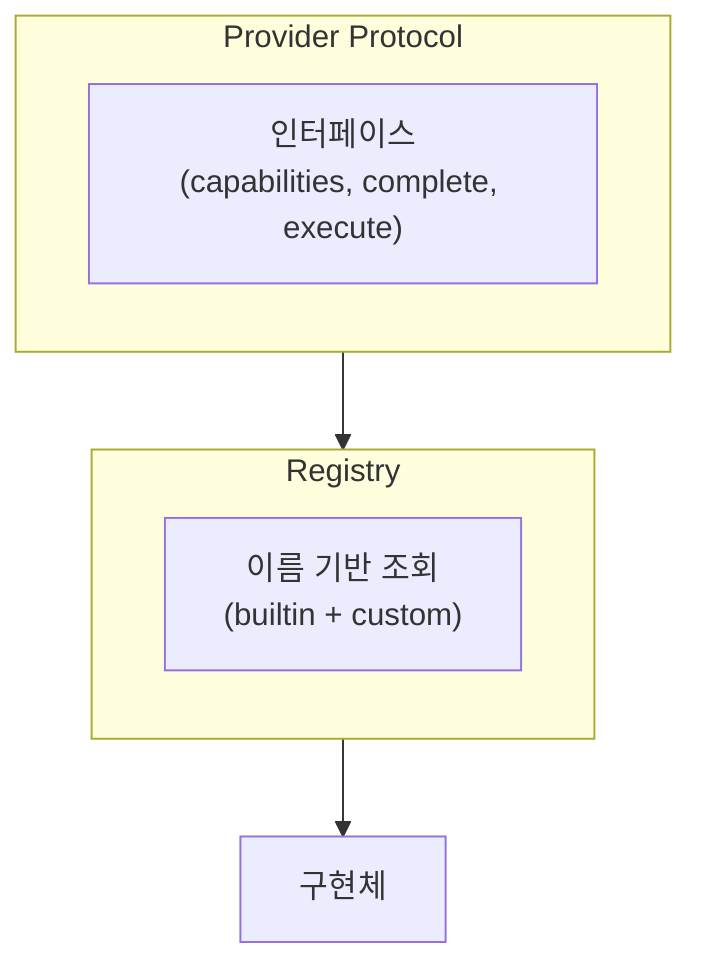

# 아키텍처 다이어그램

---

## 1. 시스템 전체 구조

3개 파이프라인과 공유 인프라 계층의 관계.

### 파이프라인 역할

| 파이프라인 | 목적 | 핵심 패턴 |
|-----------|------|----------|
| Analysis | 코드 분석 → 구조화된 문서 생성 | N-Layer, M-Stage, Writer/Judge |
| Workflow | 기능 구현의 구조화된 자동화 | N-Phase, Gate, Closed-Loop |
| Multi-Agent | 다중 에이전트 교차 검증 | N-Mode, Judge Rules, Synthesis |

---

## 2. 파이프라인 간 데이터 흐름

---

## 3. 역할 분리

시스템의 5가지 역할과 책임 경계.

| 역할 | 책임 | 금지 |
|------|------|------|
| Orchestrator | 상태 관리, Phase/Stage 전환, Provider 라우팅 | AI 판단, 파일 직접 수정 |
| Executor | 코드 실행, 파일 수정 (Primary만) | 상태 직접 수정, Gate 우회 |
| Reviewer | 분석, 검증, 관찰 추출 (Secondary) | 파일 수정, 상태 수정 |
| Judge (추상 역할) | 결과 종합, 판정. analysis judge (synthesis), multi-agent judge (verdict) | 새 evidence 생성, 원본 변조 |
| Gate | 통과 조건 평가, 라우팅 결정 | 실행, 판단 |

---

## 4. 상위 상태 전이 모델

모든 파이프라인이 공유하는 실행 상태 전이.

---

## 5. Provider 계층

Provider는 Protocol 추상화 뒤에 위치하며, Registry를 통해 이름으로 조회한다.
구현체 목록 및 capability 비교는 reference 문서를 참조한다.

---

## 6. Skill 탐색

Skill은 우선순위 기반 탐색으로 발견되며, 같은 이름의 skill은 먼저 발견된 것이 우선한다.

탐색 경로 및 캐시 메커니즘은 reference 문서를 참조한다.
