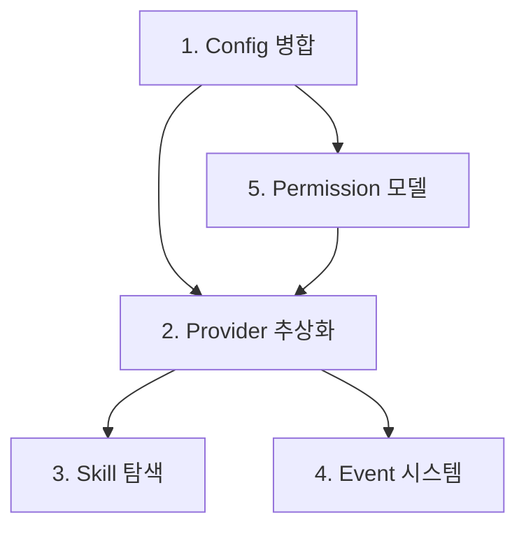

# 시스템 아키텍처

5개 아키텍처 구성요소의 관계와 확장 원칙.

---

## 구성요소 관계

---

## 1. Config 병합

설정은 system, user, project 3개 계층을 병합한다.

### 불변식

- 병합 순서: system defaults → user config → project config
- 후순위 설정이 선순위를 덮어쓴다
- dict 타입은 재귀적으로 deep merge한다

설정 키 목록, 경로, 기본값은 reference 문서를 참조한다.

---

## 2. Provider 추상화

Provider는 Protocol 추상화 뒤에 위치하며, capability를 노출한다.

### 불변식

- 모든 Provider는 동일한 Protocol을 구현한다
- Registry를 통해 이름으로 조회한다
- Provider 교체 시 파이프라인 코드 변경이 불필요하다

### 확장 규칙

새 Provider 추가 시 수정 대상:
- Protocol 구현체 추가
- Registry에 등록
- Config에 설정 추가
- Permission에 권한 추가

수정하지 않는 대상:
- 파이프라인 코드 (analysis, workflow, multi-agent)
- 기존 Provider 코드

Provider 구현체, capability 비교표, 실행 시퀀스는 status/reference 문서를 참조한다.

---

## 3. Skill 탐색

### 원칙

- Skill은 우선순위 기반 탐색으로 발견된다
- 같은 이름의 skill은 먼저 발견된 것이 우선한다 (first-found)
- SKILL.md의 YAML frontmatter를 파싱하여 metadata를 생성한다
- 프롬프트 템플릿은 변수 치환을 지원한다

탐색 경로, 캐시 메커니즘, 디렉토리 구조는 status/reference 문서를 참조한다.

---

## 4. Event 시스템

### 원칙

- 이벤트는 lifecycle, pipeline, worker, artifact, provider, decision 등의 카테고리로 분류된다
- EventProcessor가 이벤트를 수집하고 핸들러에 전달한다
- 이벤트는 관측성(observability)을 위한 것이며, 제어 흐름에 영향을 주지 않는다

EventType 목록, 핸들러 구조, heartbeat 주기는 reference 문서를 참조한다.

---

## 5. Permission 모델

### 원칙

- Permission은 ruleset과 check 함수로 Provider/tool 접근을 제어한다
- 매 도구 호출마다 권한을 검사한다
- Permission 규칙은 config에서 설정한다

### 검사 순서

1. yolo 모드 확인 (전체 허용)
2. disabled_tools 확인 (명시적 차단)
3. allowed_tools 확인 (명시적 허용)

Permission naming, 기본 허용 목록, tool loop 상세는 reference 문서를 참조한다.

---

## 구성요소 간 의존 방향

파이프라인은 공유 인프라에 의존하지만, 공유 인프라는 파이프라인을 알지 못한다.

### 확장 원칙

| 확장 | 수정 대상 | 비수정 대상 |
|------|----------|-----------|
| 새 Provider | protocol, registry, config, permission | 파이프라인 코드 |
| 새 Skill | skill 디렉토리 + SKILL.md | 파이프라인 코드, provider |
| 새 Event | EventType enum, handler | 파이프라인 로직 |
| 새 Tool | permission config | provider, skill |
| 새 Config 키 | defaults, user/project config | 기존 config 소비자 |
