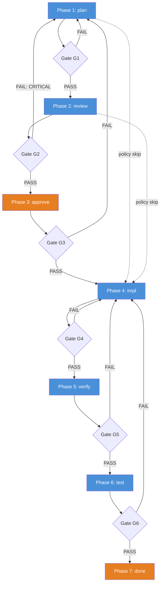
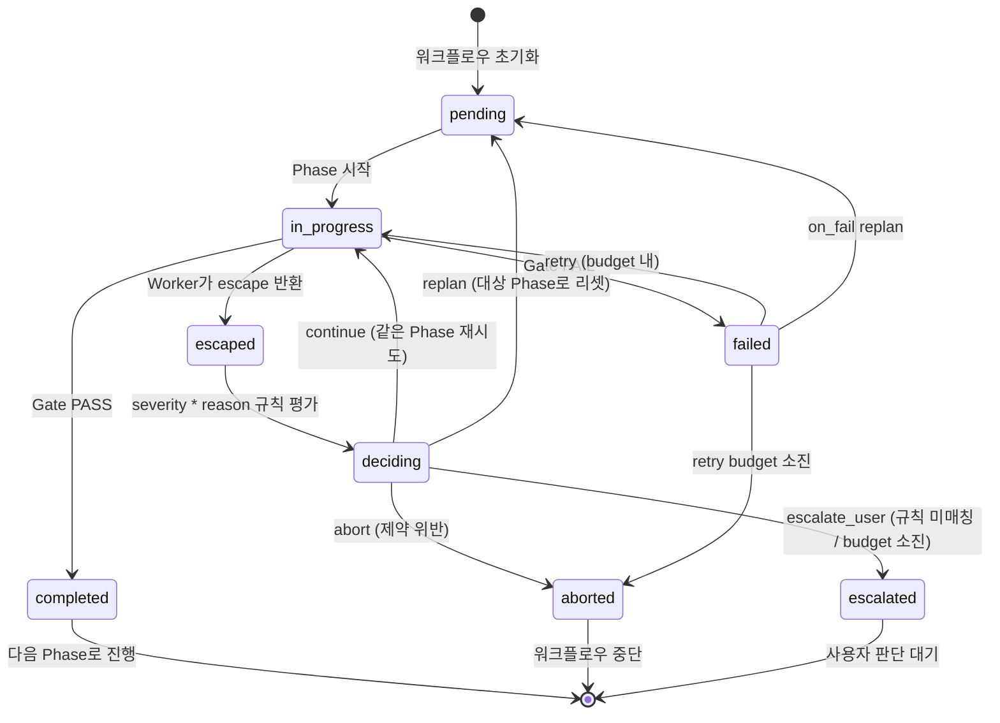
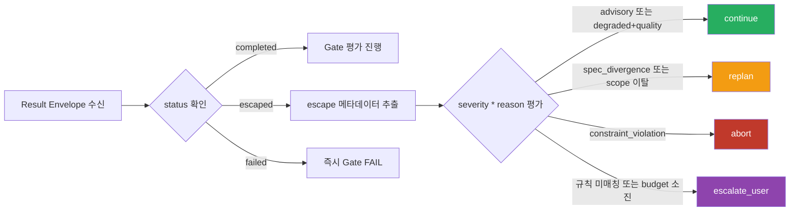
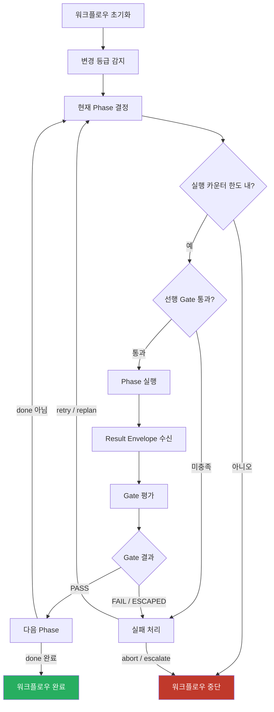

# Workflow Pipeline 다이어그램

워크플로우 파이프라인의 구조와 흐름을 시각화한 다이어그램 모음.

---

## 1. Phase 파이프라인 (Gate 포함)

Canonical phase order를 따르며, policy에 의해 일부 phase가 skip될 수 있다.
Skip된 phase는 equivalent gate satisfaction을 남겨 downstream precondition을 보장한다.

**범례**:
- 파란색: 자동 실행 가능 Phase
- 주황색: HIL 여부가 policy에 의해 결정되는 Phase
- 점선: Policy에 의한 skip 경로 (equivalent gate satisfaction 필요)

---

## 2. Phase 상태 머신

하나의 Phase가 거치는 상태 전이.

### Phase 상태 정의

| 상태 | 설명 | 전이 조건 |
|------|------|----------|
| `pending` | 실행 대기 | 초기화 또는 replan 리셋 |
| `in_progress` | 실행 중 | Phase 시작 |
| `completed` | 정상 완료 | Gate PASS |
| `escaped` | Worker가 완료 불가 보고 | Result Envelope status=escaped |
| `failed` | Gate 실패 | Gate FAIL |
| `deciding` | 자동 규칙 평가 중 | escape 후 severity*reason 매칭 |
| `aborted` | 워크플로우 중단 | 제약 위반 또는 retry budget 소진 |
| `escalated` | 사람에게 위임 | 규칙 미매칭 또는 replan budget 소진 |

---

## 3. Closed-Loop 의사결정 트리

Result Envelope 수신 후 자동 판정 규칙 적용 흐름.

---

## 4. 전체 워크플로우 생명주기

워크플로우 초기화부터 완료까지의 전체 흐름.

