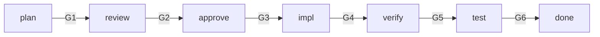

# Workflow Pipeline 개요

게이트 기반 N-Phase 워크플로우 파이프라인의 핵심 설계 원칙과 구조.

---

## 1. Phase 구조

워크플로우는 canonical phase order를 따른다.

- 정방향 phase order는 `plan → review → approve → impl → verify → test → done`이다.
- 역행은 replan으로만 가능하다.
- Policy에 의해 phase가 skipped 될 수 있다.
- Skip된 phase는 downstream precondition evaluation이 가능하도록 equivalent gate satisfaction을 남겨야 한다.

각 Phase 사이에 Gate가 존재하며, Gate를 통과해야만 다음 Phase로 진행할 수 있다.

### Phase 역할

| Phase | Gate | 역할 | 협업 패턴 |
|-------|------|------|----------|
| plan | G1 | 요구사항 분석, 기술 설계, 작업 분해 | 에이전트 팀 (spec-kit 루틴) |
| review | G2 | 교차 검증 (설계/보안/품질 관점) | 서브에이전트 |
| approve | G3 | 범위와 계획 승인 | - (conditional HIL) |
| impl | G4 | 작업 목록 기반 구현 실행 | 서브에이전트 |
| verify | G5 | 범위 검증 (결정론적 `awf wf scope-check`) + 명세 준수 확인 | 서브에이전트 (spec/품질만) |
| test | G6 | 회귀 테스트 + 수락 테스트 실행 | 에이전트 팀 (QA) |
| done | -- | 최종 확인 + 산출물 생성 | - (conditional HIL) |

### Plan Phase — Spec-Kit 루틴

plan phase는 에이전트 팀을 활용하여 기획서를 구조화한다.
에이전트들이 서로 다른 관점에서 spec을 검토하고 반박하여, 단일 에이전트가 놓치는 모순과 누락을 조기에 발견한다.

#### Spec-Kit 구성

| 산출물 | 역할 | 검증 관점 |
|--------|------|----------|
| constitution | 프로젝트 불변 규칙 | 이 기획이 기존 규칙과 충돌하지 않는가 |
| spec | 요구사항 명세 | 요구사항이 완전하고 모호하지 않은가 |
| plan | 기술 설계 + 작업 분해 | spec을 달성하기에 충분한가 |
| tasks | 구현 작업 목록 | plan과 1:1 매핑되는가, 누락은 없는가 |
| test criteria | 수락 기준 | spec의 모든 요구사항에 대응하는가 |

#### 에이전트 팀 활용

- 에이전트들이 constitution ↔ spec ↔ plan ↔ tasks 간 **교차 검증과 반박**을 수행
- 한 에이전트가 spec을 작성하면, 다른 에이전트가 constitution 위반이나 plan 과의 불일치를 지적
- 사용자가 최종 승인자(human arbiter)로 설계 판단을 확정할 수 있다 (policy에 의해 결정)

### Test Phase — QA 에이전트 팀

test phase는 에이전트 팀을 활용하여 엣지/코너 케이스를 탐색한다.

- happy path 검증 에이전트 + 적극적 파괴 시도 에이전트를 병렬로 운영
- 단일 에이전트의 확증 편향을 방지하여 테스트 커버리지를 높인다
- 경쟁 가설 구조: 한쪽이 "통과"를 주장하면, 다른 쪽이 깨뜨리려 시도

### HIL (Human-in-the-Loop) 정책

HIL 여부는 phase의 고정 속성이 아니라, policy 또는 change class에 의해 결정된다.
Agent Card의 `hil` 필드가 `true`인 phase는 사람의 판단 없이 완료할 수 없다.

### Phase 간 on_fail 라우팅 요약

Gate FAIL 시 Agent Card의 `on_fail` 섹션에 따라 retry, replan, abort, prompt_user로 분기한다.
구체적 Phase별 라우팅은 reference 문서를 참조한다.

---

## 2. Agent Card

Agent Card는 Phase별 런타임 계약이다.
Phase가 무엇을 입력으로 받고, 무엇을 출력하며, 어떤 조건에서 통과/실패하는지를 정의한다.

### 핵심 계약 요소

| 요소 | 역할 |
|------|------|
| `input.required_artifacts` | Phase 실행에 필수인 입력 산출물 |
| `input.required_state` | 선행 Gate 통과 전제조건 |
| `output.structured_result` | Gate 평가에 사용할 구조화된 결과 스키마 |
| `gate.pass_conditions` | Gate 통과에 필요한 조건 목록 (모두 AND) |
| `gate.on_pass` / `gate.on_fail` | Gate 결과에 따른 라우팅 |
| `retry.max` | Phase별 최대 재시도 횟수 |
| `hil` | Human-in-the-Loop 필수 여부 (policy에 의해 결정) |

Agent Card JSON 스키마 상세는 reference 문서를 참조한다.

---

## 3. Result Envelope

모든 Phase 실행 결과는 Result Envelope 형식으로 반환된다.

### status 정의

| status | 의미 | 후속 처리 |
|--------|------|----------|
| `completed` | Worker가 정상 완료 반환 | Gate 평가 (pass_conditions 확인) |
| `escaped` | Worker가 정상 완료 불가 보고 | escape 메타데이터 기록 → 자동 규칙 엔진으로 판정 |
| `failed` | Worker 실행 자체 실패 | 즉시 Gate FAIL 처리 |

### escape severity

| severity | 의미 |
|----------|------|
| `advisory` | 참고 수준, 진행에 영향 없음 |
| `degraded` | 품질 저하이나 기능적 진행 가능 |
| `warning` | 명세 이탈 등 주의 필요 |
| `critical` | 복구 불가, 즉각 조치 필요 |

---

## 4. 상태 외부화

모든 워크플로우 상태는 파일 시스템에 JSON으로 외부화한다.
LLM 컨텍스트 윈도우에 의존하지 않으며, 세션 간 상태를 유지한다.

상태 디렉토리 구조 및 state.json 스키마 상세는 reference 문서를 참조한다.

---

## 5. 실행 카운터

무한 루프를 방지하기 위한 안전장치로, 워크플로우 전체에 걸친 총 실행 횟수 상한을 적용한다.

### Budget 계층

| Budget 유형 | 범위 | 소진 시 동작 |
|-------------|------|-------------|
| 실행 카운터 (`totalExecutions`) | 워크플로우 전체 | RuntimeError → 워크플로우 중단 |
| Retry budget (`retry.max`) | Phase별 | Phase abort |
| Replan budget (`maxReplans`) | 워크플로우 전체 | escalate_user |

세 가지 Budget이 계층적으로 동작한다.
Phase별 retry budget이 먼저 소진되면 해당 Phase가 abort되고,
replan budget이 소진되면 사용자에게 위임되며,
총 실행 횟수가 한도에 도달하면 워크플로우 전체가 중단된다.

구체적 수치는 reference 문서를 참조한다.
