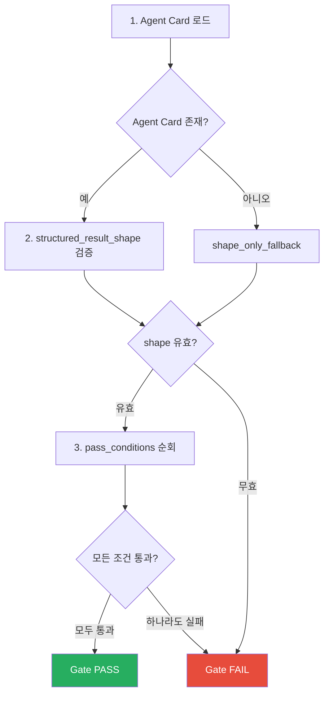
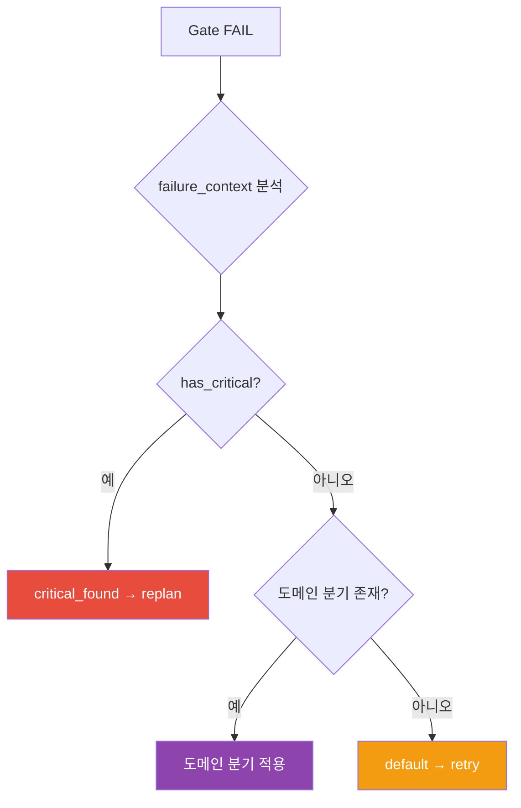

# Gate 평가와 Closed-Loop 의사결정

Gate 평가 규칙, Retry Budget, on_fail 라우팅, Closed-Loop 의사결정 원칙, 에러 분류 체계.

---

## 1. Gate 평가 규칙

Gate는 Phase 실행 결과를 구조화된 규칙으로 평가하는 관문이다.

### 불변식

- Agent Card에 정의된 `pass_conditions`를 순서대로 평가하고, **모든 조건이 통과해야** Gate PASS가 된다.
- `structured_result_shape` 검증이 실패하면 `pass_conditions`를 평가하지 않고 즉시 Gate FAIL이다.
- Agent Card가 존재하지 않으면 `shape_only_fallback` 모드로 동작한다 — 구조 검증만 수행하고 도메인 조건은 건너뛴다.

### 평가 절차

Phase별 pass_conditions 상세 및 structured_result_shape 필드는 reference 문서를 참조한다.

---

## 2. Retry Budget

각 Phase는 Agent Card에서 최대 재시도 횟수를 정의한다.
Gate FAIL 시 retries 카운터가 증가하며, 한도를 초과하면 Phase가 abort 된다.

### Retry vs Replan

| 구분 | Retry | Replan |
|------|-------|--------|
| 범위 | 같은 Phase에서 재시도 | 이전 Phase로 되돌림 |
| 카운터 | Phase별 `retries` 증가 | 워크플로우 전체 `replanCount` 증가 |
| 상태 변화 | failed → in_progress | 대상 Phase 이후 모두 pending 리셋 |
| 트리거 | Gate FAIL (default 분기) | on_fail의 특정 분기 (critical_found 등) |

Phase별 retry.max 수치는 reference 문서를 참조한다.

---

## 3. on_fail 라우팅

Gate FAIL 시 Agent Card의 `on_fail` 섹션에 따라 분기한다.

### 라우팅 우선순위

1. `failure_context.has_critical == true` 이고 `on_fail.critical_found` 존재 → 해당 분기
2. 도메인 특화 분기 (`high_only`, `scope_violation` 등) 존재 → 해당 분기
3. `on_fail.default` 존재 → 기본 분기
4. 어떤 분기도 매칭 안 되면 → 같은 Phase에서 retry (retry budget 확인)

Phase별 on_fail 상세 라우팅표는 reference 문서를 참조한다.

---

## 4. Closed-Loop 의사결정

Result Envelope의 status가 `escaped`일 때 자동 규칙 엔진이 다음 행동을 판정한다.

### 규칙 원칙

- severity와 reason의 조합으로 `continue`, `replan`, `abort`, `escalate_user` 중 하나를 결정한다.
- replan 결정 시 replan budget을 확인하며, 소진되면 `escalate_user`로 전환한다.

### 의사결정 규칙 매트릭스

| severity | reason | 결정 | 근거 |
|----------|--------|------|------|
| advisory | (무관) | continue | 참고 사항, Phase 진행에 영향 없음 |
| degraded | quality | continue | 품질 저하이나 기능적 진행 가능 |
| warning | spec_divergence | replan | 명세와의 이탈, 재계획 필요 |
| warning | scope_violation | replan | 허용 범위 벗어남, 범위 재정의 필요 (planned ∪ expanded 어느 쪽에도 없는 변경) |
| critical | spec_divergence | replan | 심각한 명세 이탈, 즉시 재계획 |
| critical | constraint_violation | abort | 복구 불가능한 제약 위반 |
| critical | budget_exceeded | abort | 리소스 한도 초과, 진행 불가 |
| (모든) | (규칙 미매칭) | escalate_user | 자동 판정 불가, 사람 판단 필요 |
| (모든) | (replan budget 소진) | escalate_user | 재계획 한도 초과, 사람 개입 필요 |

---

## 5. 에러 분류 체계

Phase 실행 중 발생하는 에러를 유형별로 분류하고, 유형에 맞는 복구 전략을 적용한다.

### 3계층 독립 동작

| 계층 | 처리 주체 | 대상 | 입력 |
|------|----------|------|------|
| 에러 분류 | 에러 분류 엔진 | Phase 실행 중 예외 | 에러 메시지 문자열 |
| Gate 평가 | Gate 엔진 | Phase 정상 완료 후 | Result Envelope (status=completed) |
| Closed-Loop | 의사결정 규칙 엔진 | Worker escape 후 | escape 메타데이터 (severity, reason) |

처리 순서:

1. Phase 실행 중 예외 → 에러 분류 → retry/fallback/abort
2. Phase 정상 완료 → Result Envelope → status 확인
3. status=completed → Gate 평가 → PASS/FAIL
4. status=escaped → Closed-Loop → continue/replan/abort/escalate
5. status=failed → 즉시 Gate FAIL

에러 유형 8종 상세 및 복구 전략은 reference 문서를 참조한다.
