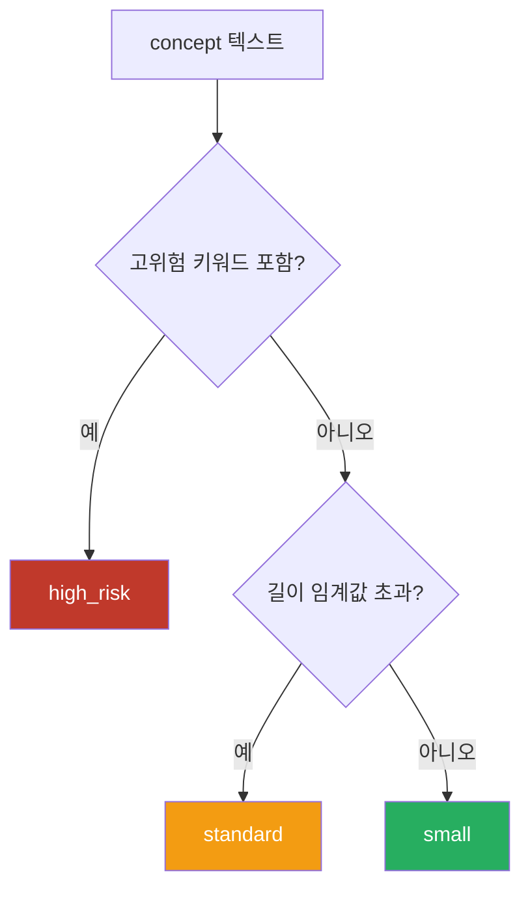
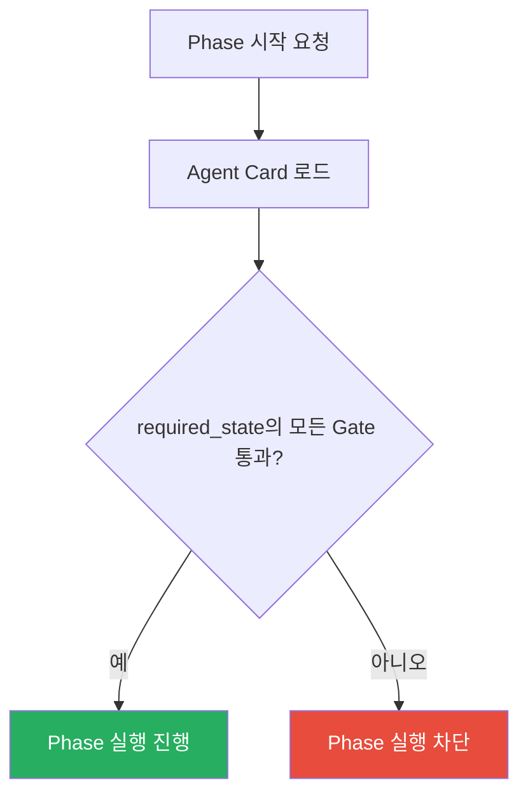

# Risk-Based Routing과 Human-in-the-Loop

변경 등급 감지, 위험 비례 투자, Human-in-the-Loop(HIL), 전제조건 검증, Replan 방향 제약.

---

## 1. 변경 등급 감지 (Change Class Detection)

워크플로우 초기화 시 concept 텍스트를 분석하여 변경 등급(change class)을 자동으로 판별한다.
이 등급은 이후 파이프라인 전체의 검증 깊이와 승인 경로를 결정한다.

### 등급 분류

| 등급 | 조건 |
|------|------|
| `high_risk` | 고위험 키워드 포함 |
| `standard` | 키워드 없음 + 텍스트 길이 초과 |
| `small` | 키워드 없음 + 텍스트 길이 이하 |

고위험 키워드 목록 및 길이 임계값은 reference 문서를 참조한다.

---

## 2. 위험 비례 투자

변경 등급에 따라 리뷰 깊이, 승인 경로, Gate 범위를 차등 적용한다.

### 핵심 원칙

- 모든 작업에 동일한 파이프라인을 적용하지 않는다.
- Policy에 의해 phase가 skipped 될 수 있다.
- **Skip된 phase는 downstream precondition evaluation이 가능하도록 equivalent gate satisfaction을 남겨야 한다.**

### 등급별 차등 영역

| 영역 | small | standard | high_risk |
|------|-------|----------|-----------|
| review 깊이 | 최소 | AI 리뷰 | 심층 다중 관점 리뷰 |
| 승인 경로 | 자동 가능 | 조건부 자동 | 사람 승인 필수 |
| Gate 범위 | 변경 파일만 | 변경 파일 → 전체 | 전체 프로젝트 |
| verify 엄격도 | scope 검증 | scope + compliance | scope + compliance + 아키텍처 |
| test 범위 | 관련 테스트 | 회귀 + 수락 | 회귀 + 수락 + 수동 검증 |

---

## 3. Human-in-the-Loop (HIL)

HIL 여부는 phase의 고정 속성이 아니라, **policy 또는 change class에 의해 결정**된다.

### 불변식

- Agent Card의 `hil` 필드가 `true`인 phase는 사람의 판단 없이 완료할 수 없다.
- HIL phase를 자동으로 실행하려 하면 경고가 발생한다.

### HIL과 변경 등급

| 등급 | approve HIL | 설명 |
|------|------------|------|
| small | policy에 의해 결정 (자동 가능) | 저위험 변경은 자동 승인 허용 |
| standard | policy에 의해 결정 (조건부 자동) | 중위험 변경은 조건부 자동 승인 |
| high_risk | 필수 (사람 승인만 허용) | 고위험 변경은 반드시 사람이 승인 |

---

## 4. 전제조건 검증 (Precondition Validation)

Phase를 시작하기 전에 선행 Gate가 통과했는지 확인한다.

### 불변식

- Agent Card의 `input.required_state`에 정의된 Gate 상태를 검증한다.
- 전제조건이 충족되지 않으면 Phase를 시작할 수 없다.
- 이는 Phase 순서 우회를 방지하고, 워크플로우의 무결성을 보장한다.

Phase별 전제조건표는 reference 문서를 참조한다.

---

## 5. Replan 방향 제약

### 불변식

- Replan은 현재 Phase와 같거나 이전 Phase로만 가능하다. 앞 방향 replan은 허용하지 않는다.
- Replan 실행 시 대상 Phase부터 끝까지의 모든 Phase와 Gate가 리셋된다.
- Replan budget이 소진되면 `escalate_user`로 전환된다.

### 방향 규칙

| 규칙 | 설명 |
|------|------|
| `target_index <= current_index` | replan 대상은 현재 이하만 허용 |
| `target_index > current_index` | ValueError 발생, 앞 방향 차단 |
| 같은 Phase로 replan | Phase 리셋 (retry와 달리 Gate도 리셋) |

---

## 6. 안전장치 종합

워크플로우 파이프라인에 적용되는 모든 안전장치:

| 안전장치 | 범위 | 소진/위반 시 동작 |
|---------|------|-----------------|
| 실행 카운터 | 워크플로우 전체 | RuntimeError → 중단 |
| Retry budget | Phase별 | Phase abort |
| Replan budget | 워크플로우 전체 | escalate_user |
| HIL 강제 | hil=true Phase | 자동 실행 차단 + 경고 |
| 전제조건 검증 | Phase 시작 전 | Phase 실행 차단 |
| Replan 방향 제약 | replan 시 | ValueError |
| Scope hash | approve 시 | spec 변경 감지 |

### 안전장치 적용 순서

1. 총 실행 횟수 한도 확인
2. 선행 Gate 통과 여부 검증
3. HIL 확인
4. Phase 실행
5. Result Envelope 평가
6. Gate 평가 (retry budget 확인)
7. on_fail 라우팅 (replan 방향 + budget 확인)

구체 수치는 reference 문서를 참조한다.
