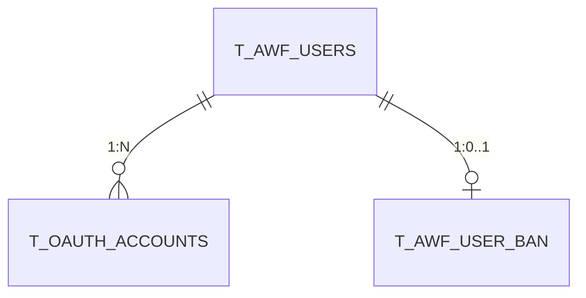

# .ai-context 사양

도메인 소스코드 분석 결과를 표준화된 구조로 저장하는 폴더 사양이다.
이 문서는 도구 독립적(tool-agnostic)이며, Claude Code `/analysis`, awf-cli `awf analyze`, Codex, 기타 도구가 동일한 .ai-context를 생성/소비할 수 있도록 계약을 정의한다.

---

## 1. 폴더 구조

```
analysis-docs/{service}/{domain}/.ai-context/
├── api-spec.json              ← API 엔드포인트 명세 (JSON)
├── data-model.md              ← DB 엔티티, 테이블, Redis, OpenSearch (Markdown)
├── domain-overview.md         ← 도메인 설명, 비즈니스 규칙, 의존성, 기술 부채 (Markdown)
├── external-integration.md    ← 외부 API, SQS, 웹훅, S2S 호출 (Markdown)
├── ANALYSIS_REPORT.md         ← 자동 생성 분석 리포트 (요약 통계, 변경점, 기술 부채)
├── analysis-config.json       ← 도메인별 오버라이드 설정 (선택)
├── .analysis-state.json       ← 파이프라인 상태 (자동 생성, resume용)
└── .tmp/                      ← 중간 산출물 (완료 시 삭제, hashes.json만 보존)
    ├── domain-bundle.xml      ← Stage 2 입력용 도메인 XML 번들
    ├── project-bundle.xml     ← Stage 3 입력용 프로젝트 XML 번들 (Stage 3 승격 시)
    ├── stage1-analysis.md     ← Stage 1 출력 (파일별 분석)
    ├── stage2-draft.md        ← Stage 2 출력 (도메인 합성 초안)
    ├── stage3-final.md        ← Stage 3 출력 (크로스서비스 검증, Stage 3 승격 시)
    └── hashes.json            ← SHA-256 파일 해시 (증분 분석용, 보존)
```

### 1.1 Markdown frontmatter

`.ai-context`의 Markdown 산출물은 운영 wiki와 동일하게 YAML frontmatter를 가진다. 대상은 Markdown 파일만이며, `api-spec.json` 같은 JSON 산출물에는 frontmatter를 붙이지 않는다.

대상 파일:
- `data-model.md`
- `domain-overview.md`
- `external-integration.md`
- `ANALYSIS_REPORT.md`

최소 frontmatter:

```yaml
---
title: Domain overview
schema: ai_context_markdown_v1
last_compiled_at: 2026-05-09T00:00:00+00:00
service: sample-api
domain: quest-challenge
analysis_mode: document
depth: standard
source_state: .analysis-state.json
source_hashes: .tmp/hashes.json
related: []
---
```

소비자는 본문 분석, 요약 추출, LLM prompt 주입 전에 frontmatter를 제거해야 한다. frontmatter는 provenance와 schema 식별용 metadata이며 도메인 본문으로 취급하지 않는다.

---

## 2. 필수 파일 4종

### 2.1 api-spec.json

도메인의 모든 API 엔드포인트를 JSON으로 명세한다.

```json
{
  "domain": "string",
  "service": "string",
  "base_path": "/domain 또는 빈 문자열",
  "description": "string (선택)",
  "controllers": [
    {
      "name": "ControllerName",
      "file": "src/path/controller.ts",
      "route_prefix": "/route",
      "guards": ["GuardName"]
    }
  ],
  "endpoints": [
    {
      "method": "GET|POST|PUT|DELETE|PATCH",
      "path": "/exact/path/:param",
      "controller": "ControllerName",
      "handler": "methodName",
      "summary": "사람이 읽을 수 있는 설명",
      "auth": "Bearer JWT | API Key | Public | (GuardName)",
      "params": { "paramName": "type -- description" },
      "query": { "queryName": "type (optional) -- description" },
      "body": {
        "type": "DtoName",
        "fields": { "fieldName": "type" }
      },
      "response": {
        "type": "ResponseType",
        "description": "응답 설명",
        "fields": { "fieldName": "type" }
      },
      "notes": "특이사항, 제한, 기술 부채 지표"
    }
  ],
  "cross_service_calls": [
    {
      "target": "service | internal-service-name",
      "method": "methodName",
      "endpoint": "METHOD /path (선택)",
      "purpose": "호출 이유",
      "auth_method": "S2S API Key | Internal"
    }
  ],
  "middleware": [
    {
      "name": "MiddlewareName",
      "applied_to": "all | specific routes",
      "purpose": "미들웨어 목적"
    }
  ],
  "websocket_events": [
    {
      "event": "eventName",
      "direction": "emit | listen",
      "payload": {},
      "notes": "이벤트 상세"
    }
  ],
  "total_endpoints": "number",
  "summary": { "controllerName": "X endpoints (설명)" }
}
```

**필수 조건**:
- 도메인 내 **모든** 엔드포인트를 누락 없이 포함
- `auth` 필드는 실제 데코레이터(@UseGuards)와 일치
- `cross_service_calls`에 대상 서비스 이름 명시
- `notes`에 알려진 이슈(GOD 메서드, 하드코딩 값 등) 기록
- `response.type`은 실제 DTO/Entity 이름 사용

### 2.2 data-model.md

도메인의 데이터 저장소(DB, Redis, OpenSearch)를 문서화한다.

**필수 섹션**:

| 섹션 | 내용 |
|------|------|
| 주요 테이블 | 테이블명, DB, 설명, 주요 컬럼을 표로 정리 |
| 테이블 상세 | 각 테이블의 전체 컬럼, 타입, 제약조건 (PK/FK/Unique), TypeORM 엔티티 파일 경로 |
| 관계도 | Mermaid erDiagram으로 테이블 간 관계 표현 |
| Redis 키 패턴 | 키 패턴, 값 타입, TTL, 용도를 표로 정리 |
| OpenSearch 인덱스 | 인덱스명, 매핑 필드, 용도 (해당 시) |
| 데이터 흐름 | 데이터 생명주기를 ASCII 또는 플로우차트로 표현 |

**관계도 예시**:


### 2.3 domain-overview.md

도메인의 역할, 비즈니스 규칙, 의존성, 기술 부채를 종합 정리한다.

**필수 섹션**:

| 섹션 | 내용 |
|------|------|
| 도메인 설명 | 1-3문장으로 도메인 책임을 정의 |
| 소스 구조 | 디렉토리 트리 (module, controller, service, dto, entities) |
| 비즈니스 규칙 | 규칙 번호, 내용, 소스(file:line), 비고를 표로 정리 |
| 상수/설정값 | 하드코딩된 상수, 값, 위치, 설명을 표로 정리 |
| 서비스 간 의존성 | Mermaid graph + 의존성 표 (방향, 대상, 방식, 설명) |
| 알려진 이슈/기술 부채 | severity별(HIGH/MEDIUM/LOW) 분류, 내용, 소스 |
| 관련 문서 | 딥다이브 문서, 다른 .ai-context 파일 링크 |

**기술 부채 분류 기준**:

| Severity | 기준 |
|----------|------|
| HIGH | GOD 메서드(>200줄), 보안 취약점(CSRF, 하드코딩 시크릿, 미검증 입력), null 참조 버그 |
| MEDIUM | 하드코딩 설정값, 누락된 검증 로직, 중복 코드 패턴 |
| LOW | 코드 스타일 개선(if-chain → Strategy), 리팩토링 기회 |

### 2.4 external-integration.md

도메인의 외부 연동(API, 메시지큐, 웹훅, S2S)을 문서화한다.

**필수 섹션**:

| 섹션 | 내용 |
|------|------|
| 외부 API 연동 | 서비스, 엔드포인트, 인증, 용도, 소스(file:line) |
| 메시지 큐 (SQS) | 발행: 큐 이름, 이벤트, 페이로드, 트리거. 구독: 큐 이름, 핸들러, 처리 내용 |
| Webhook/Callback | 소스, 엔드포인트, 용도, 검증 방식 |
| S2S 호출 | 방향(호출/피호출), 대상, 엔드포인트, 인증, 용도 |
| 타임아웃/재시도 | 대상, 타임아웃, 재시도, 폴백 |

---

## 3. 자동 생성 파일

### 3.1 ANALYSIS_REPORT.md

분석 결과를 요약하는 리포트. 자동 생성되며 직접 편집하지 않는다.

**필수 섹션**: 요약(통계 표), 도메인 특성, 아키텍처 관찰, 기술 부채 요약, 보안 분석, 크로스서비스 의존성, 파일 구성

**deep 모드 추가 섹션**: 기존 문서 대비 변경점, Stage 3 크로스서비스 검증 결과, 기술 부채 우선순위화

### 3.2 .analysis-state.json

파이프라인 상태를 추적하여 resume를 지원한다.

```json
{
  "id": "analysis-{service}-{domain}-{YYYYMMDD}",
  "service": "string",
  "domain": "string",
  "mode": "standard | deep",
  "scale": "small | standard | large",
  "startedAt": "ISO-8601",
  "completedAt": "ISO-8601 | null",
  "currentLayer": "input | bundle | analyze | output",
  "currentStage": 1,
  "layers": {
    "input":   { "status": "pending | completed" },
    "bundle":  { "status": "pending | completed", "fileCount": 0 },
    "analyze": {
      "stage1": { "status": "pending | in_progress | completed | skipped | failed", "provider": "codex | sonnet", "errorMessage": "", "retryCount": 0 },
      "stage2": { "status": "...", "provider": "sonnet | opus", "errorMessage": "", "retryCount": 0 },
      "stage3": { "status": "...", "provider": "opus", "reason": "", "errorMessage": "", "retryCount": 0 }
    },
    "output":  { "status": "pending | in_progress | completed | failed", "errorMessage": "" }
  },
  "summaries": {
    "stage1": "파일 수, API 수, 테이블 수, 규칙 수 요약",
    "stage2": "도메인 합성 결과 요약",
    "stage3": "크로스서비스 검증 결과 (해당 시)"
  },
  "artifacts": {
    "domain_bundle": ".tmp/domain-bundle.xml",
    "project_bundle": null,
    "stage1_memo": ".tmp/stage1-analysis.md",
    "stage2_draft": ".tmp/stage2-draft.md",
    "stage3_final": ".tmp/stage3-final.md"
  }
}
```

---

## 4. Stage 2 출력 형식

Stage 2는 4개 파일을 하나의 출력에서 구분자로 분리하여 생성한다.

```
===FILE: api-spec.json===
{ JSON 내용 }

===FILE: data-model.md===
# Markdown 내용

===FILE: domain-overview.md===
# Markdown 내용

===FILE: external-integration.md===
# Markdown 내용
```

**파싱 규칙**:
- 각 파일은 `===FILE: {filename}===` 마커로 시작
- 내용은 다음 줄부터 시작
- 파일 사이는 빈 줄 + 다음 마커로 구분
- 파싱 실패 시 fallback: 1차 재요청 → 2차 개별 프롬프트 분할 → 실패 기록

---

## 5. XML 번들링

소스코드를 LLM이 소비할 수 있는 구조화된 XML 형식으로 변환한다.

### 5.1 도메인 번들

Stage 1 분석 결과로 enriched된 unit 전체 번들. Stage 2 provider에 전달된다.

```xml
<review unit="{unit}">
  <structure>
    <path role="controller">src/domain/attendance/attendance.batch.controller.ts</path>
    <path role="service">src/domain/attendance/attendance.service.ts</path>
    <path role="context">src/common/entities/index.ts</path>
  </structure>

  <file path="...controller.ts" role="target" language="typescript"
        summary="NestJS batch controller exposing a PUT endpoint...">
    <content encoding="xml-escaped"><!-- 전체 파일 내용 --></content>
  </file>

  <!-- 컨텍스트 파일: import 추적으로 발견, 시그니처만 -->
  <file path="../common/entities/index.ts" role="context" mode="signatures" language="typescript">
    <content encoding="xml-escaped">export { UserAttendance };</content>
  </file>
</review>
```

| 속성 | 설명 |
|------|------|
| `role="target"` | 분석 대상 unit의 파일 (전체 내용 포함) |
| `summary` | Stage 1이 추출한 한줄 요약 (Stage 1 미실행 시 생략) |
| structure `role` | Stage 1이 파악한 파일 역할 (controller, service, dao 등) |
| `role="context"` | import 추적으로 발견된 unit 외부 참조 파일 (시그니처만) |
| `mode="signatures"` | 함수/클래스 시그니처만 추출, 구현부 제외 |

**파이프라인 순서**: Stage 1 per-file 분석 → domain-bundle 생성 → Stage 2. Stage 1이 없으면 annotation 없이 target만 포함.

**이스케이프 규칙**: `<` → `&lt;`, `>` → `&gt;`, `&` → `&amp;`

### 5.2 프로젝트 번들 (deep 모드, standard/large)

```xml
<review scope="project" name="{service}">
  <structure><!-- 프로젝트 요약 트리 --></structure>
  <config path="nest-cli.json" language="json">
    <content encoding="xml-escaped">...</content>
  </config>
  <previous-reviews>
    <stage1-summary><!-- Stage 1 요약 --></stage1-summary>
    <stage2-summary><!-- Stage 2 요약 --></stage2-summary>
  </previous-reviews>
</review>
```

### 5.3 번들 저장

번들은 디스크에 저장하여 resume, 디버깅, 프로세스 간 전달에 활용한다.

**파일 경로**:

| 번들 | 저장 경로 | 생성 조건 |
|------|----------|----------|
| 도메인 번들 | `.tmp/domain-bundle.xml` | 항상 (Layer 2) |
| 프로젝트 번들 | `.tmp/project-bundle.xml` | deep 모드 AND scale ∈ {standard, large} |

**Stale invalidation**: 다음 중 하나라도 변경되면 기존 번들을 무효화하고 재생성한다.

| 변경 감지 대상 | 비교 방법 |
|---------------|----------|
| 소스 파일 내용 | `hashes.json`의 파일별 해시와 현재 해시 비교 |
| `exclude_patterns` | 번들 생성 시 조건 해시를 `.analysis-state.json`에 기록, 현재 설정과 비교 |
| `include_tests` | 위와 동일 |
| `mode` 변경 (standard → deep) | project bundle이 없으면 재생성 |

**Stage 1 간접 무효화**:
- Stage 1 완료 후 `.tmp/import-graph.json`을 저장한다.
- 다음 실행에서 직접 변경 파일의 `exports_hash`가 바뀌면, 이전 import graph의 reverse dependents도 Stage 1 재분석 대상에 포함한다.
- `exports_hash`를 만들 수 없는 언어/파일은 content hash 변경을 exported surface 변경으로 간주한다.
- graph로 추가된 dependent는 파일 content hash가 같아도 observation cache를 우회한다.
- 삭제 파일은 이전 graph의 reverse dependents를 재분석 대상에 포함한다.

`.analysis-state.json`에 번들 생성 조건 해시를 추가한다:
```json
"layers": {
  "bundle": {
    "status": "completed",
    "fileCount": 42,
    "configHash": "sha256-of-bundle-affecting-settings"
  }
}
```

**Cleanup 정책**:

| 상태 | 번들 처리 |
|------|----------|
| 미완료 / 실패 | 유지 (resume 시 재사용) |
| 성공 완료 | 삭제 (기존 `.tmp/` cleanup 계약 준수) |
| `debug_keep_bundle: true` | 성공 시에도 보존 (디버깅용 opt-in) |

> **주의**: `.tmp/`는 소스코드 원문을 포함하므로 반드시 `.gitignore` 대상이어야 한다. 대규모 번들의 경우 선택적으로 `.xml.gz` 압축을 적용할 수 있다(MAY).

---

## 6. 검증 (Evaluator)

### 6.1 Lightweight 검증 (모든 모드)

| 체크 | 대상 | 방법 | 실패 시 |
|------|------|------|---------|
| endpoint_exists | api-spec.json | XML 번들의 @Controller, @Get/@Post 데코레이터와 대조 | 누락 목록과 함께 Stage 2 재실행 |
| table_exists | data-model.md | XML 번들의 @Entity, @Table 데코레이터와 대조 | 누락 목록과 함께 Stage 2 재실행 |

### 6.2 Full 검증 (deep 모드, lightweight 통과 후)

Secondary evaluator(read-only 권한)로 4개 신규 파일과 기존 딥다이브 문서를 비교:
- 주요 섹션 누락 여부
- 소스코드와의 내용 일치 여부
- PASS 또는 FAIL + 구체적 피드백 반환

> **구현 참고**: 현재 기본 secondary evaluator는 Codex(read-only sandbox)이며, 도구별 매핑은 10절 참조.

### 6.3 재실행 규칙

- Lightweight 실패 → Stage 2 재실행 (누락 목록 포함)
- Full 검증 실패 → Stage 2 재실행 (피드백 포함)
- 단계당 최대 1회 재시도
- 재시도 후에도 실패 → 상태 기록, 경고 표시, 계속 진행

---

## 7. Resume Protocol

분석 시작 시 **반드시 먼저** 실행한다.

1. `.analysis-state.json` 존재 확인
2. 존재하고 완료(`layers.output.status == "completed"`)이면:
   - `hashes.json`의 파일 해시와 **현재 소스 파일 해시 비교**
   - 해시 동일 → 분석 skip (기존 결과 재사용)
   - **해시 변경 → re-analyze** (기존 결과는 Stage 2 context로 보존)
3. 존재하고 미완료(`layers.output.status != "completed"`)이면:
   - `currentLayer`, `currentStage`, `mode` 복원
   - **번들 유효성 검사**:
     - `layers.bundle.status == "completed"`이고 `.tmp/domain-bundle.xml`이 존재하면:
       - `layers.bundle.configHash`와 현재 설정 해시 비교
       - 일치 + `hashes.json` 파일 해시 변경 없음 → 번들 재사용, Layer 2 건너뛰기
       - 불일치 → 번들 삭제, Layer 2 재실행
     - deep 모드에서 `.tmp/project-bundle.xml`이 존재하면:
       - `layers.bundle.configHash`와 현재 설정 해시 비교
       - 일치 + `hashes.json` 파일 해시 변경 없음 → project bundle 재사용, Stage 3 입력으로 사용
       - 불일치 → project bundle 삭제, 필요 시 재생성
   - `.tmp/` 중간 산출물과 state의 stage status 대조:
     - `"failed"` → 삭제 (재생성)
     - `"completed"` → 유지
     - 산출물 존재하나 state 기록 없음 → 삭제 (고아)
   - `retryCount < 2` → 해당 stage 재실행, retryCount 증가
   - `retryCount >= 2` → stage 건너뛰기, 경고
   - Layer 1부터 재시작하지 않고 미완료 stage부터 재개
4. 존재하지 않으면: Layer 1부터 시작

---

## 8. Scale 기반 라우팅

### Scale 판정 (결정론적, Layer 2)

| 파일 수 | Scale |
|---------|-------|
| < 10 | small |
| 10-30 | standard |
| > 30 | large |

### 모드별 프로바이더 라우팅

**standard 모드**:

| Stage | Provider | 비고 |
|-------|----------|------|
| Stage 1 | Codex | 파일별 분석 |
| Stage 2 | Sonnet | 도메인 합성 (모든 scale) |
| Stage 3 | - | 항상 skip |

**deep 모드**:

| Scale | Stage 1 | Stage 2 | Stage 3 |
|-------|---------|---------|---------|
| small (related_domains < 3) | Codex | Sonnet | skip |
| small (related_domains >= 3) | Codex | Sonnet | Opus |
| standard | Codex | Sonnet | Opus |
| large | Codex (배치) | Opus | Opus |

`stage3_force: true` (analysis-config.json) → scale 무관하게 Stage 3 실행

---

## 9. 경로 규칙

### 9.1 루트 경로

```
AWF_DOCS_ROOT     = analysis-docs 레포 루트 (3-tier fallback: 환경변수 → ../analysis-docs → ~/Documents/GitHub/analysis-docs)
AWF_GITHUB_ROOT   = GitHub 레포 부모 디렉토리 (fallback: 환경변수 → 현재 repo의 부모 디렉토리)
```

### 9.2 .ai-context 출력 위치

```
${AWF_DOCS_ROOT}/{service}/{domain}/.ai-context/
```

### 9.3 소스코드 위치 (복수 서비스 × 복수 디렉토리)

하나의 도메인은 **여러 서비스의 여러 디렉토리**에 걸쳐 있을 수 있다. 소스코드 위치는 단일 패턴이 아니라 `analysis-config.json`의 `domain_definitions`로 결정된다.

```json
// analysis-config.json 예시 (quest-challenge)
{
  "service_map": {
    "sample-api": "${AWF_GITHUB_ROOT}/sample-api",
    "sample-server": "${AWF_GITHUB_ROOT}/sample-server",
    "sample-web": "${AWF_GITHUB_ROOT}/sample-web"
  },
  "domain_definitions": {
    "quest-challenge": {
      "directories": {
        "sample-api": ["src/domain/quest", "src/domain/challenge", "src/domain/trivia", "src/domain/attendance"],
        "sample-server": ["src/quest", "src/challenge"],
        "sample-web": ["src/routes/quest"]
      },
      "related_domains": ["point-system", "notification"],
      "existing_docs": ["16_learning/05_quest-challenge/"]
    }
  }
}
```

**해석 규칙**:
- 각 디렉토리의 절대 경로 = `service_map[service]` + `directories[service][i]`
- Stage 1 번들링 시 모든 디렉토리를 순회하여 파일 수집
- `related_domains`는 Stage 3 크로스서비스 분석 범위를 결정

---

## 10. 도구별 진입점

| 도구 | 명령 | 이 사양의 역할 |
|------|------|---------------|
| Claude Code | `/analysis {service} {domain}` | 이 사양에 따라 .ai-context 생성 |
| awf-cli | `awf analyze {service} {domain}` | 이 사양에 따라 .ai-context 생성 |
| Codex | Stage 1 분석, Full 검증에서 호출됨 | 이 사양의 파일 형식을 출력/검증 |
| 수동 작성 | 템플릿 복사 후 직접 작성 | 이 사양의 파일 구조를 준수 |

> **Stage 3 승격 규칙**: 독립적인 `--deep` 플래그는 제거됨(2026-04-08, 커밋 a1ec135). Stage 3은 `analysis-config.json`의 `related_domains`가 존재하거나 `stage3_force: true`가 설정된 경우 자동 승격. 8절 라우팅 표 참조.

**핵심**: 어떤 도구로 생성하든 이 사양을 준수하면 다른 도구가 동일하게 소비할 수 있다.
