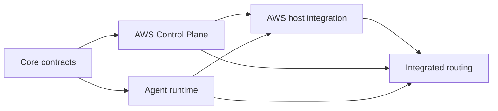

# AWF Supervisor Control Plane Implementation Plan

> **For agentic workers:** REQUIRED SUB-SKILL: Use superpowers:subagent-driven-development (recommended) or superpowers:executing-plans to implement this plan task-by-task. Steps use checkbox (`- [ ]`) syntax for tracking.

**Goal:** Deliver the approved AWF Supervisor MVP with CLI ingress, local-first routing, AWS fallback, fenced ownership, controlled OMP execution, and safe EC2 lifecycle handling.

**Architecture:** The implementation is split into five independently reviewable plans. Contracts and state rules land first, followed by the AWS Control Plane, common agent runtime, EC2 host integration, and cross-environment verification. The existing Cloudflare launcher remains the only EC2 start authority.

**MVP safety decision:** Every version-1 job requires same-generation human approval after claim and before OMP starts. This is a conservative superset of the approved design's §12 sensitive-operation list: the current native OMP boundary has no trustworthy pre-side-effect semantic classifier, so the MVP fails closed rather than pretending to distinguish those operations. `approval_required` is server-owned and always `true`; no submitter bypass, capability shortcut, or target-specific exception exists. A later relaxation requires an approved design change plus an enforceable pre-side-effect action contract.

**Tech Stack:** Python/pytest, Node.js/node:test, AWS SAM, DynamoDB, SQS, S3/KMS, API Gateway/Lambda, launchd, systemd, OMP

---

## Approved design

Read first:

- `docs/superpowers/specs/2026-07-30-awf-supervisor-control-plane-design.md`
- `aws-agent-poc/docs/superpowers/specs/2026-07-30-cloudflare-omp-remote-access-design.md`

## Execution order

### Task 1: Implement AWF core contracts and CLI

**Plan:** `docs/superpowers/plans/2026-07-30-awf-supervisor-core-contracts.md`

- [ ] Complete all six tasks in the core-contract plan.
- [ ] Record the final `ai-workflow-tools` commit containing schemas, state machine, store, client, and user CLI.
- [ ] Build the wheel and verify all four JSON schemas plus `state-machine-v1.json` are packaged.
- [ ] Require the full AWF suite to pass before starting dependent work.

### Task 2: Implement the AWS Control Plane

**Plan:** `docs/superpowers/plans/2026-07-30-awf-supervisor-aws-control-plane.md`

- [ ] Finish the Cloudflare remote-access plan first.
- [ ] Initialize and baseline-version `aws-agent-poc` if it is still unversioned.
- [ ] Complete all nine Control Plane tasks.
- [ ] Verify Supervisor Lambda has no EC2 lifecycle permission.
- [ ] Verify internal lifecycle requests go only to the existing launcher Lambda.
- [ ] Run Node tests, policy tests, and SAM lint before deployment.

### Task 3: Implement the common agent runtime and local service

**Plan:** `docs/superpowers/plans/2026-07-30-awf-supervisor-agent-runtime.md`

- [ ] Complete all eight agent-runtime tasks.
- [ ] Preserve existing OMP native batch and follow-up tests.
- [ ] Verify lease loss terminates the complete OMP process group.
- [ ] Verify local refresh credentials stay in macOS Keychain and access tokens stay in memory.
- [ ] Run the process-level local fixture E2E.

Tasks 2 and 3 may run in parallel after Task 1. Their shared contract is the exact version 1 schema and route list in the approved design. They must not negotiate new field names independently.

### Task 4: Integrate the AWS EC2 host

**Plan:** `docs/superpowers/plans/2026-07-30-awf-supervisor-aws-host.md`

- [ ] Complete all six AWS-host tasks after Tasks 2 and 3.
- [ ] Build and deploy a wheel from an exact 40-character source commit.
- [ ] Verify wheel and schema digests before systemd restart.
- [ ] Confirm active lease, unknown idle state, or pending outbox blocks AWF automatic stop.
- [ ] Confirm existing Cloudflare and Tailscale access paths remain healthy.

### Task 5: Run cross-environment acceptance and fault injection

**Plan:** `docs/superpowers/plans/2026-07-30-awf-supervisor-integration.md`

- [ ] Complete all seven integration tasks.
- [ ] Pass local route and AWS fallback with the isolated fixture repository.
- [ ] Pass duplicate delivery, stale generation, wrong owner, cancel, approval, retained-native recovery, commit-boundary cross-node recovery, and unsafe-recovery checks.
- [ ] Run one bounded real-OMP read-only smoke test after deterministic fixtures pass.
- [ ] Publish the operator runbook only after live E2E succeeds.

## MVP completion gate

The MVP is complete only when all statements below have fresh evidence:

- CLI `submit`, `status/watch`, `cancel`, `approve/reject`, and `agents` work against the deployed Control Plane.
- A healthy local agent receives `target=auto` without starting EC2.
- An offline local agent causes one or more metadata-only, schema-valid launcher start requests that converge on a running EC2 instance; the AWS agent then completes the job with one valid owner/generation.
- One job has at most one valid owner/generation.
- Every claimed version-1 job reaches `WAITING_APPROVAL`, and only a same-generation `APPROVE/CONTINUE` decision may return it to `RUNNING` and start OMP.
- Stale owners and stale approvals receive deterministic conflicts.
- A running job without a verified checkpoint is never auto-requeued.
- A verified clean/pushed commit-boundary checkpoint can recover on a compatible alternate node/environment; dirty, unpushed, or ref-mismatched state cannot.
- An active lease or outbox prevents AWF automatic EC2 stop.
- The Cloudflare launcher is still the only component with `ec2:StartInstances`.
- No source patch, credential, raw prompt, or raw model output appears in DynamoDB or CloudWatch.
- Existing AWF OMP checkpoint, provenance, follow-up, and full regression suites pass.

Slack ingress is not part of this implementation. It becomes a thin adapter over the proven admin API in a separate project.
