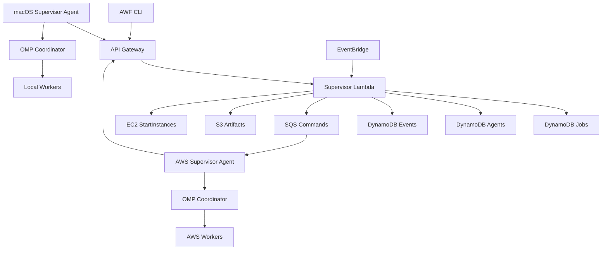

# AWF Supervisor Control Plane 설계

작성일: 2026-07-30  
상태: 승인됨  
대상 저장소: `ai-workflow-tools`, `aws-agent-poc`

## 1. 배경

AWF는 OMP native batch, checkpoint, provenance, follow-up 실행을 지원한다. 현재 OMP coordinator는 활성 실행 안에서 worker를 관찰하고 제한적으로 조정한다. 프로세스가 끝난 뒤 checkpoint를 계속 감시하거나, 실행 위치를 선택하거나, 중복 복구를 막는 상시 supervisor는 없다.

`aws-agent-poc`는 Ubuntu EC2와 영구 `/workspace` EBS를 제공한다. EC2는 유휴 시 중지되므로 EC2 내부 프로세스만으로 상시 control plane을 구성할 수 없다. 로컬 macOS와 AWS EC2를 함께 쓰면서 사용자가 실행 위치를 선택하지 않게 하려면, EC2 수명과 독립된 중앙 상태가 필요하다.

이 설계는 다음 구성을 채택한다.

- AWS serverless Control Plane이 작업 상태와 소유권을 관리한다.
- macOS와 EC2에는 AWF Supervisor Agent가 하나씩 실행된다.
- 작업은 여러 agent 중 하나만 lease로 소유한다.
- OMP는 선택된 agent 안에서 worker 실행을 조정한다.
- 첫 구현은 CLI ingress를 제공한다. Slack은 같은 API를 쓰는 후속 adapter로 분리한다.

## 2. 목표

첫 구현 단위는 다음을 끝까지 지원해야 한다.

1. CLI에서 작업을 제출하고 상태를 관찰한다.
2. Control Plane이 local 또는 AWS 실행 위치를 자동 선택한다.
3. local agent가 건강하고 적합하면 local을 우선 사용한다.
4. local을 사용할 수 없으면 Control Plane이 EC2를 시작하고 AWS agent에 작업을 배정한다.
5. lease와 generation fencing으로 동일 작업의 중복 소유를 막는다.
6. OMP native checkpoint와 provenance를 보존한다.
7. cancel, approve, reject 요청을 현재 generation에만 적용한다.
8. 활성 lease나 미전송 이벤트가 있는 동안 EC2 자동 중지를 막는다.
9. checkpoint가 불완전한 실행은 자동 재실행하지 않는다.

## 3. 제외 범위

다음은 첫 구현에 포함하지 않는다.

- Slack bot과 Slack thread UI
- 여러 AWS 계정 또는 여러 EC2 pool
- Kubernetes worker
- local과 AWS의 Active-Active 공동 실행
- 미커밋 source patch의 환경 간 자동 전송
- 운영 배포와 rollback의 무인 승인
- OMP 내부 worker 정책의 재설계
- 기존 `.workflow/state.json`을 클라우드 상태로 교체하는 작업

## 4. 설계 원칙

### 4.1 작업 소유자는 하나다

여러 실행 노드가 등록될 수 있지만 job의 유효 owner는 하나뿐이다. DynamoDB conditional write와 단조 증가하는 `generation`을 fencing token으로 사용한다.

### 4.2 Supervisor 상태와 workflow 상태를 분리한다

`.workflow/state.json`은 레포 내부 7-Phase 상태다. Control Plane은 이를 직접 수정하지 않는다. 중앙에는 실행 위치, lease, heartbeat, checkpoint reference를 담은 execution envelope만 저장한다.

### 4.3 자동 복구보다 중복 부작용 방지를 우선한다

LLM 실행은 commit, push, PR, 외부 API 호출 같은 부작용을 만들 수 있다. `RUNNING` 작업의 실행 종료를 증명하지 못하면 새 owner에게 즉시 재배정하지 않는다.

### 4.4 EC2는 executor다

EC2는 유휴 시 중지될 수 있다. Global Supervisor 역할은 Lambda, DynamoDB, SQS, EventBridge가 담당한다. EC2는 실행이 필요할 때 시작되는 agent host다.

### 4.5 source-bearing artifact는 기본적으로 환경을 벗어나지 않는다

첫 구현의 S3에는 상태 envelope, checksum, redacted log, OMP provenance만 저장한다. 미커밋 source diff와 patch는 업로드하지 않는다.

## 5. 전체 구조



### 5.1 AWS Control Plane

Control Plane은 다음 AWS resource로 구성한다.

- API Gateway: human CLI와 agent API
- Lambda: submit, routing, lease, event, reconciliation, EC2 start
- DynamoDB Jobs: job execution envelope
- DynamoDB Agents: agent heartbeat와 capability
- DynamoDB Events: 정렬 가능한 job event
- SQS Commands: AWS agent용 명령 전달
- EventBridge: lease reconciliation과 EC2 idle 판단 트리거
- S3: checkpoint reference, provenance, redacted 결과
- KMS: S3와 DynamoDB 암호화 key

MVP는 한 리전, 한 AWS 계정, 한 AWS EC2 agent를 전제로 한다.

### 5.2 macOS Supervisor Agent

`launchd`가 user agent를 유지한다. inbound port는 열지 않는다. agent는 outbound HTTPS로 heartbeat, claim acceptance, event, lease renewal을 전송한다.

agent가 보고하는 capability에는 다음이 포함된다.

- OS와 architecture
- AWF와 OMP version
- provider availability
- repo availability
- 최대 동시 실행 수
- 현재 실행 수
- local policy label

### 5.3 AWS Supervisor Agent

`aws-agent-poc` EC2에서 `systemd` service로 실행한다. `/workspace/repos` 기준 clone과 `agentctl task-create`를 사용해 격리 worktree를 만든다.

AWS agent는 다음 순서로 준비된다.

1. `/workspace` EBS mount 확인
2. cloud-init/bootstrap 완료 확인
3. `agentctl doctor`
4. AWF와 OMP version 확인
5. Control Plane 등록과 heartbeat
6. SQS long polling 시작

### 5.4 OMP Coordinator

Supervisor Agent는 job을 claim한 뒤 OMP coordinator를 실행한다. OMP는 기존 native batch 계약을 그대로 사용한다.

- 한 번의 native `task` batch 실행
- worker event와 완료 결과 관찰
- 제한된 corrective steering
- checkpoint와 coordinator session 보존
- 검증된 follow-up 또는 successor 실행

Control Plane은 OMP worker를 직접 조작하지 않는다. agent가 OMP 결과를 Supervisor event로 변환한다.

## 6. 작업 상태 모델

정상 상태 전이는 다음과 같다.

```text
QUEUED
  -> CLAIMED
  -> PREPARING
  -> RUNNING
  -> WAITING_APPROVAL | PAUSED
  -> SUCCEEDED | FAILED | CANCELLED
```

예외 상태는 다음과 같다.

- `BLOCKED`: capability, repo, credential 또는 policy가 부족함
- `STALE`: heartbeat와 lease가 만료됐지만 이전 실행의 종료를 확인하지 못함
- `RECOVERY_REQUIRED`: 실행은 시작됐고 안전한 checkpoint가 없음

### 6.1 허용 전이

| 현재 | 다음 | 조건 |
|---|---|---|
| `QUEUED` | `CLAIMED` | router가 owner와 generation을 conditional write |
| `CLAIMED` | `PREPARING` | agent가 claim token 수락 |
| `PREPARING` | `RUNNING` | worktree와 OMP coordinator 시작 증거 존재 |
| `RUNNING` | `WAITING_APPROVAL` | 현재 generation의 승인 요청 존재 |
| `RUNNING` | `PAUSED` | 검증된 checkpoint와 중지 증거 존재 |
| `PAUSED` | `CLAIMED` | 복구 가능한 checkpoint와 새 generation |
| non-terminal | `CANCELLED` | agent가 실행 중지와 정리를 확인 |
| non-terminal | `FAILED` | 재시도 불가 오류와 종료 증거 존재 |
| `RUNNING` | `SUCCEEDED` | OMP result, provenance, artifact 검증 통과 |

`STALE`과 `RECOVERY_REQUIRED`는 reconciliation 또는 사람의 결정 없이 `QUEUED`로 돌아가지 않는다.

## 7. 데이터 모델

### 7.1 Job envelope

```json
{
  "job_id": "01J...",
  "workflow_id": "2026-07-30-login-contract",
  "state": "RUNNING",
  "desired_state": "RUNNING",
  "requested_target": "auto",
  "owner_agent_id": "aws-agent-01",
  "generation": 4,
  "lease_expires_at": "2026-07-30T12:05:00Z",
  "attempt": 2,
  "repo_refs": [
    {"repo": "blip-server", "base": "main"},
    {"repo": "blip-api", "base": "staging"}
  ],
  "required_capabilities": ["git", "omp", "github"],
  "checkpoint": {
    "kind": "awf-omp-native",
    "artifact_uri": "s3://bucket/jobs/01J/checkpoint.json",
    "sha256": "..."
  },
  "created_at": "2026-07-30T12:00:00Z",
  "updated_at": "2026-07-30T12:03:30Z"
}
```

필수 식별자는 opaque하고 출력 가능한 ASCII로 제한한다. prompt 전문, source code, credential은 DynamoDB에 저장하지 않는다.

### 7.2 Agent record

```json
{
  "agent_id": "local-mac-01",
  "environment": "local",
  "status": "ONLINE",
  "last_heartbeat_at": "2026-07-30T12:03:20Z",
  "max_concurrency": 1,
  "active_jobs": 0,
  "capabilities": ["git", "omp", "github"],
  "repos": ["ai-workflow-tools", "blip-server"],
  "version": {
    "awf": "0.1.0",
    "omp": "..."
  }
}
```

`repos`는 접근 가능성만 나타낸다. 경로와 remote credential은 중앙에 저장하지 않는다.

### 7.3 Event record

Supervisor event는 기존 `ExecutionEvent`의 핵심 필드를 유지한다.

```json
{
  "job_id": "01J...",
  "generation": 4,
  "sequence": 18,
  "type": "WORKER_COMPLETED",
  "timestamp": "2026-07-30T12:03:10Z",
  "source": "aws-agent-01",
  "data": {}
}
```

중복 제거 key는 `job_id + generation + sequence`다. agent의 local outbox가 sequence를 할당한다.

## 8. Lease와 fencing

기본값은 다음과 같다.

- lease 기간: 90초
- renewal 주기: 30초
- claim acceptance 제한: 60초
- heartbeat online 기준: 최근 45초

모든 owner write는 아래 조건을 만족해야 한다.

```text
job_id 일치
owner_agent_id 일치
generation 일치
lease_expires_at > server_now
```

소유권 이전 시 Control Plane은 `generation`을 증가시킨다. 이전 generation의 heartbeat, event, checkpoint, 완료 보고는 거부한다.

SQS는 at-least-once 전달을 전제로 한다. 명령은 `command_id`를 가지며 agent는 durable command ledger로 중복 실행을 막는다.

## 9. 라우팅

`requested_target`은 `auto`, `local`, `aws` 중 하나다. `auto` 정책은 다음 순서로 평가한다.

1. required capability와 policy label 검사
2. repo 접근 가능성 검사
3. online local agent와 capacity 검사
4. 적합한 local agent에 우선 배정
5. local이 없으면 AWS policy 검사
6. AWS agent가 offline이면 tagged EC2 시작
7. AWS agent 등록 후 claim 생성
8. 어느 환경도 적합하지 않으면 `BLOCKED`

`CLAIMED` 이후에는 비용 최적화만을 이유로 owner를 바꾸지 않는다.

## 10. CLI

사용자 명령은 다음과 같다.

```bash
awf supervisor submit \
  --repo blip-server:main \
  --repo blip-api:staging \
  --prompt-file task.txt

awf supervisor status <job-id>
awf supervisor watch <job-id>
awf supervisor cancel <job-id>
awf supervisor approve <job-id>
awf supervisor reject <job-id>
awf supervisor agents
```

`submit` 기본 target은 `auto`다. `--target local|aws`로 명시할 수 있지만 capability와 security policy를 우회하지 않는다.

agent 운영 명령은 별도 namespace를 사용한다.

```bash
awf supervisor agent enroll
awf supervisor agent run
awf supervisor agent doctor
```

CLI 출력은 사람용 text와 자동화용 `--json`을 모두 제공한다. JSON schema는 version field를 가진다.

## 11. 인증과 권한

### 11.1 사람의 CLI

관리 작업은 AWS SSO 임시 자격증명으로 SigV4 서명한다. access key를 파일에 새로 저장하지 않는다.

### 11.2 AWS agent

EC2 Instance Role을 사용한다. role은 다음 resource로 제한한다.

- Supervisor API의 agent route
- AWS command queue
- 지정된 DynamoDB item action
- job artifact prefix
- KMS decrypt/encrypt context

EC2 role에 `ec2:StartInstances`나 관리자 API 권한을 주지 않는다.

### 11.3 Local agent

`agent enroll`은 사람이 AWS SSO로 인증한 세션에서 revocable bootstrap credential을 발급한다. credential은 macOS Keychain에 저장한다.

- AWS access key가 아니다.
- agent identity와 허용 API가 고정된다.
- 짧은 수명의 access token으로 교환한다.
- 서버에는 credential 원문 대신 검증 가능한 hash를 저장한다.
- revoke와 rotate를 지원한다.

Local agent는 자신의 heartbeat, claim, lease, event만 읽고 쓸 수 있다.

### 11.4 저장과 로그

- S3: SSE-KMS, public access block, TLS-only, versioning, lifecycle
- DynamoDB: encryption at rest와 point-in-time recovery
- CloudWatch: prompt, source diff, credential, raw model output 제외
- artifact: SHA-256 검증 후 사용
- API: request id와 idempotency key 기록

## 12. 승인 경계

다음 작업은 `WAITING_APPROVAL`을 거친다.

- production 배포 또는 rollback
- 데이터 삭제
- IAM과 security policy 변경
- 기존 scope 밖의 repo 추가
- checkpoint 없는 `RUNNING` 작업 재시도
- 미커밋 작업의 다른 환경 이전

승인 record는 `job_id`, `generation`, `requested_action`, `decision`, `actor`, `timestamp`를 포함한다. generation이 달라지면 기존 승인은 무효다.

## 13. 복구

### 13.1 Agent outbox

agent는 중앙 전송 전에 이벤트를 local durable outbox에 기록한다.

- macOS: user application state directory
- AWS: `/workspace` 또는 종료 후에도 유지되는 EBS 경로

전송 성공 후에만 삭제한다. Control Plane은 event key로 중복을 제거한다.

### 13.2 장애별 처리

| 장애 | 처리 |
|---|---|
| claim 수락 전 agent 소실 | lease 만료 후 새 generation으로 재배정 |
| 준비 중 실패, 외부 부작용 없음 | 실패 증거 기록 후 재배정 가능 |
| 실행 중 네트워크 단절 | 신규 명령 중단, checkpoint와 안전 중지 시도 |
| 검증된 checkpoint 후 중지 | `PAUSED`, 동일 환경 우선 재개 |
| checkpoint 없이 실행 소실 | `RECOVERY_REQUIRED` |
| 이전 owner 복귀 | stale generation write 전부 거부 |
| Control Plane 일시 장애 | agent는 lease 만료 전 orphan containment 진입 |
| SQS 중복 | command ledger에서 제거 |

### 13.3 Cross-node 복구

첫 구현은 commit 경계에서만 자동 cross-node 복구를 허용한다.

- commit과 remote ref가 있으면 새 환경에서 fetch
- source-bearing uncommitted state가 있으면 자동 이전 금지
- 같은 EC2의 EBS나 같은 Mac disk가 남아 있으면 동일 환경 재개 가능
- 환경이 사라졌으면 `RECOVERY_REQUIRED`

암호화 patch transfer는 별도 보안 검토 후 추가한다.

## 14. AWS EC2 수명주기

기존 `aws-agent-idle-stop`의 `pgrep` 조건만으로는 Supervisor 작업을 보호할 수 없다. AWS agent는 다음 상태를 원자적으로 관리한다.

```text
/var/lib/aws-agent/supervisor-active-lease.json
```

EC2 중지는 아래 조건을 모두 만족할 때만 허용한다.

1. 유효하거나 복구 판단 중인 active lease가 없음
2. OMP coordinator가 실행 중이지 않음
3. durable outbox가 비어 있음
4. `/workspace/.keep-awake`가 없음
5. idle timeout이 지남

Control Plane이 보이지 않지만 active lease 파일이 남아 있으면 idle-stop script는 `shutdown`을 호출하지 않는다. systemd stop hook의 lease 반납과 outbox flush는 best effort 복구 수단이며 안전 경계로 간주하지 않는다. Control Plane도 active lease가 있는 인스턴스에 `StopInstances`를 호출하지 않는다. 수동 또는 외부 강제 중지는 장애로 기록하고 다음 시작 때 reconciliation한다.

## 15. 오류 처리

외부 API 오류는 다음 범주로 정규화한다.

- `TRANSIENT`: timeout, throttling, 일시적 network 오류
- `AUTH_REQUIRED`: local credential 만료 또는 revoke
- `POLICY_DENIED`: capability 또는 security policy 거부
- `CONFLICT`: generation, owner, idempotency 충돌
- `CORRUPT_ARTIFACT`: checksum 또는 schema 불일치
- `UNSAFE_RECOVERY`: checkpoint 없이 실행 상태가 불명확함
- `TERMINAL_EXECUTION`: OMP 또는 worker가 재시도 불가 오류로 종료

`TRANSIENT`만 제한된 exponential backoff를 허용한다. `CONFLICT`는 재시도 전에 최신 envelope를 다시 읽는다. 나머지는 명시적인 상태로 전환한다.

## 16. 검증

### 16.1 상태 머신 단위 테스트

- 모든 허용 전이와 금지 전이
- lease 획득, 갱신, 만료
- generation fencing
- duplicate command와 event
- stale approval 거부

### 16.2 Control Plane 통합 테스트

- DynamoDB conditional update
- SQS duplicate delivery
- EC2 start idempotency
- IAM deny path
- S3 checksum과 KMS policy
- EventBridge reconciliation

### 16.3 공유 contract 테스트

Control Plane, macOS agent, EC2 agent는 동일한 envelope와 event fixture를 사용한다.

- 필수 field 누락은 fail-closed
- 지원하지 않는 major schema version은 거부
- opaque identifier와 timestamp 형식 검증
- redaction contract 검증

### 16.4 장애 주입

- heartbeat 지연과 유실
- lease renewal 중 network 단절
- agent crash
- stale owner 복귀
- EC2 stop 중 outbox 존재
- Control Plane response 유실
- OMP checkpoint 손상

### 16.5 실제 E2E

1. CLI submit, local route, OMP fixture 완료
2. local offline, EC2 자동 시작, AWS route 완료
3. 실행 중 cancel
4. 승인 대기와 승인 후 재개
5. 완료 후 EC2 idle-stop
6. stale generation event 거부

## 17. 수락 조건

- 한 job에 동시에 하나의 유효 owner와 generation만 존재한다.
- 이전 owner는 handoff 이후 job 상태와 artifact를 변경하지 못한다.
- 검증된 checkpoint가 없으면 실행 중 작업을 자동 재실행하지 않는다.
- active lease 또는 outbox가 있으면 AWF의 자동 EC2 중지가 시작되지 않는다.
- Local agent는 다른 agent의 job을 claim하거나 event를 쓸 수 없다.
- CLI의 submit, status/watch, cancel, approve/reject가 실제 Control Plane과 agent를 거쳐 동작한다.
- local이 offline이면 EC2가 자동 시작되고 AWS agent가 작업을 완료한다.
- 기존 AWF `.workflow/state.json`, OMP native checkpoint, provenance 계약이 유지된다.

## 18. 저장소별 변경 경계

### `ai-workflow-tools`

- `awf supervisor` CLI
- execution envelope와 event schema
- 상태 머신과 lease client
- local/AWS 공용 agent runtime
- OMP adapter
- local launchd template
- contract, unit, agent integration test

### `aws-agent-poc`

- Control Plane CloudFormation resource
- EC2 role 최소 권한
- AWF/OMP 설치와 version 확인
- Supervisor systemd service
- `agentctl` worktree adapter
- idle-stop lease/outbox 보호
- 배포 및 실제 AWS E2E script

두 저장소는 versioned JSON schema와 fixture로 계약을 공유한다. 한 저장소의 내부 Python module을 다른 저장소가 직접 import하지 않는다.

## 19. 구현 분할

전체 구현은 다음 순서로 나눈다.

1. AWF Supervisor domain contract와 in-memory/state-machine test
2. Control Plane API와 DynamoDB/SQS persistence
3. local agent와 CLI local E2E
4. AWS EC2 agent와 lifecycle 통합
5. 자동 라우팅과 local-to-AWS failover E2E
6. 운영 보안과 장애 주입 검증
7. Slack adapter 후속 프로젝트

각 단계는 앞 단계의 versioned contract를 사용한다. 첫 단계에서 AWS SDK나 Slack API를 domain state machine에 결합하지 않는다.

## 20. 결정 사항 요약

- Global Supervisor는 AWS serverless Control Plane이다.
- macOS와 EC2는 Supervisor Agent다.
- job은 Active-Passive 단일 owner lease를 사용한다.
- local을 우선하고 필요할 때 EC2를 자동 시작한다.
- `.workflow/state.json`과 중앙 execution envelope를 분리한다.
- checkpoint 없는 실행은 자동 재실행하지 않는다.
- source-bearing uncommitted patch는 MVP에서 환경 간 전송하지 않는다.
- 첫 ingress는 CLI이며 Slack은 후속 adapter다.
